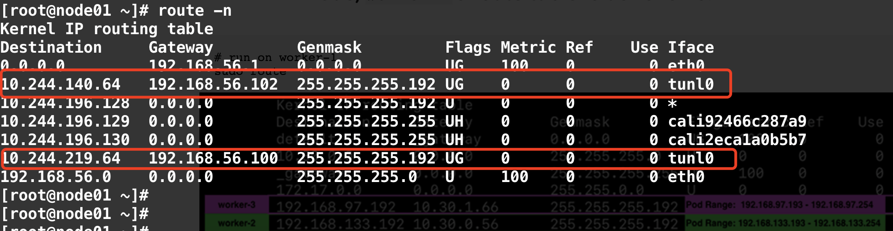

# Calico Architecture


## Felix
作为calico-node中的一个进程，运行在所有节点上，主要任务是：负载配置路由以及ACL等信息来确保endpoint的连通状态。

### Interface management

Programs information about interfaces into the kernel so the kernel can correctly handle the traffic from that endpoint. In particular, it ensures that the host responds to ARP requests from each workload with the MAC of the host, and enables IP forwarding for interfaces that it manages. It also monitors interfaces to ensure that the programming is applied at the appropriate time.

### Route programming

Programs routes to the endpoints on its host into the Linux kernel FIB (Forwarding Information Base). This ensures that packets destined for those endpoints that arrive on at the host are forwarded accordingly.

### ACL programming

Programs ACLs into the Linux kernel to ensure that only valid traffic can be sent between endpoints, and that endpoints cannot circumvent Calico security measures.

### State reporting

Provides network health data. In particular, it reports errors and problems when configuring its host. This data is written to the datastore so it visible to other components and operators of the network.

## BIRD
作为calico-node中的另一个进程，主要任务是从Felix获取本节点的路由地址，然后发布给其他BGP邻居。
The BGP client is responsible for:

### Route distribution

When Felix inserts routes into the Linux kernel FIB, the BGP client distributes them to other nodes in the deployment. This ensures efficient traffic routing for the deployment.

### BGP route reflector configuration

BGP route reflectors are often configured for large deployments rather than a standard BGP client. BGP route reflectors acts as a central point for connecting BGP clients. (Standard BGP requires that every BGP client be connected to every other BGP client in a mesh topology, which is difficult to maintain.)

For redundancy, you can seamlessly deploy multiple BGP route reflectors. BGP route reflectors are involved only in control of the network: no endpoint data passes through them. When the Calico BGP client advertises routes from its FIB to the route reflector, the route reflector advertises those routes out to the other nodes in the deployment.

## confd
主要任务： 监控calico datastore, 便于更新BGP配置和全局配置，诸如：AS号，日志级别，IPAM信息。(CRD: ipamblock ippool)
Confd基于calico datastore上数据更新，动态产生BIRD配置文件。当配置文件更新后，confd触发BIRD重新加载新的配置文件。


## CNI plugin
为kubernetes集群提供calico网络

## Datastore plugin
通过减少每个节点对数据存储的影响来增加规模
### Kubernetes API datastore
### etcd

## IPAM Plugin
主要任务： 使用calico的ipool资源来控制如何将IP地址分配给集群中的pod。

## calico/kube-controllers container
The calico/kube-controllers container includes the following controllers:
- policy controller: watches network policies and programs Calico policies.
- namespace controller: watches namespaces and programs Calico profiles.
- serviceaccount controller: watches service accounts and programs Calico profiles.
- workloadendpoint controller: watches for changes to pod labels and updates Calico workload endpoints.
- node controller: watches for the removal of Kubernetes nodes and removes corresponding data from Calico,  and optionally watches for node updates to create and sync host endpoints for each node.

### Typha
主要任务： 通过减少每个节点的数据存储影响来提高规模，Typha作为一个单独的pod，运行在Felix和datastore之间，默认部署时有3个副本。
Typha代表所有的Felix和confd客户端，维护一个单一的数据存储连接。缓存数据存储状态以及删除重复的事件，因为一个Typha示例可以支持100个Felix实例连接，并且Typha可以过滤一些与Felix无关的更新，从而减少Felix自身的CPU使用率。在一个100多个的集群中，这是必不可少的。

### calicoctl
主要任务： 一个命令行工具，调用datastore来创建、查看、更新和删除calico对应。

```bash
[root@master net.d]# calicoctl -h
Usage:
  calicoctl [options] <command> [<args>...]

    create       Create a resource by file, directory or stdin.
    replace      Replace a resource by file, directory or stdin.
    apply        Apply a resource by file, directory or stdin.  This creates a resource
                 if it does not exist, and replaces a resource if it does exists.
    patch        Patch a pre-exisiting resource in place.
    delete       Delete a resource identified by file, directory, stdin or resource type and
                 name.
    get          Get a resource identified by file, directory, stdin or resource type and
                 name.
    label        Add or update labels of resources.
    convert      Convert config files between different API versions.
    ipam         IP address management.
    node         Calico node management.
    version      Display the version of this binary.
    export       Export the Calico datastore objects for migration
    import       Import the Calico datastore objects for migration
    datastore    Calico datastore management.

Options:
  -h --help               Show this screen.
  -l --log-level=<level>  Set the log level (one of panic, fatal, error,
                          warn, info, debug) [default: panic]

Description:
  The calicoctl command line tool is used to manage Calico network and security
  policy, to view and manage endpoint configuration, and to manage a Calico
  node instance.

  See 'calicoctl <command> --help' to read about a specific subcommand.
[root@master net.d]#
[root@master net.d]# calicoctl ipam show
+----------+---------------+-----------+------------+--------------+
| GROUPING |     CIDR      | IPS TOTAL | IPS IN USE |   IPS FREE   |
+----------+---------------+-----------+------------+--------------+
| IP Pool  | 10.244.0.0/16 |     65536 | 8 (0%)     | 65528 (100%) |
+----------+---------------+-----------+------------+--------------+
[root@master net.d]#
```


## Calico部署

calico安装好后，pod情况:
```bash
[root@master ~]# kubectl get pod -A
NAMESPACE         NAME                                       READY   STATUS    RESTARTS   AGE
calico-system     calico-kube-controllers-546d44f5b7-2cjxc   1/1     Running   0          3h
calico-system     calico-node-4nrr2                          1/1     Running   0          178m
calico-system     calico-node-57874                          1/1     Running   0          178m
calico-system     calico-node-z6j7s                          1/1     Running   0          3h
calico-system     calico-typha-75d45b876-8vjdx               1/1     Running   0          3h
calico-system     calico-typha-75d45b876-mh2jt               1/1     Running   0          178m
calico-system     calico-typha-75d45b876-rftwn               1/1     Running   0          176ms
kube-system       coredns-6d56c8448f-btz2q                   1/1     Running   0          3h
kube-system       coredns-6d56c8448f-v9x24                   1/1     Running   0          3h
kube-system       etcd-master                                1/1     Running   0          3h1m
kube-system       kube-apiserver-master                      1/1     Running   0          3h1m
kube-system       kube-controller-manager-master             1/1     Running   0          3h1m
kube-system       kube-proxy-5tljr                           1/1     Running   0          3h
kube-system       kube-proxy-nsvzq                           1/1     Running   0          178m
kube-system       kube-proxy-tgmwn                           1/1     Running   0          178m
kube-system       kube-scheduler-master                      1/1     Running   0          3h1m
tigera-operator   tigera-operator-657cc89589-4d86z           1/1     Running   0          3h
```

## Calico路由模式

Calico提供三种路由模式
- IP-in-IP：默认模式，封装
- Direct： 未封装
- VXLAN： 封装，no BGP

### IP-IN-IP 默认配置
默认使用IPIP模式，使能NATgoing
```bash
[root@master ~]# cat custom-resources.yaml
# This section includes base Calico installation configuration.
# For more information, see: https://docs.projectcalico.org/v3.17/reference/installation/api#operator.tigera.io/v1.Installation
apiVersion: operator.tigera.io/v1
kind: Installation
metadata:
  name: default
spec:
  # Configures Calico networking.
  calicoNetwork:
    # Note: The ipPools section cannot be modified post-install.
    ipPools:
    - blockSize: 26
      cidr: 10.244.0.0/16
      #encapsulation: VXLANCrossSubnet
      #natOutgoing: Enabled
      #nodeSelector: all()
[root@master ~]# kubectl get ippools.crd.projectcalico.org default-ipv4-ippool -oyaml
apiVersion: crd.projectcalico.org/v1
kind: IPPool
metadata:
  annotations:
    projectcalico.org/metadata: '{"uid":"4dd82395-8bbb-4689-b440-d20bdcdca127","creationTimestamp":"2020-12-28T07:07:27Z"}'
  creationTimestamp: "2020-12-28T07:07:27Z"
  generation: 1
  managedFields:
  name: default-ipv4-ippool
  resourceVersion: "739"
  selfLink: /apis/crd.projectcalico.org/v1/ippools/default-ipv4-ippool
  uid: 4bd56231-01bc-4739-93d8-43598d5fe2e5
spec:
  blockSize: 26
  cidr: 10.244.0.0/16
  ipipMode: Always
  natOutgoing: true
  nodeSelector: all()
  vxlanMode: Never
# nodeSelector可以设置对应的某个节点使用哪个段？
[root@master ~]# calicoctl get ippool -owide
NAME                  CIDR            NAT    IPIPMODE   VXLANMODE   DISABLED   SELECTOR
default-ipv4-ippool   10.244.0.0/16   true   Always     Never       false      all()
```

路由情况



部署测试应用
```bash
[root@master kubernetes]# kubectl get pod -owide
NAME                                READY   STATUS    RESTARTS   AGE   IP               NODE     NOMINATED NODE   READINESS GATES
nginx-deployment-66b6c48dd5-7fjt9   1/1     Running   0          49m   10.244.196.130   node01   <none>           <none>
nginx-deployment-66b6c48dd5-9bxcg   1/1     Running   0          49m   10.244.140.65    node02   <none>           <none>
nginx-deployment-66b6c48dd5-cn6v9   1/1     Running   0          49m   10.244.196.129   node01   <none>           <none>
[root@master kubernetes]#
[root@node01 ~]# ps -ef|grep nginx
root     14866 14751  0 17:22 ?        00:00:00 nginx: master process nginx -g daemon off;
root     14889 14777  0 17:22 ?        00:00:00 nginx: master process nginx -g daemon off;
101      14911 14889  0 17:22 ?        00:00:00 nginx: worker process
101      14912 14866  0 17:22 ?        00:00:00 nginx: worker process
root     29597 16541  0 18:12 pts/0    00:00:00 grep --color=auto nginx
[root@node01 ~]#
[root@node01 ~]# nsenter -n -t 14866
[root@node01 ~]# ping 10.244.140.65
PING 10.244.140.65 (10.244.140.65) 56(84) bytes of data.
64 bytes from 10.244.140.65: icmp_seq=1 ttl=62 time=2.01 ms
64 bytes from 10.244.140.65: icmp_seq=2 ttl=62 time=1.59 ms
64 bytes from 10.244.140.65: icmp_seq=3 ttl=62 time=0.403 ms
^C
--- 10.244.140.65 ping statistics ---
3 packets transmitted, 3 received, 0% packet loss, time 2003ms
rtt min/avg/max/mdev = 0.403/1.339/2.019/0.684 ms
[root@node01 ~]#
```
在node02上抓包


### Direct

```bash
[root@master kubernetes]# calicoctl get ippool default-ipv4-ippool -oyaml
apiVersion: projectcalico.org/v3
kind: IPPool
metadata:
  creationTimestamp: "2020-12-28T07:07:27Z"
  name: default-ipv4-ippool
  resourceVersion: "739"
  uid: 4bd56231-01bc-4739-93d8-43598d5fe2e5
spec:
  blockSize: 26
  cidr: 10.244.0.0/16
  ipipMode: Always
  natOutgoing: true
  nodeSelector: all()
  vxlanMode: Never
```
修改ipipMode为Never。
```bash
[root@master kubernetes]# cat direct-ippool.yaml
apiVersion: projectcalico.org/v3
kind: IPPool
metadata:
  name: default-ipv4-ippool
spec:
  blockSize: 26
  cidr: 10.244.0.0/16
  ipipMode: Never
  natOutgoing: true
  nodeSelector: all()
  vxlanMode: Never
[root@master kubernetes]# calicoctl apply -f  direct-ippool.yaml
Successfully applied 1 'IPPool' resource(s)
[root@master kubernetes]#
[root@master kubernetes]# calicoctl get ippool default-ipv4-ippool -owide
NAME                  CIDR            NAT    IPIPMODE   VXLANMODE   DISABLED   SELECTOR
default-ipv4-ippool   10.244.0.0/16   true   Never      Never       false      all()
```

修改完成后，查看路由情况：
```bash
[root@node01 ~]# route -n
Kernel IP routing table
Destination     Gateway         Genmask         Flags Metric Ref    Use Iface
0.0.0.0         192.168.56.1    0.0.0.0         UG    100    0        0 eth0
10.244.140.64   192.168.56.102  255.255.255.192 UG    0      0        0 eth0
10.244.196.128  0.0.0.0         255.255.255.192 U     0      0        0 *
10.244.196.129  0.0.0.0         255.255.255.255 UH    0      0        0 cali92466c287a9
10.244.196.130  0.0.0.0         255.255.255.255 UH    0      0        0 cali2eca1a0b5b7
10.244.219.64   192.168.56.100  255.255.255.192 UG    0      0        0 eth0
192.168.56.0    0.0.0.0         255.255.255.0   U     100    0        0 eth0
[root@node01 ~]#
[root@node01 ~]# ip r
default via 192.168.56.1 dev eth0 proto static metric 100
10.244.140.64/26 via 192.168.56.102 dev eth0 proto bird
blackhole 10.244.196.128/26 proto bird
10.244.196.129 dev cali92466c287a9 scope link
10.244.196.130 dev cali2eca1a0b5b7 scope link
10.244.219.64/26 via 192.168.56.100 dev eth0 proto bird
192.168.56.0/24 dev eth0 proto kernel scope link src 192.168.56.101 metric 100
[root@node01 ~]#
```
节点node01到10.244.140.64/26(node02)以及10.244.219.64/26(master)的路由是通过各自节点的BGP(BIRD)发布学习来的。

```bash
[root@node01 ~]# calicoctl node status
Calico process is running.

IPv4 BGP status
+----------------+-------------------+-------+----------+-------------+
|  PEER ADDRESS  |     PEER TYPE     | STATE |  SINCE   |    INFO     |
+----------------+-------------------+-------+----------+-------------+
| 192.168.56.100 | node-to-node mesh | up    | 16:13:35 | Established |
| 192.168.56.102 | node-to-node mesh | up    | 16:13:35 | Established |
+----------------+-------------------+-------+----------+-------------+

IPv6 BGP status
No IPv6 peers found.

# calico-node bird进程配置
sh-4.4# cat bird.cfg
function apply_communities ()
{
}

# Generated by confd
include "bird_aggr.cfg";
include "bird_ipam.cfg";

router id 192.168.56.101;

# Configure synchronization between routing tables and kernel.
protocol kernel {
  learn;             # Learn all alien routes from the kernel
  persist;           # Don't remove routes on bird shutdown
  scan time 2;       # Scan kernel routing table every 2 seconds
  import all;
  export filter calico_kernel_programming; # Default is export none
  graceful restart;  # Turn on graceful restart to reduce potential flaps in
                     # routes when reloading BIRD configuration.  With a full
                     # automatic mesh, there is no way to prevent BGP from
                     # flapping since multiple nodes update their BGP
                     # configuration at the same time, GR is not guaranteed to
                     # work correctly in this scenario.
  merge paths on;    # Allow export multipath routes (ECMP)
}

# Watch interface up/down events.
protocol device {
  debug { states };
  scan time 2;    # Scan interfaces every 2 seconds
}

protocol direct {
  debug { states };
  interface -"cali*", -"kube-ipvs*", "*"; # Exclude cali* and kube-ipvs* but
                                          # include everything else.  In
                                          # IPVS-mode, kube-proxy creates a
                                          # kube-ipvs0 interface. We exclude
                                          # kube-ipvs0 because this interface
                                          # gets an address for every in use
                                          # cluster IP. We use static routes
                                          # for when we legitimately want to
                                          # export cluster IPs.
}


# Template for all BGP clients
template bgp bgp_template {
  debug { states };
  description "Connection to BGP peer";
  local as 64512;
  multihop;
  gateway recursive; # This should be the default, but just in case.
  import all;        # Import all routes, since we don't know what the upstream
                     # topology is and therefore have to trust the ToR/RR.
  export filter calico_export_to_bgp_peers;  # Only want to export routes for workloads.
  source address 192.168.56.101;  # The local address we use for the TCP connection
  add paths on;
  graceful restart;  # See comment in kernel section about graceful restart.
  connect delay time 2;
  connect retry time 5;
  error wait time 5,30;
}

# ------------- Node-to-node mesh -------------


# For peer /host/master/ip_addr_v4
protocol bgp Mesh_192_168_56_100 from bgp_template {
  neighbor 192.168.56.100 as 64512;
}

# For peer /host/node01/ip_addr_v4
# Skipping ourselves (192.168.56.101)

# For peer /host/node02/ip_addr_v4
protocol bgp Mesh_192_168_56_102 from bgp_template {
  neighbor 192.168.56.102 as 64512;
  passive on; # Mesh is unidirectional, peer will connect to us.
}

# ------------- Global peers -------------
# No global peers configured.


# ------------- Node-specific peers -------------

# No node-specific peers configured.

sh-4.4#
sh-4.4# cat bird_aggr.cfg
# Generated by confd

protocol static {
   # IP blocks for this host.
   route 10.244.196.128/26 blackhole;
}


# Aggregation of routes on this host; export the block, nothing beneath it.
function calico_aggr ()
{
      # Block 10.244.196.128/26 is confirmed
      if ( net = 10.244.196.128/26 ) then { accept; }
      if ( net ~ 10.244.196.128/26 ) then { reject; }
}
sh-4.4#
sh-4.4# cat bird
bird.cfg        bird6.cfg       bird6_aggr.cfg  bird6_ipam.cfg  bird_aggr.cfg   bird_ipam.cfg
sh-4.4# cat bird_ipam.cfg
# Generated by confd
filter calico_export_to_bgp_peers {
  # filter code terminates when it calls `accept;` or `reject;`, call apply_communities() before calico_aggr()
  apply_communities();
  calico_aggr();

  if ( net ~ 10.244.0.0/16 ) then {
    accept;
  }
  reject;
}


filter calico_kernel_programming {

  if ( net ~ 10.244.0.0/16 ) then {
    krt_tunnel = "";
    accept;
  }

  accept;
}
sh-4.4#
```

### VXLAN

```bash
[root@master ~]# cat custom-resources.yaml
# This section includes base Calico installation configuration.
# For more information, see: https://docs.projectcalico.org/v3.17/reference/installation/api#operator.tigera.io/v1.Installation
apiVersion: operator.tigera.io/v1
kind: Installation
metadata:
  name: default
spec:
  # Configures Calico networking.
  calicoNetwork:
    bgp: Disabled
    # Note: The ipPools section cannot be modified post-install.
    ipPools:
    - blockSize: 26
      cidr: 10.244.0.0/16
      encapsulation: VXLAN
      #natOutgoing: Enabled
      #nodeSelector: all()

[root@master ~]# kubectl get installations.operator.tigera.io default -oyaml
apiVersion: operator.tigera.io/v1
kind: Installation
metadata:
  annotations:
    kubectl.kubernetes.io/last-applied-configuration: |
      {"apiVersion":"operator.tigera.io/v1","kind":"Installation","metadata":{"annotations":{},"name":"default"},"spec":{"calicoNetwork":{"bgp":"Disabled","ipPools":[{"blockSize":26,"cidr":"10.244.0.0/16","encapsulation":"VXLAN"}]}}}
  creationTimestamp: "2020-12-29T03:45:36Z"
  generation: 6
  name: default
  resourceVersion: "126723"
  selfLink: /apis/operator.tigera.io/v1/installations/default
  uid: 09b1e67c-0d41-41da-95d2-8cffa3faadb6
spec:
  calicoNetwork:
    bgp: Disabled
    hostPorts: Enabled
    ipPools:
    - blockSize: 26
      cidr: 10.244.0.0/16
      encapsulation: VXLAN
      natOutgoing: Enabled
      nodeSelector: all()
    multiInterfaceMode: None
    nodeAddressAutodetectionV4:
      firstFound: true
  cni:
    ipam:
      type: Calico
    type: Calico
  flexVolumePath: /usr/libexec/kubernetes/kubelet-plugins/volume/exec/
  nodeUpdateStrategy:
    rollingUpdate:
      maxUnavailable: 1
    type: RollingUpdate
  variant: Calico
status:
  computed:
    calicoNetwork:
      bgp: Disabled
      hostPorts: Enabled
      ipPools:
      - blockSize: 26
        cidr: 10.244.0.0/16
        encapsulation: VXLAN
        natOutgoing: Enabled
        nodeSelector: all()
      multiInterfaceMode: None
      nodeAddressAutodetectionV4:
        firstFound: true
    cni:
      ipam:
        type: Calico
      type: Calico
    flexVolumePath: /usr/libexec/kubernetes/kubelet-plugins/volume/exec/
    nodeUpdateStrategy:
      rollingUpdate:
        maxUnavailable: 1
      type: RollingUpdate
    variant: Calico
  mtu: 1450
  variant: Calico

[root@master ~]# ip r
default via 192.168.56.1 dev eth0 proto static metric 100
10.244.140.64/26 via 10.244.140.64 dev vxlan.calico onlink
10.244.196.128/26 via 10.244.196.128 dev vxlan.calico onlink
192.168.56.0/24 dev eth0 proto kernel scope link src 192.168.56.100 metric 100
[root@master ~]#
[root@master ~]#
[root@master ~]#
[root@master ~]# route -n
Kernel IP routing table
Destination     Gateway         Genmask         Flags Metric Ref    Use Iface
0.0.0.0         192.168.56.1    0.0.0.0         UG    100    0        0 eth0
10.244.140.64   10.244.140.64   255.255.255.192 UG    0      0        0 vxlan.calico
10.244.196.128  10.244.196.128  255.255.255.192 UG    0      0        0 vxlan.calico
192.168.56.0    0.0.0.0         255.255.255.0   U     100    0        0 eth0
[root@master ~]#
[root@master ~]#
[root@master ~]# calicoctl node status
Calico process is running.

None of the BGP backend processes (BIRD or GoBGP) are running.

[root@master ~]# calicoctl get ippool
NAME                  CIDR            SELECTOR
default-ipv4-ippool   10.244.0.0/16   all()

[root@master ~]# calicoctl get ippool default-ipv4-ippool -owide
NAME                  CIDR            NAT    IPIPMODE   VXLANMODE   DISABLED   SELECTOR
default-ipv4-ippool   10.244.0.0/16   true   Never      Always      false      all()

```


### 如何更改网络模式
```bash
[root@master ~]# calicoctl get ippool -o yaml >net
[root@master ~]# vim net
apiVersion: projectcalico.org/v3
items:
- apiVersion: projectcalico.org/v3
  kind: IPPool
  metadata:
    creationTimestamp: "2020-12-14T07:14:00Z"
    name: default-ipv4-ippool
    resourceVersion: "9479"
    uid: 93977cbe-a722-4197-9fb9-4ce808aceb94
  spec:
    # 此池使用的分配块的CIDR大小。块按需分配给主机，并用于汇总路由。该值只能在创建池时设置，IPv4为20至32（含），IPv6为116至128（含）
    blockSize: 26
    # 该池使用的IP范围
    cidr: 10.244.0.0/16
    # 定义何时使用网路模式，Never为BGP模式；Always为ipip模式，如果主机跨网段，设置为CrossSubnet
    ipipMode: Never
    # 默认为false，设置为true，允许容器nat出host
    natOutgoing: true
    nodeSelector: all()
    # vxlan隧道模式，不能与ipipMode同时使用。有三个值，跟ipipMode的一样
    vxlanMode: Never
kind: IPPoolList
metadata:
  resourceVersion: "13426"
[root@master ~]# calicoctl apply -f net
Successfully applied 1 'IPPool' resource(s)
[root@master ~]# calicoctl get ippool -o wide
NAME                  CIDR            NAT    IPIPMODE   VXLANMODE   DISABLED   SELECTOR   
default-ipv4-ippool   10.244.0.0/16   true   Never      Never       false      all()    
[root@master ~]# kubectl delete po -lk8s-app=calico-node -ncalico-system
pod "calico-node-b28vj" deleted
pod "calico-node-nlts5" deleted
```


