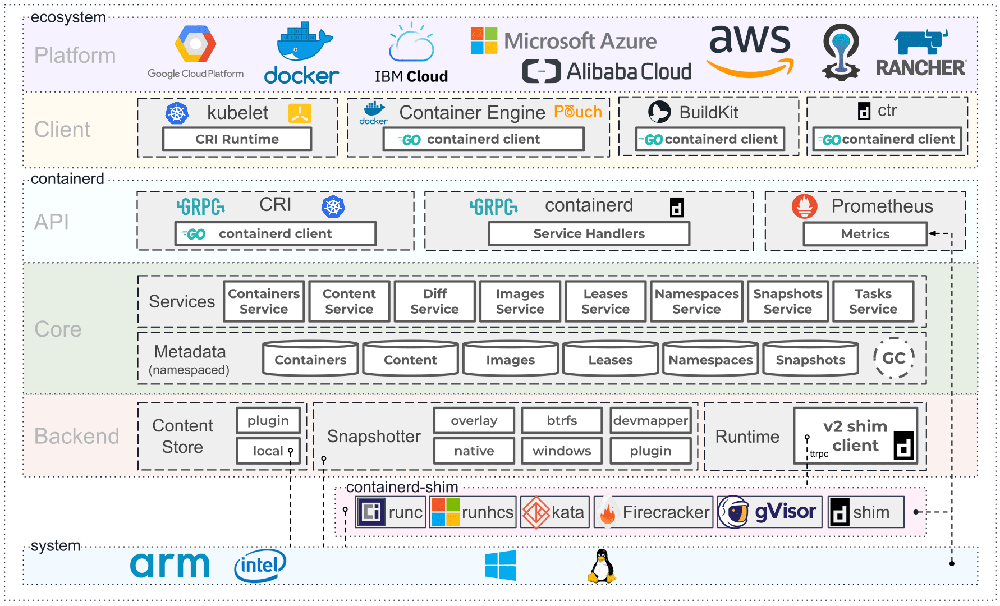

## Containerd 的前世今生
很久以前，Docker 强势崛起，以“镜像”这个大招席卷全球，对其他容器技术进行致命的降维打击，使其毫无招架之力，就连 Google 也不例外。Google 为了不被拍死在沙滩上，被迫拉下脸面（当然，跪舔是不可能的），希望 Docker 公司和自己联合推进一个开源的容器运行时作为 Docker 的核心依赖，不然就走着瞧。Docker 公司觉得自己的智商被侮辱了，走着瞧就走着瞧，谁怕谁啊！

很明显，Docker 公司的这个决策断送了自己的大好前程，造成了今天的悲剧。

紧接着，Google 联合 Red Hat、IBM 等几位巨佬连哄带骗忽悠 Docker 公司将 libcontainer 捐给中立的社区（OCI，Open Container Intiative），并改名为 runc，不留一点 Docker 公司的痕迹~~

这还不够，为了彻底扭转 Docker 一家独大的局面，几位大佬又合伙成立了一个基金会叫 CNCF（Cloud Native Computing Fundation），这个名字想必大家都很熟了，我就不详细介绍了。CNCF 的目标很明确，既然在当前的维度上干不过 Docker，干脆往上爬，升级到大规模容器编排的维度，以此来击败 Docker。

Docker 公司当然不甘示弱，搬出了 Swarm 和 Kubernetes 进行 PK，最后的结局大家都知道了，Swarm 战败。然后 Docker 公司耍了个小聪明，将自己的核心依赖 Containerd 捐给了 CNCF，以此来标榜 Docker 是一个 PaaS 平台。

很明显，这个小聪明又大大加速了自己的灭亡。


巨佬们心想，想当初想和你合作搞个中立的核心运行时，你死要面子活受罪，就是不同意，好家伙，现在自己搞了一个，还捐出来了，这是什么操作？也罢，这倒省事了，我就直接拿 Containerd 来做文章吧。

首先呢，为了表示 Kubernetes 的中立性，当然要搞个标准化的容器运行时接口，只要适配了这个接口的容器运行时，都可以和我一起玩耍哦，第一个支持这个接口的当然就是 Containerd 啦。至于这个接口的名字，大家应该都知道了，它叫 CRI（Container Runntime Interface）。

这样还不行，为了蛊惑 Docker 公司，Kubernetes 暂时先委屈自己，专门在自己的组件中集成了一个 shim（你可以理解为垫片），用来将 CRI 的调用翻译成 Docker 的 API，让 Docker 也能和自己愉快地玩耍，温水煮青蛙，养肥了再杀。。。

就这样，Kubernetes 一边假装和 Docker 愉快玩耍，一边背地里不断优化 Containerd 的健壮性以及和 CRI 对接的丝滑性。现在 Containerd 的翅膀已经完全硬了，是时候卸下我的伪装，和 Docker say bye bye 了。后面的事情大家也都知道了~~

Docker 这门技术成功了，Docker 这个公司却失败了。

## Containerd架构
时至今日，Containerd 已经变成一个工业级的容器运行时了，连口号都有了：超简单！超健壮！可移植性超强！

当然，为了让 Docker 以为自己不会抢饭碗，Containerd 声称自己的设计目的主要是为了嵌入到一个更大的系统中（暗指 Kubernetes），而不是直接由开发人员或终端用户使用。

事实上呢，Containerd 现在基本上啥都能干了，开发人员或者终端用户可以在宿主机中管理完整的容器生命周期，包括容器镜像的传输和存储、容器的执行和管理、存储和网络等。大家可以考虑学起来了。

先来看看 Containerd 的架构：



可以看到 Containerd 仍然采用标准的 C/S 架构，服务端通过 GRPC 协议提供稳定的 API，客户端通过调用服务端的 API 进行高级的操作。

为了解耦，Containerd 将不同的职责划分给不同的组件，每个组件就相当于一个子系统（subsystem）。连接不同子系统的组件被称为模块。

总体上 Containerd 被划分为两个子系统：
- Bundle : 在 Containerd 中，Bundle 包含了配置、元数据和根文件系统数据，你可以理解为容器的文件系统。而 Bundle 子系统允许用户从镜像中提取和打包 Bundles。
- Runtime : Runtime 子系统用来执行 Bundles，比如创建容器。
其中，每一个子系统的行为都由一个或多个模块协作完成（架构图中的 Core 部分）。每一种类型的模块都以插件的形式集成到 Containerd 中，而且插件之间是相互依赖的。例如，上图中的每一个长虚线的方框都表示一种类型的插件，包括 Service Plugin、Metadata Plugin、GC Plugin、Runtime Plugin 等，其中 Service Plugin 又会依赖 Metadata Plugin、GC Plugin 和 Runtime Plugin。每一个小方框都表示一个细分的插件，例如 Metadata Plugin 依赖 Containers Plugin、Content Plugin 等。 总之，万物皆插件，插件就是模块，模块就是插件


这里介绍几个常用的插件：
- Content Plugin : 提供对镜像中可寻址内容的访问，所有不可变的内容都被存储在这里。
- Snapshot Plugin : 用来管理容器镜像的文件系统快照。镜像中的每一个 layer 都会被解压成文件系统快照，类似于 Docker 中的 graphdriver。
- Metrics : 暴露各个组件的监控指标。
从总体来看，Containerd 被分为三个大块：Storage、Metadata 和 Runtime，可以将上面的架构图提炼一下：


## Containerd基本操作
### 二进制包安装
Containerd 提供了两个压缩包，一个叫 containerd-${VERSION}.${OS}-${ARCH}.tar.gz，另一个叫 cri-containerd-${VERSION}.${OS}-${ARCH}.tar.gz。其中  cri-containerd-${VERSION}.${OS}-${ARCH}.tar.gz 包含了所有 Kubernetes 需要的二进制文件。如果你只是本地测试，可以选择前一个压缩包；如果是作为 Kubernetes 的容器运行时，需要选择后一个压缩包。

Containerd是需要调用runc的，而第一个压缩包是不包含runc二进制文件的，如果你选择第一个压缩包，还需要提前安装runc。所以我建议直接使用cri-containerd压缩包。

首先从 release 页面下载最新版本的压缩包，当前最新版本为 1.4.3：
```bash
→ wget https://github.com/containerd/containerd/releases/download/v1.4.3/cri-containerd-cni-1.4.3-linux-amd64.tar.gz
```

可以通过 tar 的 -t 选项直接看到压缩包中包含哪些文件：
```bash
root@luke:~# tar -tf cri-containerd-cni-1.4.3-linux-amd64.tar.gz
etc/
etc/cni/
etc/cni/net.d/
etc/cni/net.d/10-containerd-net.conflist
etc/crictl.yaml
etc/systemd/
etc/systemd/system/
etc/systemd/system/containerd.service
usr/
usr/local/
usr/local/bin/
usr/local/bin/containerd-shim-runc-v2
usr/local/bin/ctr
usr/local/bin/containerd-shim
usr/local/bin/containerd-shim-runc-v1
usr/local/bin/crictl
usr/local/bin/critest
usr/local/bin/containerd
usr/local/sbin/
usr/local/sbin/runc
opt/
opt/cni/
opt/cni/bin/
opt/cni/bin/vlan
opt/cni/bin/host-local
opt/cni/bin/flannel
opt/cni/bin/bridge
opt/cni/bin/host-device
opt/cni/bin/tuning
opt/cni/bin/firewall
opt/cni/bin/bandwidth
opt/cni/bin/ipvlan
opt/cni/bin/sbr
opt/cni/bin/dhcp
opt/cni/bin/portmap
opt/cni/bin/ptp
opt/cni/bin/static
opt/cni/bin/macvlan
opt/cni/bin/loopback
opt/containerd/
opt/containerd/cluster/
opt/containerd/cluster/version
opt/containerd/cluster/gce/
opt/containerd/cluster/gce/cni.template
opt/containerd/cluster/gce/configure.sh
opt/containerd/cluster/gce/cloud-init/
opt/containerd/cluster/gce/cloud-init/master.yaml
opt/containerd/cluster/gce/cloud-init/node.yaml
opt/containerd/cluster/gce/env
root@luke:~#
```
直接将压缩包解压到系统的各个目录中：
```bash
sudo tar -C / -xzf cri-containerd-cni-1.4.3-linux-amd64.tar.gz
```
将 /usr/local/bin 和 /usr/local/sbin 追加到 ~/.bashrc 文件的 $PATH 环境变量中：
```bash
export PATH=$PATH:/usr/local/bin:/usr/local/sbin
```
生成默认配置文件，并启动containerd服务
```bash
## Configure containerd
sudo mkdir -p /etc/containerd
sudo containerd config default > /etc/containerd/config.toml

# Restart containerd
sudo systemctl restart containerd
```
如启动报如下错误：
```bash
Failed to start containerd.service: Unit containerd.service is masked.
```
只需执行如下命令，再重新启动即可
```bash
systemctl unmask containerd
```


### apt或yum安装
```bash
cat <<EOF | sudo tee /etc/modules-load.d/containerd.conf
overlay
br_netfilter
EOF

sudo modprobe overlay
sudo modprobe br_netfilter

# Setup required sysctl params, these persist across reboots.
cat <<EOF | sudo tee /etc/sysctl.d/99-kubernetes-cri.conf
net.bridge.bridge-nf-call-iptables  = 1
net.ipv4.ip_forward                 = 1
net.bridge.bridge-nf-call-ip6tables = 1
EOF

# Apply sysctl params without reboot
sudo sysctl --system

# ubuntu
# (Install containerd)
## Set up the repository
### Install packages to allow apt to use a repository over HTTPS
sudo apt-get update && sudo apt-get install -y apt-transport-https ca-certificates curl software-properties-common libseccomp2

## Add Docker's official GPG key
curl -fsSL https://download.docker.com/linux/ubuntu/gpg | sudo apt-key --keyring /etc/apt/trusted.gpg.d/docker.gpg add -

## Add Docker apt repository.
sudo add-apt-repository \
    "deb [arch=amd64] https://download.docker.com/linux/ubuntu \
    $(lsb_release -cs) \
    stable"

## Install containerd
sudo apt-get update && sudo apt-get install -y containerd.io

# Configure containerd
sudo mkdir -p /etc/containerd
sudo containerd config default | sudo tee /etc/containerd/config.toml

# Restart containerd
sudo systemctl restart containerd

# centos
# (Install containerd)
## Set up the repository
### Install required packages
sudo yum install -y yum-utils device-mapper-persistent-data lvm2

## Add docker repository
sudo yum-config-manager \
    --add-repo \
    https://download.docker.com/linux/centos/docker-ce.repo

## Install containerd
sudo yum update -y && sudo yum install -y containerd.io

## Configure containerd
sudo mkdir -p /etc/containerd
sudo containerd config default > /etc/containerd/config.toml

# Restart containerd
sudo systemctl restart containerd

```

### 基本配置讲解
#### 镜像加速
由于某些不可描述的因素，在国内拉取公共镜像仓库的速度是极慢的，为了节约拉取时间，需要为 Containerd 配置镜像仓库的 mirror。Containerd 的镜像仓库 mirror 与 Docker 相比有两个区别：

Containerd 只支持通过 CRI 拉取镜像的 mirror，也就是说，只有通过 crictl 或者 Kubernetes 调用时 mirror 才会生效，通过 ctr 拉取是不会生效的。
Docker 只支持为 Docker Hub 配置 mirror，而 Containerd 支持为任意镜像仓库配置 mirror。
配置镜像加速之前，先来看下 Containerd 的配置结构，乍一看可能会觉得很复杂，复杂就复杂在 plugin 的配置部分：
```bash
[plugins]
  [plugins."io.containerd.gc.v1.scheduler"]
    pause_threshold = 0.02
    deletion_threshold = 0
    mutation_threshold = 100
    schedule_delay = "0s"
    startup_delay = "100ms"
  [plugins."io.containerd.grpc.v1.cri"]
    disable_tcp_service = true
    stream_server_address = "127.0.0.1"
    stream_server_port = "0"
    stream_idle_timeout = "4h0m0s"
    enable_selinux = false
    sandbox_image = "k8s.gcr.io/pause:3.1"
    stats_collect_period = 10
    systemd_cgroup = false
    enable_tls_streaming = false
    max_container_log_line_size = 16384
    disable_cgroup = false
    disable_apparmor = false
    restrict_oom_score_adj = false
    max_concurrent_downloads = 3
    disable_proc_mount = false
    [plugins."io.containerd.grpc.v1.cri".containerd]
      snapshotter = "overlayfs"
      default_runtime_name = "runc"
      no_pivot = false
      [plugins."io.containerd.grpc.v1.cri".containerd.default_runtime]
        runtime_type = ""
        runtime_engine = ""
        runtime_root = ""
        privileged_without_host_devices = false
      [plugins."io.containerd.grpc.v1.cri".containerd.untrusted_workload_runtime]
        runtime_type = ""
        runtime_engine = ""
        runtime_root = ""
        privileged_without_host_devices = false
      [plugins."io.containerd.grpc.v1.cri".containerd.runtimes]
        [plugins."io.containerd.grpc.v1.cri".containerd.runtimes.runc]
          runtime_type = "io.containerd.runc.v1"
          runtime_engine = ""
          runtime_root = ""
          privileged_without_host_devices = false
    [plugins."io.containerd.grpc.v1.cri".cni]
      bin_dir = "/opt/cni/bin"
      conf_dir = "/etc/cni/net.d"
      max_conf_num = 1
      conf_template = ""
    [plugins."io.containerd.grpc.v1.cri".registry]
      [plugins."io.containerd.grpc.v1.cri".registry.mirrors]
        [plugins."io.containerd.grpc.v1.cri".registry.mirrors."docker.io"]
          endpoint = ["https://registry-1.docker.io"]
    [plugins."io.containerd.grpc.v1.cri".x509_key_pair_streaming]
      tls_cert_file = ""
      tls_key_file = ""
  [plugins."io.containerd.internal.v1.opt"]
    path = "/opt/containerd"
  [plugins."io.containerd.internal.v1.restart"]
    interval = "10s"
  [plugins."io.containerd.metadata.v1.bolt"]
    content_sharing_policy = "shared"
  [plugins."io.containerd.monitor.v1.cgroups"]
    no_prometheus = false
  [plugins."io.containerd.runtime.v1.linux"]
    shim = "containerd-shim"
    runtime = "runc"
    runtime_root = ""
    no_shim = false
    shim_debug = false
  [plugins."io.containerd.runtime.v2.task"]
    platforms = ["linux/amd64"]
  [plugins."io.containerd.service.v1.diff-service"]
    default = ["walking"]
  [plugins."io.containerd.snapshotter.v1.devmapper"]
    root_path = ""
    pool_name = ""
    base_image_size = ""
```
每一个顶级配置块的命名都是 plugins."io.containerd.xxx.vx.xxx" 这种形式，其实每一个顶级配置块都代表一个插件，其中 io.containerd.xxx.vx 表示插件的类型，vx 后面的 xxx 表示插件的 ID。可以通过 ctr 一览无余：
```bash
ctr plugin ls
TYPE                            ID                    PLATFORMS      STATUS
io.containerd.content.v1        content               -              ok
io.containerd.snapshotter.v1    btrfs                 linux/amd64    error
io.containerd.snapshotter.v1    devmapper             linux/amd64    error
io.containerd.snapshotter.v1    aufs                  linux/amd64    ok
io.containerd.snapshotter.v1    native                linux/amd64    ok
io.containerd.snapshotter.v1    overlayfs             linux/amd64    ok
io.containerd.snapshotter.v1    zfs                   linux/amd64    error
io.containerd.metadata.v1       bolt                  -              ok
io.containerd.differ.v1         walking               linux/amd64    ok
io.containerd.gc.v1             scheduler             -              ok
io.containerd.service.v1        containers-service    -              ok
io.containerd.service.v1        content-service       -              ok
io.containerd.service.v1        diff-service          -              ok
io.containerd.service.v1        images-service        -              ok
io.containerd.service.v1        leases-service        -              ok
io.containerd.service.v1        namespaces-service    -              ok
io.containerd.service.v1        snapshots-service     -              ok
io.containerd.runtime.v1        linux                 linux/amd64    ok
io.containerd.runtime.v2        task                  linux/amd64    ok
io.containerd.monitor.v1        cgroups               linux/amd64    ok
io.containerd.service.v1        tasks-service         -              ok
io.containerd.internal.v1       restart               -              ok
io.containerd.grpc.v1           containers            -              ok
io.containerd.grpc.v1           content               -              ok
io.containerd.grpc.v1           diff                  -              ok
io.containerd.grpc.v1           events                -              ok
io.containerd.grpc.v1           healthcheck           -              ok
io.containerd.grpc.v1           images                -              ok
io.containerd.grpc.v1           leases                -              ok
io.containerd.grpc.v1           namespaces            -              ok
io.containerd.internal.v1       opt                   -              ok
io.containerd.grpc.v1           snapshots             -              ok
io.containerd.grpc.v1           tasks                 -              ok
io.containerd.grpc.v1           version               -              ok
io.containerd.grpc.v1           cri                   linux/amd64    ok
```
顶级配置块下面的子配置块表示该插件的各种配置，比如 cri 插件下面就分为 containerd、cni 和 registry 的配置，而 containerd 下面又可以配置各种 runtime，还可以配置默认的 runtime。

镜像加速的配置就在 cri 插件配置块下面的 registry 配置块，所以需要修改的部分如下：
```bash
    [plugins."io.containerd.grpc.v1.cri".registry]
      [plugins."io.containerd.grpc.v1.cri".registry.mirrors]
        [plugins."io.containerd.grpc.v1.cri".registry.mirrors."docker.io"]
          endpoint = ["https://dockerhub.mirrors.nwafu.edu.cn"]
        [plugins."io.containerd.grpc.v1.cri".registry.mirrors."k8s.gcr.io"]
          endpoint = ["https://registry.aliyuncs.com/k8sxio"]
        [plugins."io.containerd.grpc.v1.cri".registry.mirrors."gcr.io"]
          endpoint = ["xxx"]
```
registry.mirrors."xxx" : 表示需要配置 mirror 的镜像仓库。例如，registry.mirrors."docker.io" 表示配置 docker.io 的 mirror。
endpoint : 表示提供 mirror 的镜像加速服务。例如，这里推荐使用西北农林科技大学提供的镜像加速服务作为 docker.io 的 mirror。

#### 存储配置
Containerd 有两个不同的存储路径，一个用来保存持久化数据，一个用来保存运行时状态。
```bash
root = "/var/lib/containerd"
state = "/run/containerd"
```
root用来保存持久化数据，包括 Snapshots, Content, Metadata 以及各种插件的数据。每一个插件都有自己单独的目录，**Containerd 本身不存储任何数据，它的所有功能都来自于已加载的插件，真是太机智了**。
```bash
tree -L 2 /var/lib/containerd/
/var/lib/containerd/
├── io.containerd.content.v1.content
│   ├── blobs
│   └── ingest
├── io.containerd.grpc.v1.cri
│   ├── containers
│   └── sandboxes
├── io.containerd.metadata.v1.bolt
│   └── meta.db
├── io.containerd.runtime.v1.linux
│   └── k8s.io
├── io.containerd.runtime.v2.task
├── io.containerd.snapshotter.v1.aufs
│   └── snapshots
├── io.containerd.snapshotter.v1.btrfs
├── io.containerd.snapshotter.v1.native
│   └── snapshots
├── io.containerd.snapshotter.v1.overlayfs
│   ├── metadata.db
│   └── snapshots
└── tmpmounts

18 directories, 2 files

root@luke:/var/lib/containerd# ls
io.containerd.content.v1.content  io.containerd.runtime.v2.task       io.containerd.snapshotter.v1.native
io.containerd.metadata.v1.bolt    io.containerd.snapshotter.v1.aufs   io.containerd.snapshotter.v1.overlayfs
io.containerd.runtime.v1.linux    io.containerd.snapshotter.v1.btrfs  tmpmounts
root@luke:/var/lib/containerd#
root@luke:/var/lib/containerd#
root@luke:/var/lib/containerd# ls -l io.containerd.content.v1.content/
total 4
drwxr-xr-x 2 root root 4096 Dec 22 07:14 ingest
root@luke:/var/lib/containerd# ls -l io.containerd.content.v1.content/ingest/
total 0
root@luke:/var/lib/containerd#
root@luke:/var/lib/containerd# ls -l io.containerd.snapshotter.v1.overlayfs/snapshots/
total 0
root@luke:/var/lib/containerd#
root@luke:/var/lib/containerd# ls -l io.containerd.snapshotter.v1.overlayfs/
total 4
drwx------ 2 root root 4096 Dec 22 07:14 snapshots
root@luke:/var/lib/containerd# cat io.containerd.metadata.v1.bolt/meta.db
��
  �n3zm����
           ��X��.�8v1versionroot@luke:/var/lib/containerd#
root@luke:/var/lib/containerd#


```
state 用来保存临时数据，包括 sockets、pid、挂载点、运行时状态以及不需要持久化保存的插件数据。
```bash
 tree -L 2 /run/containerd/
/run/containerd/
├── containerd.sock
├── containerd.sock.ttrpc
├── io.containerd.grpc.v1.cri
│   ├── containers
│   └── sandboxes
├── io.containerd.runtime.v1.linux
│   └── k8s.io
├── io.containerd.runtime.v2.task
└── runc
    └── k8s.io

8 directories, 2 files
```
#### OOM
还有一项配置需要留意：
```bash
oom_score = 0
```
Containerd 是容器的守护者，一旦发生内存不足的情况，理想的情况应该是先杀死容器，而不是杀死 Containerd。所以需要调整 Containerd 的 OOM 权重，减少其被 OOM Kill 的几率。最好是将 oom_score 的值调整为比其他守护进程略低的值。这里的 oom_socre 其实对应的是 /proc/<pid>/oom_socre_adj，在早期的 Linux 内核版本里使用 oom_adj 来调整权重, 后来改用 oom_socre_adj 了。该文件描述如下：

> The value of /proc/<pid>/oom_score_adj is added to the badness score before it is used to determine which task to kill.  Acceptable values range from -1000 (OOM_SCORE_ADJ_MIN) to +1000 (OOM_SCORE_ADJ_MAX).  This allows userspace to polarize the preference for oom killing either by always preferring a certain task or completely disabling it.  The lowest possible value, -1000, is equivalent to disabling oom killing entirely for that task since it will always report a badness score of 0.

在计算最终的 badness score 时，会在计算结果是中加上 oom_score_adj ,这样用户就可以通过该在值来保护某个进程不被杀死或者每次都杀某个进程。其取值范围为 -1000 到 1000。

如果将该值设置为 -1000，则进程永远不会被杀死，因为此时 badness score 永远返回0。

建议 Containerd 将该值设置为 -999 到 0 之间。如果作为 Kubernetes 的 Worker 节点，可以考虑设置为 -999。

#### Systemd 配置
建议通过 systemd 配置 Containerd 作为守护进程运行，配置文件在上文已经被解压出来了：
```bash
cat /etc/systemd/system/containerd.service
# Copyright The containerd Authors.
#
# Licensed under the Apache License, Version 2.0 (the "License");
# you may not use this file except in compliance with the License.
# You may obtain a copy of the License at
#
#     http://www.apache.org/licenses/LICENSE-2.0
#
# Unless required by applicable law or agreed to in writing, software
# distributed under the License is distributed on an "AS IS" BASIS,
# WITHOUT WARRANTIES OR CONDITIONS OF ANY KIND, either express or implied.
# See the License for the specific language governing permissions and
# limitations under the License.

[Unit]
Description=containerd container runtime
Documentation=https://containerd.io
After=network.target local-fs.target

[Service]
ExecStartPre=-/sbin/modprobe overlay
ExecStart=/usr/local/bin/containerd

Type=notify
Delegate=yes
KillMode=process
Restart=always
RestartSec=5
# Having non-zero Limit*s causes performance problems due to accounting overhead
# in the kernel. We recommend using cgroups to do container-local accounting.
LimitNPROC=infinity
LimitCORE=infinity
LimitNOFILE=1048576
# Comment TasksMax if your systemd version does not supports it.
# Only systemd 226 and above support this version.
TasksMax=infinity
OOMScoreAdjust=-999

[Install]
WantedBy=multi-user.target
```
这里有两个重要的参数：
- Delegate : 这个选项允许 Containerd 以及运行时自己管理自己创建的容器的 cgroups。如果不设置这个选项，systemd 就会将进程移到自己的 cgroups 中，从而导致 Containerd 无法正确获取容器的资源使用情况。

- KillMode : 这个选项用来处理 Containerd 进程被杀死的方式。默认情况下，systemd 会在进程的 cgroup 中查找并杀死 Containerd 的所有子进程，这肯定不是我们想要的。KillMode字段可以设置的值如下。

我们需要将 KillMode 的值设置为 process，这样可以确保升级或重启 Containerd 时不杀死现有的容器。
- control-group（默认值）：当前控制组里面的所有子进程，都会被杀掉
- process：只杀主进程
- mixed：主进程将收到 SIGTERM 信号，子进程收到 SIGKILL 信号
- none：没有进程会被杀掉，只是执行服务的 stop 命令。


### 镜像操作
#### 1、镜像下载
```bash
root@luke:/var/lib/containerd# ctr images pull docker.io/library/nginx:alpine
docker.io/library/nginx:alpine:                                                   resolved       |++++++++++++++++++++++++++++++++++++++|
index-sha256:c2ce58e024275728b00a554ac25628af25c54782865b3487b11c21cafb7fabda:    done           |++++++++++++++++++++++++++++++++++++++|
manifest-sha256:01747306a7247dbe928db991eab42e4002118bf636dd85b4ffea05dd907e5b66: done           |++++++++++++++++++++++++++++++++++++++|
layer-sha256:e295e0624aa3268544bd2a4efaa6b471db1f4e5340ffa94f145ff05008cd7f37:    done           |++++++++++++++++++++++++++++++++++++++|
config-sha256:629df02b47c8733258baf6663e308a86cd23f80247d35407022c35fd91a50ea3:   done           |++++++++++++++++++++++++++++++++++++++|
layer-sha256:801bfaa63ef2094d770c809815b9e2b9c1194728e5e754ef7bc764030e140cea:    done           |++++++++++++++++++++++++++++++++++++++|
layer-sha256:b1242e25d28452a7ebfd93d40d8f8b2629a05f4805e40b23ee109f49da5645b5:    done           |++++++++++++++++++++++++++++++++++++++|
layer-sha256:7453d3e6b909a42e8ab2ae94425962629cbf5415ba5baed93171b37ee576fe1c:    done           |++++++++++++++++++++++++++++++++++++++|
layer-sha256:07ce7418c4f86bc008243dc5900d1efbcdc5e4c167fbae32af74e015163ac6c8:    done           |++++++++++++++++++++++++++++++++++++++|
elapsed: 17.7s                                                                    total:  7.7 Mi (444.4 KiB/s)
unpacking linux/amd64 sha256:c2ce58e024275728b00a554ac25628af25c54782865b3487b11c21cafb7fabda...
done

root@luke:/var/lib/containerd/io.containerd.content.v1.content/blobs/sha256# ctr i ls
REF                            TYPE                                                      DIGEST                                                                  SIZE    PLATFORMS                                                                                LABELS
docker.io/library/nginx:alpine application/vnd.docker.distribution.manifest.list.v2+json sha256:c2ce58e024275728b00a554ac25628af25c54782865b3487b11c21cafb7fabda 9.3 MiB linux/386,linux/amd64,linux/arm/v6,linux/arm/v7,linux/arm64/v8,linux/ppc64le,linux/s390x -
```
其中**c2ce58e024275728b00a554ac25628af25c54782865b3487b11c21cafb7fabda**是拉取镜像后生成的唯一镜像索引标识，这个标识其实在后端会是一个文件(在/var/lib/containerd/io.containerd.content.v1.content目录下)。
```bash
root@luke:/var/lib/containerd/io.containerd.content.v1.content/blobs/sha256# cat c2ce58e024275728b00a554ac25628af25c54782865b3487b11c21cafb7fabda|jq
{
  "manifests": [
    {
      "digest": "sha256:01747306a7247dbe928db991eab42e4002118bf636dd85b4ffea05dd907e5b66",
      "mediaType": "application/vnd.docker.distribution.manifest.v2+json",
      "platform": {
        "architecture": "amd64",
        "os": "linux"
      },
      "size": 1360
    },
    {
      "digest": "sha256:55533d629d34a30401be42a186c2d7f6338feb808e42a3b40f40faf3f99b5596",
      "mediaType": "application/vnd.docker.distribution.manifest.v2+json",
      "platform": {
        "architecture": "arm",
        "os": "linux",
        "variant": "v6"
      },
      "size": 1360
    },
    {
      "digest": "sha256:a755aff93bc794df8c9be8f849b7d7777160966d6a74af33727e92925c579d36",
      "mediaType": "application/vnd.docker.distribution.manifest.v2+json",
      "platform": {
        "architecture": "arm",
        "os": "linux",
        "variant": "v7"
      },
      "size": 1360
    },
    {
      "digest": "sha256:f48204c7bccf58041ed1719f55e22d70eb3460c5302c6100097ca78ce5970c07",
      "mediaType": "application/vnd.docker.distribution.manifest.v2+json",
      "platform": {
        "architecture": "arm64",
        "os": "linux",
        "variant": "v8"
      },
      "size": 1360
    },
    {
      "digest": "sha256:336994e7a9b771908b905b1c0124e11895780b0e3af50075a2014063b3292bfd",
      "mediaType": "application/vnd.docker.distribution.manifest.v2+json",
      "platform": {
        "architecture": "386",
        "os": "linux"
      },
      "size": 1360
    },
    {
      "digest": "sha256:50bf829ce093e6a1b5e244a9017bb8679590344332f01f8d1eb947877c9a3694",
      "mediaType": "application/vnd.docker.distribution.manifest.v2+json",
      "platform": {
        "architecture": "ppc64le",
        "os": "linux"
      },
      "size": 1360
    },
    {
      "digest": "sha256:d152c79d06eeb7d7acd4041f47b8c71ef93e52b2f6fa70aee4e0fc365bdc475d",
      "mediaType": "application/vnd.docker.distribution.manifest.v2+json",
      "platform": {
        "architecture": "s390x",
        "os": "linux"
      },
      "size": 1360
    }
  ],
  "mediaType": "application/vnd.docker.distribution.manifest.list.v2+json",
  "schemaVersion": 2
}
```
上面内容就是各种底层硬件架构不同的镜像的sha256，比如amd64位的Linux的digest为01747306a7247dbe928db991eab42e4002118bf636dd85b4ffea05dd907e5b66。我们在content的blob/sha256能看到这个标识的文件。
```bash
root@luke:/var/lib/containerd/io.containerd.content.v1.content/blobs/sha256# ls -l
total 9512
-r--r--r-- 1 root root    1360 Dec 22 07:38 01747306a7247dbe928db991eab42e4002118bf636dd85b4ffea05dd907e5b66
-r--r--r-- 1 root root     894 Dec 22 07:38 07ce7418c4f86bc008243dc5900d1efbcdc5e4c167fbae32af74e015163ac6c8
-r--r--r-- 1 root root    7990 Dec 22 07:38 629df02b47c8733258baf6663e308a86cd23f80247d35407022c35fd91a50ea3
-r--r--r-- 1 root root     600 Dec 22 07:38 7453d3e6b909a42e8ab2ae94425962629cbf5415ba5baed93171b37ee576fe1c
-r--r--r-- 1 root root 2799066 Dec 22 07:38 801bfaa63ef2094d770c809815b9e2b9c1194728e5e754ef7bc764030e140cea
-r--r--r-- 1 root root 6908078 Dec 22 07:38 b1242e25d28452a7ebfd93d40d8f8b2629a05f4805e40b23ee109f49da5645b5
-r--r--r-- 1 root root    1645 Dec 22 07:38 c2ce58e024275728b00a554ac25628af25c54782865b3487b11c21cafb7fabda
-r--r--r-- 1 root root     666 Dec 22 07:38 e295e0624aa3268544bd2a4efaa6b471db1f4e5340ffa94f145ff05008cd7f37

root@luke:/var/lib/containerd/io.containerd.content.v1.content/blobs/sha256# file 01747306a7247dbe928db991eab42e4002118bf636dd85b4ffea05dd907e5b66
01747306a7247dbe928db991eab42e4002118bf636dd85b4ffea05dd907e5b66: JSON data
# 017473xxxx这个文件是一个json格式的，记录了这个镜像的config以及各个镜像layer的sha256。
root@luke:/var/lib/containerd/io.containerd.content.v1.content/blobs/sha256# cat 01747306a7247dbe928db991eab42e4002118bf636dd85b4ffea05dd907e5b66
{
   "schemaVersion": 2,
   "mediaType": "application/vnd.docker.distribution.manifest.v2+json",
   "config": {
      "mediaType": "application/vnd.docker.container.image.v1+json",
      "size": 7990,
      "digest": "sha256:629df02b47c8733258baf6663e308a86cd23f80247d35407022c35fd91a50ea3"
   },
   "layers": [
      {
         "mediaType": "application/vnd.docker.image.rootfs.diff.tar.gzip",
         "size": 2799066,
         "digest": "sha256:801bfaa63ef2094d770c809815b9e2b9c1194728e5e754ef7bc764030e140cea"
      },
      {
         "mediaType": "application/vnd.docker.image.rootfs.diff.tar.gzip",
         "size": 6908078,
         "digest": "sha256:b1242e25d28452a7ebfd93d40d8f8b2629a05f4805e40b23ee109f49da5645b5"
      },
      {
         "mediaType": "application/vnd.docker.image.rootfs.diff.tar.gzip",
         "size": 600,
         "digest": "sha256:7453d3e6b909a42e8ab2ae94425962629cbf5415ba5baed93171b37ee576fe1c"
      },
      {
         "mediaType": "application/vnd.docker.image.rootfs.diff.tar.gzip",
         "size": 894,
         "digest": "sha256:07ce7418c4f86bc008243dc5900d1efbcdc5e4c167fbae32af74e015163ac6c8"
      },
      {
         "mediaType": "application/vnd.docker.image.rootfs.diff.tar.gzip",
         "size": 666,
         "digest": "sha256:e295e0624aa3268544bd2a4efaa6b471db1f4e5340ffa94f145ff05008cd7f37"
      }
   ]
}
```
从上面输出可以看到此镜像的config文件sha256为629df02b47c8733258baf6663e308a86cd23f80247d35407022c35fd91a50ea3，里面记录了镜像的一些基本信息，其中就包括dockerfile。
```bash
root@luke:/var/lib/containerd/io.containerd.content.v1.content/blobs/sha256# cat 629df02b47c8733258baf6663e308a86cd23f80247d35407022c35fd91a50ea3 |jq
{
  "architecture": "amd64",
  "config": {
    "Hostname": "",
    "Domainname": "",
    "User": "",
    "AttachStdin": false,
    "AttachStdout": false,
    "AttachStderr": false,
    "ExposedPorts": {
      "80/tcp": {}
    },
    "Tty": false,
    "OpenStdin": false,
    "StdinOnce": false,
    "Env": [
      "PATH=/usr/local/sbin:/usr/local/bin:/usr/sbin:/usr/bin:/sbin:/bin",
      "NGINX_VERSION=1.19.6",
      "NJS_VERSION=0.5.0",
      "PKG_RELEASE=1"
    ],
    "Cmd": [
      "nginx",
      "-g",
      "daemon off;"
    ],
    "Image": "sha256:ae1de1ef1f2d5edd89b350457e4ba5b0e33f9ab0ddd3a3067e70a81888a8ee89",
    "Volumes": null,
    "WorkingDir": "",
    "Entrypoint": [
      "/docker-entrypoint.sh"
    ],
    "OnBuild": null,
    "Labels": {
      "maintainer": "NGINX Docker Maintainers <docker-maint@nginx.com>"
    },
    "StopSignal": "SIGQUIT"
  },
  "container": "60c5e8b3dddcf9391ca614145b2330ed0260a94b5daba9cc11958725ae245871",
  "container_config": {
    "Hostname": "60c5e8b3dddc",
    "Domainname": "",
    "User": "",
    "AttachStdin": false,
    "AttachStdout": false,
    "AttachStderr": false,
    "ExposedPorts": {
      "80/tcp": {}
    },
    "Tty": false,
    "OpenStdin": false,
    "StdinOnce": false,
    "Env": [
      "PATH=/usr/local/sbin:/usr/local/bin:/usr/sbin:/usr/bin:/sbin:/bin",
      "NGINX_VERSION=1.19.6",
      "NJS_VERSION=0.5.0",
      "PKG_RELEASE=1"
    ],
    "Cmd": [
      "/bin/sh",
      "-c",
      "#(nop) ",
      "CMD [\"nginx\" \"-g\" \"daemon off;\"]"
    ],
    "Image": "sha256:ae1de1ef1f2d5edd89b350457e4ba5b0e33f9ab0ddd3a3067e70a81888a8ee89",
    "Volumes": null,
    "WorkingDir": "",
    "Entrypoint": [
      "/docker-entrypoint.sh"
    ],
    "OnBuild": null,
    "Labels": {
      "maintainer": "NGINX Docker Maintainers <docker-maint@nginx.com>"
    },
    "StopSignal": "SIGQUIT"
  },
  "created": "2020-12-17T15:01:13.822179024Z",
  "docker_version": "19.03.12",
  "history": [
    {
      "created": "2020-12-17T00:19:41.960367136Z",
      "created_by": "/bin/sh -c #(nop) ADD file:ec475c2abb2d46435286b5ae5efacf5b50b1a9e3b6293b69db3c0172b5b9658b in / "
    },
    {
      "created": "2020-12-17T00:19:42.11518025Z",
      "created_by": "/bin/sh -c #(nop)  CMD [\"/bin/sh\"]",
      "empty_layer": true
    },
    {
      "created": "2020-12-17T15:01:06.568645379Z",
      "created_by": "/bin/sh -c #(nop)  LABEL maintainer=NGINX Docker Maintainers <docker-maint@nginx.com>",
      "empty_layer": true
    },
    {
      "created": "2020-12-17T15:01:06.78825333Z",
      "created_by": "/bin/sh -c #(nop)  ENV NGINX_VERSION=1.19.6",
      "empty_layer": true
    },
    {
      "created": "2020-12-17T15:01:06.991482923Z",
      "created_by": "/bin/sh -c #(nop)  ENV NJS_VERSION=0.5.0",
      "empty_layer": true
    },
    {
      "created": "2020-12-17T15:01:07.213016474Z",
      "created_by": "/bin/sh -c #(nop)  ENV PKG_RELEASE=1",
      "empty_layer": true
    },
    {
      "created": "2020-12-17T15:01:12.343805937Z",
      "created_by": "/bin/sh -c set -x     && addgroup -g 101 -S nginx     && adduser -S -D -H -u 101 -h /var/cache/nginx -s /sbin/nologin -G nginx -g nginx nginx     && apkArch=\"$(cat /etc/apk/arch)\"     && nginxPackages=\"         nginx=${NGINX_VERSION}-r${PKG_RELEASE}         nginx-module-xslt=${NGINX_VERSION}-r${PKG_RELEASE}         nginx-module-geoip=${NGINX_VERSION}-r${PKG_RELEASE}         nginx-module-image-filter=${NGINX_VERSION}-r${PKG_RELEASE}         nginx-module-njs=${NGINX_VERSION}.${NJS_VERSION}-r${PKG_RELEASE}     \"     && case \"$apkArch\" in         x86_64)             set -x             && KEY_SHA512=\"e7fa8303923d9b95db37a77ad46c68fd4755ff935d0a534d26eba83de193c76166c68bfe7f65471bf8881004ef4aa6df3e34689c305662750c0172fca5d8552a *stdin\"             && apk add --no-cache --virtual .cert-deps                 openssl             && wget -O /tmp/nginx_signing.rsa.pub https://nginx.org/keys/nginx_signing.rsa.pub             && if [ \"$(openssl rsa -pubin -in /tmp/nginx_signing.rsa.pub -text -noout | openssl sha512 -r)\" = \"$KEY_SHA512\" ]; then                 echo \"key verification succeeded!\";                 mv /tmp/nginx_signing.rsa.pub /etc/apk/keys/;             else                 echo \"key verification failed!\";                 exit 1;             fi             && apk del .cert-deps             && apk add -X \"https://nginx.org/packages/mainline/alpine/v$(egrep -o '^[0-9]+\\.[0-9]+' /etc/alpine-release)/main\" --no-cache $nginxPackages             ;;         *)             set -x             && tempDir=\"$(mktemp -d)\"             && chown nobody:nobody $tempDir             && apk add --no-cache --virtual .build-deps                 gcc                 libc-dev                 make                 openssl-dev                 pcre-dev                 zlib-dev                 linux-headers                 libxslt-dev                 gd-dev                 geoip-dev                 perl-dev                 libedit-dev                 mercurial                 bash                 alpine-sdk                 findutils             && su nobody -s /bin/sh -c \"                 export HOME=${tempDir}                 && cd ${tempDir}                 && hg clone https://hg.nginx.org/pkg-oss                 && cd pkg-oss                 && hg up ${NGINX_VERSION}-${PKG_RELEASE}                 && cd alpine                 && make all                 && apk index -o ${tempDir}/packages/alpine/${apkArch}/APKINDEX.tar.gz ${tempDir}/packages/alpine/${apkArch}/*.apk                 && abuild-sign -k ${tempDir}/.abuild/abuild-key.rsa ${tempDir}/packages/alpine/${apkArch}/APKINDEX.tar.gz                 \"             && cp ${tempDir}/.abuild/abuild-key.rsa.pub /etc/apk/keys/             && apk del .build-deps             && apk add -X ${tempDir}/packages/alpine/ --no-cache $nginxPackages             ;;     esac     && if [ -n \"$tempDir\" ]; then rm -rf \"$tempDir\"; fi     && if [ -n \"/etc/apk/keys/abuild-key.rsa.pub\" ]; then rm -f /etc/apk/keys/abuild-key.rsa.pub; fi     && if [ -n \"/etc/apk/keys/nginx_signing.rsa.pub\" ]; then rm -f /etc/apk/keys/nginx_signing.rsa.pub; fi     && apk add --no-cache --virtual .gettext gettext     && mv /usr/bin/envsubst /tmp/         && runDeps=\"$(         scanelf --needed --nobanner /tmp/envsubst             | awk '{ gsub(/,/, \"\\nso:\", $2); print \"so:\" $2 }'             | sort -u             | xargs -r apk info --installed             | sort -u     )\"     && apk add --no-cache $runDeps     && apk del .gettext     && mv /tmp/envsubst /usr/local/bin/     && apk add --no-cache tzdata     && apk add --no-cache curl ca-certificates     && ln -sf /dev/stdout /var/log/nginx/access.log     && ln -sf /dev/stderr /var/log/nginx/error.log     && mkdir /docker-entrypoint.d"
    },
    {
      "created": "2020-12-17T15:01:12.587739927Z",
      "created_by": "/bin/sh -c #(nop) COPY file:e7e183879c35719c18aa7f733651029fbcc55f5d8c22a877ae199b389425789e in / "
    },
    {
      "created": "2020-12-17T15:01:12.80716468Z",
      "created_by": "/bin/sh -c #(nop) COPY file:0b866ff3fc1ef5b03c4e6c8c513ae014f691fb05d530257dfffd07035c1b75da in /docker-entrypoint.d "
    },
    {
      "created": "2020-12-17T15:01:13.028242821Z",
      "created_by": "/bin/sh -c #(nop) COPY file:0fd5fca330dcd6a7de297435e32af634f29f7132ed0550d342cad9fd20158258 in /docker-entrypoint.d "
    },
    {
      "created": "2020-12-17T15:01:13.214734476Z",
      "created_by": "/bin/sh -c #(nop)  ENTRYPOINT [\"/docker-entrypoint.sh\"]",
      "empty_layer": true
    },
    {
      "created": "2020-12-17T15:01:13.422868795Z",
      "created_by": "/bin/sh -c #(nop)  EXPOSE 80",
      "empty_layer": true
    },
    {
      "created": "2020-12-17T15:01:13.618366516Z",
      "created_by": "/bin/sh -c #(nop)  STOPSIGNAL SIGQUIT",
      "empty_layer": true
    },
    {
      "created": "2020-12-17T15:01:13.822179024Z",
      "created_by": "/bin/sh -c #(nop)  CMD [\"nginx\" \"-g\" \"daemon off;\"]",
      "empty_layer": true
    }
  ],
  "os": "linux",
  "rootfs": {
    "type": "layers",
    "diff_ids": [
      "sha256:777b2c648970480f50f5b4d0af8f9a8ea798eea43dbcf40ce4a8c7118736bdcf",
      "sha256:029c325415eefcca20121600ff4b4cab98a0fda7ba7845aac9edb5cff1a815bd",
      "sha256:0614f8d14b89225d894e40b29480975de605cd7d4b00e8427698d8cbac9131f2",
      "sha256:e8f8cd3583be6eaca511109f4c51a150e22b2f26fb63a2c4d95510257b24ec1d",
      "sha256:3633e038dbe3a1523be86b461611c6ac539acb8f9eccc52df406c74be6061045"
    ]
  }
}
```
上面的 diff_id 对应的的是一个镜像层，其排列也是有顺序的，从上到下依次表示镜像层的最低层到最顶层：


同时snapshot插件目录下(/var/lib/containerd/io.containerd.snapshotter.v1.overlayfs)也会有对应的解压后的镜像目录。
```bash
root@luke:/var/lib/containerd/io.containerd.snapshotter.v1.overlayfs# ls -l
total 44
-rw------- 1 root root 65536 Dec 22 07:38 metadata.db
drwx------ 7 root root  4096 Dec 22 07:38 snapshots
root@luke:/var/lib/containerd/io.containerd.snapshotter.v1.overlayfs# ls -l snapshots/
total 20
drwx------ 4 root root 4096 Dec 22 07:38 1
drwx------ 4 root root 4096 Dec 22 07:38 2
drwx------ 4 root root 4096 Dec 22 07:38 3
drwx------ 4 root root 4096 Dec 22 07:38 4
drwx------ 4 root root 4096 Dec 22 07:38 5
```

#### 2.本地镜像查询
```bash
root@luke:/var/lib/containerd/io.containerd.snapshotter.v1.overlayfs# ctr i ls
REF                            TYPE                                                      DIGEST                                                                  SIZE    PLATFORMS                                                                                LABELS
docker.io/library/nginx:alpine application/vnd.docker.distribution.manifest.list.v2+json sha256:c2ce58e024275728b00a554ac25628af25c54782865b3487b11c21cafb7fabda 9.3 MiB linux/386,linux/amd64,linux/arm/v6,linux/arm/v7,linux/arm64/v8,linux/ppc64le,linux/s390x -
```
这里需要注意**PLATFORMS**，它是镜像的能够运行的平台标识。 我们可以将主机挂载到本地的某个目录下
```bash
root@luke:~# ctr i mount docker.io/library/nginx:alpine /mnt
sha256:41d2e92ec9d933298115cd01bae2d829a74fdab4817485c525825a1006a115bb
/mnt
# 实际就是将io.containerd.snapshotter.v1.overlayfs下的 镜像解压后的文件目录合并后挂载到/mnt下
root@luke:~# mount
......
overlay on /mnt type overlay (ro,relatime,lowerdir=/var/lib/containerd/io.containerd.snapshotter.v1.overlayfs/snapshots/5/fs:/var/lib/containerd/io.containerd.snapshotter.v1.overlayfs/snapshots/4/fs:/var/lib/containerd/io.containerd.snapshotter.v1.overlayfs/snapshots/3/fs:/var/lib/containerd/io.containerd.snapshotter.v1.overlayfs/snapshots/2/fs:/var/lib/containerd/io.containerd.snapshotter.v1.overlayfs/snapshots/1/fs,xino=off)
# lowerdir=lower1:lower2:lower3:lower4  层级lower1>lower2>lower3>lower4
root@luke:/var/lib/containerd/io.containerd.snapshotter.v1.overlayfs# ls -l snapshots/
total 20
drwx------ 4 root root 4096 Dec 22 07:38 1
drwx------ 4 root root 4096 Dec 22 07:38 2
drwx------ 4 root root 4096 Dec 22 07:38 3
drwx------ 4 root root 4096 Dec 22 07:38 4
drwx------ 4 root root 4096 Dec 22 07:38 5
root@luke:~# ctr i unmount /mnt
```

#### 3、导出镜像
```bash
root@luke:~# ctr i export nginx.tar.gz docker.io/library/nginx:alpine
root@luke:~# ls
bcc  cri-containerd-cni-1.4.3-linux-amd64.tar.gz  nginx.tar.gz  snap  test  test.txt  text1.txt
root@luke:~#
```

#### 4. 导入镜像
```bash
root@luke:~# ctr i import nginx.tar.gz
unpacking docker.io/library/nginx:alpine (sha256:c2ce58e024275728b00a554ac25628af25c54782865b3487b11c21cafb7fabda)...done
root@luke:~#
```
#### 5、其他操作
```bash
ctr i --help
NAME:
   ctr images - manage images

USAGE:
   ctr images command [command options] [arguments...]

COMMANDS:
   check       check that an image has all content available locally
   export      export images
   import      import images
   list, ls    list images known to containerd
   mount       mount an image to a target path
   unmount     unmount the image from the target
   pull        pull an image from a remote
   push        push an image to a remote
   remove, rm  remove one or more images by reference
   tag         tag an image
   label       set and clear labels for an image

OPTIONS:
   --help, -h  show help
```

### content 
#### 1. 查看content信息
```bash
root@luke:/var/lib/containerd/io.containerd.content.v1.content/blobs/sha256# ctr content ls
DIGEST									SIZE	AGE		LABELS
sha256:01747306a7247dbe928db991eab42e4002118bf636dd85b4ffea05dd907e5b66	1.36kB	26 hours	containerd.io/gc.ref.content.l.0=sha256:801bfaa63ef2094d770c809815b9e2b9c1194728e5e754ef7bc764030e140cea,containerd.io/gc.ref.content.config=sha256:629df02b47c8733258baf6663e308a86cd23f80247d35407022c35fd91a50ea3,containerd.io/distribution.source.docker.io=library/nginx,containerd.io/gc.ref.content.l.4=sha256:e295e0624aa3268544bd2a4efaa6b471db1f4e5340ffa94f145ff05008cd7f37,containerd.io/gc.ref.content.l.3=sha256:07ce7418c4f86bc008243dc5900d1efbcdc5e4c167fbae32af74e015163ac6c8,containerd.io/gc.ref.content.l.2=sha256:7453d3e6b909a42e8ab2ae94425962629cbf5415ba5baed93171b37ee576fe1c,containerd.io/gc.ref.content.l.1=sha256:b1242e25d28452a7ebfd93d40d8f8b2629a05f4805e40b23ee109f49da5645b5
sha256:07ce7418c4f86bc008243dc5900d1efbcdc5e4c167fbae32af74e015163ac6c8	894B	26 hours	containerd.io/uncompressed=sha256:e8f8cd3583be6eaca511109f4c51a150e22b2f26fb63a2c4d95510257b24ec1d,containerd.io/distribution.source.docker.io=library/nginx
sha256:629df02b47c8733258baf6663e308a86cd23f80247d35407022c35fd91a50ea3	7.99kB	26 hours	containerd.io/gc.ref.snapshot.overlayfs=sha256:41d2e92ec9d933298115cd01bae2d829a74fdab4817485c525825a1006a115bb,containerd.io/distribution.source.docker.io=library/nginx
sha256:7453d3e6b909a42e8ab2ae94425962629cbf5415ba5baed93171b37ee576fe1c	600B	26 hours	containerd.io/uncompressed=sha256:0614f8d14b89225d894e40b29480975de605cd7d4b00e8427698d8cbac9131f2,containerd.io/distribution.source.docker.io=library/nginx
sha256:801bfaa63ef2094d770c809815b9e2b9c1194728e5e754ef7bc764030e140cea	2.799MB	26 hours	containerd.io/uncompressed=sha256:777b2c648970480f50f5b4d0af8f9a8ea798eea43dbcf40ce4a8c7118736bdcf,containerd.io/distribution.source.docker.io=library/nginx
sha256:b1242e25d28452a7ebfd93d40d8f8b2629a05f4805e40b23ee109f49da5645b5	6.908MB	26 hours	containerd.io/uncompressed=sha256:029c325415eefcca20121600ff4b4cab98a0fda7ba7845aac9edb5cff1a815bd,containerd.io/distribution.source.docker.io=library/nginx
sha256:c2ce58e024275728b00a554ac25628af25c54782865b3487b11c21cafb7fabda	1.645kB	26 hours	containerd.io/gc.ref.content.m.4=sha256:336994e7a9b771908b905b1c0124e11895780b0e3af50075a2014063b3292bfd,containerd.io/gc.ref.content.m.3=sha256:f48204c7bccf58041ed1719f55e22d70eb3460c5302c6100097ca78ce5970c07,containerd.io/gc.ref.content.m.2=sha256:a755aff93bc794df8c9be8f849b7d7777160966d6a74af33727e92925c579d36,containerd.io/gc.ref.content.m.1=sha256:55533d629d34a30401be42a186c2d7f6338feb808e42a3b40f40faf3f99b5596,containerd.io/gc.ref.content.m.0=sha256:01747306a7247dbe928db991eab42e4002118bf636dd85b4ffea05dd907e5b66,containerd.io/distribution.source.docker.io=library/nginx,containerd.io/gc.ref.content.m.6=sha256:d152c79d06eeb7d7acd4041f47b8c71ef93e52b2f6fa70aee4e0fc365bdc475d,containerd.io/gc.ref.content.m.5=sha256:50bf829ce093e6a1b5e244a9017bb8679590344332f01f8d1eb947877c9a3694
sha256:e295e0624aa3268544bd2a4efaa6b471db1f4e5340ffa94f145ff05008cd7f37	666B	26 hours	containerd.io/uncompressed=sha256:3633e038dbe3a1523be86b461611c6ac539acb8f9eccc52df406c74be6061045,containerd.io/distribution.source.docker.io=library/nginx
```
content基本流程如下图：


具体layers：

differ_id中第一个是镜像的最底层，最后一个是镜像的最高层

```bash
# differ_id是通过layers内容解压后再以sha256sum计算出来的，比如：
# sha256:801bfaa63ef2094d770c809815b9e2b9c1194728e5e754ef7bc764030e140cea	2.799MB	26 hours	containerd.io/uncompressed=sha256:777b2c648970480f50f5b4d0af8f9a8ea798eea43dbcf40ce4a8c7118736bdcf,containerd.io/distribution.source.docker.io=library/nginx

root@luke:/var/lib/containerd/io.containerd.content.v1.content/blobs/sha256# cat 801bfaa63ef2094d770c809815b9e2b9c1194728e5e754ef7bc764030e140cea |gunzip - |sha256sum -
777b2c648970480f50f5b4d0af8f9a8ea798eea43dbcf40ce4a8c7118736bdcf -
```

#### 2. 查看某个digest具体内容
```bash
root@luke:/var/lib/containerd/io.containerd.snapshotter.v1.overlayfs/snapshots# ctr content get sha256:01747306a7247dbe928db991eab42e4002118bf636dd85b4ffea05dd907e5b66
{
   "schemaVersion": 2,
   "mediaType": "application/vnd.docker.distribution.manifest.v2+json",
   "config": {
      "mediaType": "application/vnd.docker.container.image.v1+json",
      "size": 7990,
      "digest": "sha256:629df02b47c8733258baf6663e308a86cd23f80247d35407022c35fd91a50ea3"
   },
   "layers": [
      {
         "mediaType": "application/vnd.docker.image.rootfs.diff.tar.gzip",
         "size": 2799066,
         "digest": "sha256:801bfaa63ef2094d770c809815b9e2b9c1194728e5e754ef7bc764030e140cea"
      },
      {
         "mediaType": "application/vnd.docker.image.rootfs.diff.tar.gzip",
         "size": 6908078,
         "digest": "sha256:b1242e25d28452a7ebfd93d40d8f8b2629a05f4805e40b23ee109f49da5645b5"
      },
      {
         "mediaType": "application/vnd.docker.image.rootfs.diff.tar.gzip",
         "size": 600,
         "digest": "sha256:7453d3e6b909a42e8ab2ae94425962629cbf5415ba5baed93171b37ee576fe1c"
      },
      {
         "mediaType": "application/vnd.docker.image.rootfs.diff.tar.gzip",
         "size": 894,
         "digest": "sha256:07ce7418c4f86bc008243dc5900d1efbcdc5e4c167fbae32af74e015163ac6c8"
      },
      {
         "mediaType": "application/vnd.docker.image.rootfs.diff.tar.gzip",
         "size": 666,
         "digest": "sha256:e295e0624aa3268544bd2a4efaa6b471db1f4e5340ffa94f145ff05008cd7f37"
      }
   ]
}root@luke:/var/lib/containerd/io.containerd.snapshotter.v1.overlayfs/snapshots#
root@luke:/var/lib/containerd/io.containerd.snapshotter.v1.overlayfs/snapshots#
root@luke:/var/lib/containerd/io.containerd.snapshotter.v1.overlayfs/snapshots# ctr content get sha256:07ce7418c4f86bc008243dc5900d1efbcdc5e4c167fbae32af74e015163ac6c8
��V�o�8���l�J{�IB
�~�D�,7��F�U?���#VW�0��0%U��lѣ�%��<�m��8FA����ǽn�X�^�t�n�߀���o��{o�I�,�|`nG'kF'���@����y0a%�#4�C�n|����?n�~�������x䡍|9�Ώ���ܯ$Sl=B� J0����!a
                                                                                                                                            �B\�L�l�"1|�7@c��L�ȗh}�����!�%�(Qp�
                                 ^�r<!c5(�Ie]z��w�B@bA6B4���5�@�2*�"EP��ϒx„M��1	���"ȏ�Ӷ�$0оrϙ��8'V�QR�K����e���Z��zE�·
�A���LHԠ�h>K�3���+��������m0�js�����E�n�$PR���;!8�U�jL�ܔ@�&�ܭ���i��8FT��Y!�k����Ϗhݝƒ#��sPq!^������8Lz�nW��O㳟��5x6��O9�%Pju�����3;j5?�);��_�����2�TcQn���
���:l^��
S|�XC����~�D���Em�E�6k5wLf,��)rX�6BIo�oY�j{��KNY�	��ls&E�Ʈ	{҉_�]�p��;鼜M����O�w[��S��&�2�-r��X-&�݈�a8$hXT̤������ET
     r��Z樚?���g�n]�S�RG�:�v��F�%˙%��^��?^��^�g����'�
```

#### 3. 其他操作
```bash
root@luke:/var/lib/containerd/io.containerd.snapshotter.v1.overlayfs/snapshots# ctr content -h
NAME:
   ctr content - manage content

USAGE:
   ctr content command [command options] [arguments...]

COMMANDS:
   active                   display active transfers
   delete, del, remove, rm  permanently delete one or more blobs
   edit                     edit a blob and return a new digest
   fetch                    fetch all content for an image into containerd
   fetch-object             retrieve objects from a remote
   get                      get the data for an object
   ingest                   accept content into the store
   list, ls                 list all blobs in the store
   push-object              push an object to a remote
   label                    add labels to content

OPTIONS:
   --help, -h  show help
```

### 容器
```bash
root@luke:~# ctr c
NAME:
   ctr containers - manage containers

USAGE:
   ctr containers command [command options] [arguments...]

COMMANDS:
   create           create container
   delete, del, rm  delete one or more existing containers
   info             get info about a container
   list, ls         list containers
   label            set and clear labels for a container
   checkpoint       checkpoint a container
   restore          restore a container from checkpoint

OPTIONS:
   --help, -h  show help
```
#### 1、创建容器
```bash
root@luke:~# ctr c create -h
NAME:
   ctr containers create - create container

USAGE:
   ctr containers create [command options] [flags] Image|RootFS CONTAINER [COMMAND] [ARG...]

OPTIONS:
   --snapshotter value       snapshotter name. Empty value stands for the default value. [$CONTAINERD_SNAPSHOTTER]
   --config value, -c value  path to the runtime-specific spec config file
   --cwd value               specify the working directory of the process
   --env value               specify additional container environment variables (i.e. FOO=bar)
   --env-file value          specify additional container environment variables in a file(i.e. FOO=bar, one per line)
   --label value             specify additional labels (i.e. foo=bar)
   --mount value             specify additional container mount (ex: type=bind,src=/tmp,dst=/host,options=rbind:ro)
   --net-host                enable host networking for the container
   --privileged              run privileged container
   --read-only               set the containers filesystem as readonly
   --runtime value           runtime name (default: "io.containerd.runc.v2")
   --tty, -t                 allocate a TTY for the container
   --with-ns value           specify existing Linux namespaces to join at container runtime (format '<nstype>:<path>')
   --pid-file value          file path to write the task's pid
   --gpus value              add gpus to the container (default: 0)
   --allow-new-privs         turn off OCI spec's NoNewPrivileges feature flag
   --memory-limit value      memory limit (in bytes) for the container (default: 0)
   --device value            add a device to a container
   --seccomp                 enable the default seccomp profile
   --rootfs                  use custom rootfs that is not managed by containerd snapshotter
   --no-pivot                disable use of pivot-root (linux only)
   --cpu-quota value         Limit CPU CFS quota (default: -1)
   --cpu-period value        Limit CPU CFS period (default: 0)

root@luke:~# ctr c create docker.io/library/nginx:alpine nginx
root@luke:~# ctr c ls
CONTAINER    IMAGE                             RUNTIME
nginx        docker.io/library/nginx:alpine    io.containerd.runc.v2
```
#### 2、查看容器信息
```bash
root@luke:~# ctr c info nginx
{
    "ID": "nginx",
    "Labels": {
        "io.containerd.image.config.stop-signal": "SIGQUIT"
    },
    "Image": "docker.io/library/nginx:alpine",
    "Runtime": {
        "Name": "io.containerd.runc.v2",
        "Options": {
            "type_url": "containerd.runc.v1.Options"
        }
    },
    "SnapshotKey": "nginx",
    "Snapshotter": "overlayfs",
    "CreatedAt": "2020-12-24T03:45:22.081430731Z",
    "UpdatedAt": "2020-12-24T03:45:22.081430731Z",
    "Extensions": null,
    "Spec": {
        "ociVersion": "1.0.2-dev",
        "process": {
            "user": {
                "uid": 0,
                "gid": 0,
                "additionalGids": [
                    1,
                    2,
                    3,
                    4,
                    6,
                    10,
                    11,
                    20,
                    26,
                    27
                ]
            },
            "args": [
                "/docker-entrypoint.sh",
                "nginx",
                "-g",
                "daemon off;"
            ],
            "env": [
                "PATH=/usr/local/sbin:/usr/local/bin:/usr/sbin:/usr/bin:/sbin:/bin",
                "NGINX_VERSION=1.19.6",
                "NJS_VERSION=0.5.0",
                "PKG_RELEASE=1"
            ],
            "cwd": "/",
            "capabilities": {
                "bounding": [
                    "CAP_CHOWN",
                    "CAP_DAC_OVERRIDE",
                    "CAP_FSETID",
                    "CAP_FOWNER",
                    "CAP_MKNOD",
                    "CAP_NET_RAW",
                    "CAP_SETGID",
                    "CAP_SETUID",
                    "CAP_SETFCAP",
                    "CAP_SETPCAP",
                    "CAP_NET_BIND_SERVICE",
                    "CAP_SYS_CHROOT",
                    "CAP_KILL",
                    "CAP_AUDIT_WRITE"
                ],
                "effective": [
                    "CAP_CHOWN",
                    "CAP_DAC_OVERRIDE",
                    "CAP_FSETID",
                    "CAP_FOWNER",
                    "CAP_MKNOD",
                    "CAP_NET_RAW",
                    "CAP_SETGID",
                    "CAP_SETUID",
                    "CAP_SETFCAP",
....
```

### Task
#### 1、启动容器
上面 create 的命令创建了容器后，并没有处于运行状态，只是一个静态的容器。一个 container 对象只是包含了运行一个容器所需的资源及配置的数据结构，这意味着 namespaces、rootfs 和容器的配置都已经初始化成功了，只是用户进程(这里是 nginx)还没有启动。

然而一个容器真正的运行起来是由 task 对象实现的，task 代表任务的意思，可以为容器设置网卡，还可以配置工具来对容器进行监控等。

所以还需要通过 task 启动容器：
```bash
root@luke:~# ctr task start -h
NAME:
   ctr tasks start - start a container that has been created

USAGE:
   ctr tasks start [command options] CONTAINER

OPTIONS:
   --null-io         send all IO to /dev/null
   --log-uri value   log uri
   --fifo-dir value  directory used for storing IO FIFOs
   --pid-file value  file path to write the task's pid
   --detach, -d      detach from the task after it has started execution

root@luke:~# ctr task start -d --log-uri /var/log/nginx.log nginx
root@luke:~# ctr task ls
TASK     PID     STATUS
nginx    7034    RUNNING
root@luke:~# cat /var/log/nginx.log
/docker-entrypoint.sh: /docker-entrypoint.d/ is not empty, will attempt to perform configuration
/docker-entrypoint.sh: Looking for shell scripts in /docker-entrypoint.d/
/docker-entrypoint.sh: Launching /docker-entrypoint.d/10-listen-on-ipv6-by-default.sh
10-listen-on-ipv6-by-default.sh: Getting the checksum of /etc/nginx/conf.d/default.conf
10-listen-on-ipv6-by-default.sh: Enabled listen on IPv6 in /etc/nginx/conf.d/default.conf
/docker-entrypoint.sh: Launching /docker-entrypoint.d/20-envsubst-on-templates.sh
/docker-entrypoint.sh: Configuration complete; ready for start up
/docker-entrypoint.sh: /docker-entrypoint.d/ is not empty, will attempt to perform configuration
/docker-entrypoint.sh: Looking for shell scripts in /docker-entrypoint.d/
/docker-entrypoint.sh: Launching /docker-entrypoint.d/10-listen-on-ipv6-by-default.sh
10-listen-on-ipv6-by-default.sh: info: IPv6 listen already enabled
/docker-entrypoint.sh: Launching /docker-entrypoint.d/20-envsubst-on-templates.sh
/docker-entrypoint.sh: Configuration complete; ready for start up
root@luke:~#
```
当然，也可以一步到位直接创建并运行容器
```bash
root@luke:~# ctr run --log-uri /var/log/nginx.log -d docker.io/library/nginx:alpine nginx
root@luke:~# cat /var/log/nginx.log
/docker-entrypoint.sh: /docker-entrypoint.d/ is not empty, will attempt to perform configuration
/docker-entrypoint.sh: Looking for shell scripts in /docker-entrypoint.d/
/docker-entrypoint.sh: Launching /docker-entrypoint.d/10-listen-on-ipv6-by-default.sh
10-listen-on-ipv6-by-default.sh: info: Getting the checksum of /etc/nginx/conf.d/default.conf
10-listen-on-ipv6-by-default.sh: info: Enabled listen on IPv6 in /etc/nginx/conf.d/default.conf
/docker-entrypoint.sh: Launching /docker-entrypoint.d/20-envsubst-on-templates.sh
/docker-entrypoint.sh: Configuration complete; ready for start up

root@luke:~# ctr run -d docker.io/library/nginx:alpine nginx2
root@luke:~# ctr c ls
CONTAINER    IMAGE                             RUNTIME
nginx        docker.io/library/nginx:alpine    io.containerd.runc.v2
nginx2       docker.io/library/nginx:alpine    io.containerd.runc.v2
root@luke:~# ctr task ls
TASK      PID     STATUS
nginx     7879    RUNNING
nginx2    8005    RUNNING
root@luke:~#

overlay on /run/containerd/io.containerd.runtime.v2.task/default/nginx/rootfs type overlay (rw,relatime,lowerdir=/var/lib/containerd/io.containerd.snapshotter.v1.overlayfs/snapshots/5/fs:/var/lib/containerd/io.containerd.snapshotter.v1.overlayfs/snapshots/4/fs:/var/lib/containerd/io.containerd.snapshotter.v1.overlayfs/snapshots/3/fs:/var/lib/containerd/io.containerd.snapshotter.v1.overlayfs/snapshots/2/fs:/var/lib/containerd/io.containerd.snapshotter.v1.overlayfs/snapshots/1/fs,upperdir=/var/lib/containerd/io.containerd.snapshotter.v1.overlayfs/snapshots/10/fs,workdir=/var/lib/containerd/io.containerd.snapshotter.v1.overlayfs/snapshots/10/work,xino=off)
overlay on /run/containerd/io.containerd.runtime.v2.task/default/nginx2/rootfs type overlay (rw,relatime,lowerdir=/var/lib/containerd/io.containerd.snapshotter.v1.overlayfs/snapshots/5/fs:/var/lib/containerd/io.containerd.snapshotter.v1.overlayfs/snapshots/4/fs:/var/lib/containerd/io.containerd.snapshotter.v1.overlayfs/snapshots/3/fs:/var/lib/containerd/io.containerd.snapshotter.v1.overlayfs/snapshots/2/fs:/var/lib/containerd/io.containerd.snapshotter.v1.overlayfs/snapshots/1/fs,upperdir=/var/lib/containerd/io.containerd.snapshotter.v1.overlayfs/snapshots/11/fs,workdir=/var/lib/containerd/io.containerd.snapshotter.v1.overlayfs/snapshots/11/work,xino=off)

# 进入容器后创建一个文件
root@luke:~# ctr task exec --exec-id 0 -t nginx sh
/ # echo 111 > 1.txt
/ # exit
root@luke:~#
root@luke:~# cd /var/lib/containerd/io.containerd.snapshotter.v1.overlayfs/snapshots
root@luke:/var/lib/containerd/io.containerd.snapshotter.v1.overlayfs/snapshots# ls
1  10  11  2  3  4  5
root@luke:~# cd /var/lib/containerd/io.containerd.snapshotter.v1.overlayfs/snapshots/10
root@luke:/var/lib/containerd/io.containerd.snapshotter.v1.overlayfs/snapshots/10# cd fs/
root@luke:/var/lib/containerd/io.containerd.snapshotter.v1.overlayfs/snapshots/10/fs# ls
1.txt  etc  root  var
root@luke:/var/lib/containerd/io.containerd.snapshotter.v1.overlayfs/snapshots/10/fs#
```

#### 2、删除task和容器
```bash
# task必须先stop，然后才能删除
root@luke:~# ctr task ls
TASK     PID     STATUS
nginx    7034    RUNNING
root@luke:~# ctr task rm nginx
ERRO[0000] unable to delete nginx                        error="task must be stopped before deletion: running: failed precondition"
ctr: task must be stopped before deletion: running: failed precondition
root@luke:~# ctr task kill nginx
root@luke:~# ctr task ls
TASK     PID     STATUS
nginx    7034    STOPPED
root@luke:~#
root@luke:~# ctr task rm nginx
root@luke:~# ctr task ls
TASK    PID    STATUS
root@luke:~# ctr c ls
CONTAINER    IMAGE                             RUNTIME
nginx        docker.io/library/nginx:alpine    io.containerd.runc.v2
# 容器相关的任务必须先删除，才能删除容器。
root@luke:~# ctr c rm nginx
root@luke:~#
```

#### 3、查看运行任务容器的进程pid
```bash
root@luke:~# ctr t ps nginx
PID     INFO
7228    -
7279    -
7280    -
root@luke:~# nsenter -n -t 7228
root@luke:~# ip a
1: lo: <LOOPBACK,UP,LOWER_UP> mtu 65536 qdisc noqueue state UNKNOWN group default qlen 1000
    link/loopback 00:00:00:00:00:00 brd 00:00:00:00:00:00
    inet 127.0.0.1/8 scope host lo
       valid_lft forever preferred_lft forever
    inet6 ::1/128 scope host
       valid_lft forever preferred_lft forever
```
#### 4、查看容器任务的metrics
获取容器的内存、CPU 和 PID 的限额与使用量。
```bash
root@luke:~# ctr t metrics nginx
ID       TIMESTAMP
nginx    2020-12-24 04:19:21.133325244 +0000 UTC

METRIC                   VALUE
memory.usage_in_bytes    3571712
memory.limit_in_bytes    9223372036854771712
memory.stat.cache        0
cpuacct.usage            29887440
cpuacct.usage_percpu     [7534328 22353112 0 0 0 0 0 0 0 0 0 0 0 0 0 0 0 0 0 0 0 0 0 0 0 0 0 0 0 0 0 0]
pids.current             3
pids.limit               0
root@luke:~#
```
#### 5、进入容器
```bash
root@luke:~# ctr t exec --exec-id 0 -t nginx sh
/ # ls
bin                   media                 srv
dev                   mnt                   sys
docker-entrypoint.d   opt                   tmp
docker-entrypoint.sh  proc                  usr
etc                   root                  var
home                  run
lib                   sbin
/ # pwd
/
/ # ps -ef
PID   USER     TIME  COMMAND
    1 root      0:00 nginx: master process nginx -g daemon off;
   30 nginx     0:00 nginx: worker process
   31 nginx     0:00 nginx: worker process
   45 root      0:00 sh
   53 root      0:00 ps -ef
/ #
```
#### 6、查看容器日志(不建议使用)
```bash
# 使用attach后是一个前台进程，如果退出，那容器的任务也自动被删除了
root@luke:~# ctr t ls
TASK     PID     STATUS
nginx    7568    RUNNING
root@luke:~# ctr t attach nginx
10-listen-on-ipv6-by-default.sh: info: Getting the checksum of /etc/nginx/conf.d/default.conf
10-listen-on-ipv6-by-default.sh: info: Enabled listen on IPv6 in /etc/nginx/conf.d/default.conf
/docker-entrypoint.sh: Launching /docker-entrypoint.d/20-envsubst-on-templates.sh
/docker-entrypoint.sh: Configuration complete; ready for start up


l^Croot@luke:~#
root@luke:~#
root@luke:~# ctr task ls
TASK    PID    STATUS
```

## Containerd与Kubernetes

### 1、安装Containerd以及kubelet kubeadm
这里有一个shell脚本,直接执行即可。
```bash
[root@master ~]# cat 1-system-init.sh
sed -i 's/SELINUX=enforcing/SELINUX=disabled/g' /etc/selinux/config
setenforce 0
systemctl disable firewalld
systemctl stop firewalld

swapoff -a
cp /etc/fstab /etc/fstab_bak
cat /etc/fstab_bak |grep -v swap > /etc/fstab
cat /etc/fstab

cat <<EOF | sudo tee /etc/modules-load.d/containerd.conf
overlay
br_netfilter
EOF

sudo modprobe overlay
sudo modprobe br_netfilter

cat <<EOF >  /etc/sysctl.d/k8s.conf
vm.swappiness = 0
net.bridge.bridge-nf-call-ip6tables = 1
net.bridge.bridge-nf-call-iptables = 1
net.ipv4.ip_forward = 1
EOF


#使配置生效
modprobe overlay
modprobe br_netfilter
sysctl -p /etc/sysctl.d/k8s.conf

sysctl --system

cat > /etc/sysconfig/modules/ipvs.modules <<EOF
#!/bin/bash
modprobe -- ip_vs
modprobe -- ip_vs_rr
modprobe -- ip_vs_wrr
modprobe -- ip_vs_sh
modprobe -- nf_conntrack_ipv4
EOF

chmod 755 /etc/sysconfig/modules/ipvs.modules && bash /etc/sysconfig/modules/ipvs.modules && lsmod | grep -e ip_vs -e nf_conntrack_ipv4

rm -rf /etc/yum.repos.d/*

cat >  /etc/yum.repos.d/Centos-7.repo  <<EOF
# CentOS-Base.repo
#
# The mirror system uses the connecting IP address of the client and the
# update status of each mirror to pick mirrors that are updated to and
# geographically close to the client.  You should use this for CentOS updates
# unless you are manually picking other mirrors.
#
# If the mirrorlist= does not work for you, as a fall back you can try the
# remarked out baseurl= line instead.
#
#

[base]
name=CentOS-$releasever - Base - mirrors.aliyun.com
failovermethod=priority
baseurl=https://mirrors.aliyun.com/centos/7/os/x86_64/
gpgcheck=1
gpgkey=https://mirrors.aliyun.com/centos/RPM-GPG-KEY-CentOS-7

#released updates
[updates]
name=CentOS-$releasever - Updates - mirrors.aliyun.com
failovermethod=priority
baseurl=https://mirrors.aliyun.com/centos/7/updates/x86_64/
gpgcheck=1
gpgkey=https://mirrors.aliyun.com/centos/RPM-GPG-KEY-CentOS-7

#additional packages that may be useful
[extras]
name=CentOS-$releasever - Extras - mirrors.aliyun.com
failovermethod=priority
baseurl=https://mirrors.aliyun.com/centos/7/extras/x86_64/
gpgcheck=1
gpgkey=https://mirrors.aliyun.com/centos/RPM-GPG-KEY-CentOS-7

#additional packages that extend functionality of existing packages
[centosplus]
name=CentOS-$releasever - Plus - mirrors.aliyun.com
failovermethod=priority
baseurl=https://mirrors.aliyun.com/centos/7/centosplus/x86_64/
gpgcheck=1
enabled=0
gpgkey=https://mirrors.aliyun.com/centos/RPM-GPG-KEY-CentOS-7

#contrib - packages by Centos Users
[contrib]
name=CentOS-$releasever - Contrib - mirrors.aliyun.com
failovermethod=priority
baseurl=https://mirrors.aliyun.com/centos/7/contrib/x86_64/
gpgcheck=1
enabled=0
gpgkey=https://mirrors.aliyun.com/centos/RPM-GPG-KEY-CentOS-7
EOF

cat > /etc/yum.repos.d/epel.repo <<EOF
[epel]
name=Extra Packages for Enterprise Linux 7 - $basearch
baseurl=http://mirrors.aliyun.com/epel/7/x86_64
failovermethod=priority
enabled=1
gpgcheck=0
gpgkey=file:///etc/pki/rpm-gpg/RPM-GPG-KEY-EPEL-7

[epel-debuginfo]
name=Extra Packages for Enterprise Linux 7 - $basearch - Debug
baseurl=http://mirrors.aliyun.com/epel/7/x86_64/debug
failovermethod=priority
enabled=0
gpgkey=file:///etc/pki/rpm-gpg/RPM-GPG-KEY-EPEL-7
gpgcheck=0

[epel-source]
name=Extra Packages for Enterprise Linux 7 - $basearch - Source
baseurl=http://mirrors.aliyun.com/epel/7/SRPMS
        http://mirrors.aliyuncs.com/epel/7/SRPMS
failovermethod=priority
enabled=0
gpgkey=file:///etc/pki/rpm-gpg/RPM-GPG-KEY-EPEL-7
gpgcheck=0
EOF

yum  repolist
yum makecache fast
sudo yum install -y yum-utils device-mapper-persistent-data lvm2 vim net-tools wget curl  ipvsadm ipset

sudo yum-config-manager -y --add-repo http://mirrors.aliyun.com/docker-ce/linux/centos/docker-ce.repo

sudo yum makecache fast
sudo yum -y install containerd.io


cat <<EOF > /etc/yum.repos.d/kubernetes.repo
[kubernetes]
name=Kubernetes
baseurl=http://mirrors.aliyun.com/kubernetes/yum/repos/kubernetes-el7-x86_64
enabled=1
gpgcheck=0
repo_gpgcheck=0
gpgkey=http://mirrors.aliyun.com/kubernetes/yum/doc/yum-key.gpg
        http://mirrors.aliyun.com/kubernetes/yum/doc/rpm-package-key.gpg
EOF
setenforce 0
yum install -y kubelet-1.19.0 kubeadm-1.19.0 kubectl-1.19.0
systemctl enable kubelet


sudo mkdir -p /etc/containerd
sudo containerd config default > /etc/containerd/config.toml

# Restart containerd
sudo systemctl restart containerd

cat > /etc/crictl.yaml <<EOF
runtime-endpoint: unix:///run/containerd/containerd.sock
image-endpoint: unix:///run/containerd/containerd.sock
timeout: 10
debug: false
EOF
```
### 2、部署Kubernetes集群
```bash
# 修改kubeadm的默认配置。
[root@master ~] kubeadm config print init-defaults > config.yaml
```
config.yaml内容字段格式参考[](https://godoc.org/k8s.io/kubernetes/cmd/kubeadm/app/apis/kubeadm#pkg-subdirectories)

需要修改的地方：
- localAPIEndpoint.advertiseAddress修改为本机地址。
- nodeRegistration.criSocket修改为contianerd的sock“/run/containerd/containerd.sock”
- networking添加podSubnet为10.244.0.0/16
- imageRepository改为 registry.aliyuncs.com/google_containers（k8s.gcr的镜像国内没法下载)
```bash
[root@master ~]# cat config.yaml
apiVersion: kubeadm.k8s.io/v1beta2
bootstrapTokens:
- groups:
  - system:bootstrappers:kubeadm:default-node-token
  token: abcdef.0123456789abcdef
  ttl: 24h0m0s
  usages:
  - signing
  - authentication
kind: InitConfiguration
localAPIEndpoint:
  advertiseAddress: 192.168.56.100
  bindPort: 6443
nodeRegistration:
  criSocket: /run/containerd/containerd.sock
  name: master
  taints:
  - effect: NoSchedule
    key: node-role.kubernetes.io/master
---
apiServer:
  timeoutForControlPlane: 4m0s
apiVersion: kubeadm.k8s.io/v1beta2
certificatesDir: /etc/kubernetes/pki
clusterName: kubernetes
controllerManager: {}
dns:
  type: CoreDNS
etcd:
  local:
    dataDir: /var/lib/etcd
imageRepository: registry.aliyuncs.com/google_containers
kind: ClusterConfiguration
kubernetesVersion: v1.19.0
networking:
  dnsDomain: cluster.local
  serviceSubnet: 10.96.0.0/12
  podSubnet: 10.244.0.0/16
scheduler: {}
---
apiVersion: kubeproxy.config.k8s.io/v1alpha1
kind: KubeProxyConfiguration
mode: ipvs

[root@master ~]# kubeadm init --config config.yaml
W1225 14:37:56.148038   22013 configset.go:348] WARNING: kubeadm cannot validate component configs for API groups [kubelet.config.k8s.io kubeproxy.config.k8s.io]
[init] Using Kubernetes version: v1.19.0
[preflight] Running pre-flight checks
	[WARNING Hostname]: hostname "master" could not be reached
	[WARNING Hostname]: hostname "master": lookup master on 192.168.56.1:53: no such host
[preflight] Pulling images required for setting up a Kubernetes cluster
[preflight] This might take a minute or two, depending on the speed of your internet connection
[preflight] You can also perform this action in beforehand using 'kubeadm config images pull'
[certs] Using certificateDir folder "/etc/kubernetes/pki"
[certs] Generating "ca" certificate and key
[certs] Generating "apiserver" certificate and key
[certs] apiserver serving cert is signed for DNS names [kubernetes kubernetes.default kubernetes.default.svc kubernetes.default.svc.cluster.local master] and IPs [10.96.0.1 192.168.56.100]
[certs] Generating "apiserver-kubelet-client" certificate and key
[certs] Generating "front-proxy-ca" certificate and key
[certs] Generating "front-proxy-client" certificate and key
[certs] Generating "etcd/ca" certificate and key
[certs] Generating "etcd/server" certificate and key
[certs] etcd/server serving cert is signed for DNS names [localhost master] and IPs [192.168.56.100 127.0.0.1 ::1]
[certs] Generating "etcd/peer" certificate and key
[certs] etcd/peer serving cert is signed for DNS names [localhost master] and IPs [192.168.56.100 127.0.0.1 ::1]
[certs] Generating "etcd/healthcheck-client" certificate and key
[certs] Generating "apiserver-etcd-client" certificate and key
[certs] Generating "sa" key and public key
[kubeconfig] Using kubeconfig folder "/etc/kubernetes"
[kubeconfig] Writing "admin.conf" kubeconfig file
[kubeconfig] Writing "kubelet.conf" kubeconfig file
[kubeconfig] Writing "controller-manager.conf" kubeconfig file
[kubeconfig] Writing "scheduler.conf" kubeconfig file
[kubelet-start] Writing kubelet environment file with flags to file "/var/lib/kubelet/kubeadm-flags.env"
[kubelet-start] Writing kubelet configuration to file "/var/lib/kubelet/config.yaml"
[kubelet-start] Starting the kubelet
[control-plane] Using manifest folder "/etc/kubernetes/manifests"
[control-plane] Creating static Pod manifest for "kube-apiserver"
[control-plane] Creating static Pod manifest for "kube-controller-manager"
[control-plane] Creating static Pod manifest for "kube-scheduler"
[etcd] Creating static Pod manifest for local etcd in "/etc/kubernetes/manifests"
[wait-control-plane] Waiting for the kubelet to boot up the control plane as static Pods from directory "/etc/kubernetes/manifests". This can take up to 4m0s
[apiclient] All control plane components are healthy after 16.504823 seconds
[upload-config] Storing the configuration used in ConfigMap "kubeadm-config" in the "kube-system" Namespace
[kubelet] Creating a ConfigMap "kubelet-config-1.19" in namespace kube-system with the configuration for the kubelets in the cluster
[upload-certs] Skipping phase. Please see --upload-certs
[mark-control-plane] Marking the node master as control-plane by adding the label "node-role.kubernetes.io/master=''"
[mark-control-plane] Marking the node master as control-plane by adding the taints [node-role.kubernetes.io/master:NoSchedule]
[bootstrap-token] Using token: abcdef.0123456789abcdef
[bootstrap-token] Configuring bootstrap tokens, cluster-info ConfigMap, RBAC Roles
[bootstrap-token] configured RBAC rules to allow Node Bootstrap tokens to get nodes
[bootstrap-token] configured RBAC rules to allow Node Bootstrap tokens to post CSRs in order for nodes to get long term certificate credentials
[bootstrap-token] configured RBAC rules to allow the csrapprover controller automatically approve CSRs from a Node Bootstrap Token
[bootstrap-token] configured RBAC rules to allow certificate rotation for all node client certificates in the cluster
[bootstrap-token] Creating the "cluster-info" ConfigMap in the "kube-public" namespace
[kubelet-finalize] Updating "/etc/kubernetes/kubelet.conf" to point to a rotatable kubelet client certificate and key
[addons] Applied essential addon: CoreDNS
[addons] Applied essential addon: kube-proxy

Your Kubernetes control-plane has initialized successfully!

To start using your cluster, you need to run the following as a regular user:

  mkdir -p $HOME/.kube
  sudo cp -i /etc/kubernetes/admin.conf $HOME/.kube/config
  sudo chown $(id -u):$(id -g) $HOME/.kube/config

You should now deploy a pod network to the cluster.
Run "kubectl apply -f [podnetwork].yaml" with one of the options listed at:
  https://kubernetes.io/docs/concepts/cluster-administration/addons/

Then you can join any number of worker nodes by running the following on each as root:

kubeadm join 192.168.56.100:6443 --token abcdef.0123456789abcdef \
    --discovery-token-ca-cert-hash sha256:9b475e2d6328ee8e9673c2f4fba40d5b2f8b092c526a4b4abce067ed0d65bbc0
[root@master ~]# mkdir -p $HOME/.kube
[root@master ~]# sudo cp -i /etc/kubernetes/admin.conf $HOME/.kube/config
[root@master ~]# sudo chown $(id -u):$(id -g) $HOME/.kube/config

[root@master ~]# kubectl taint node master node-role.kubernetes.io/master-
node/master untainted
```

增加节点1
```bash
# 首先获取token和证书hash
[root@master ~]# kubeadm token list
TOKEN                     TTL         EXPIRES                     USAGES                   DESCRIPTION                                                EXTRA GROUPS
abcdef.0123456789abcdef   21h         2020-12-26T11:34:50+08:00   authentication,signing   <none>                                                     system:bootstrappers:kubeadm:default-node-token
[root@master ~]# openssl x509 -pubkey -in /etc/kubernetes/pki/ca.crt | openssl rsa -pubin -outform der 2>/dev/null |    openssl dgst -sha256 -hex | sed 's/^.* //'
9b475e2d6328ee8e9673c2f4fba40d5b2f8b092c526a4b4abce067ed0d65bbc0

[root@node01 ~]# kubeadm join 192.168.56.100:6443 --token abcdef.0123456789abcdef \
    --discovery-token-ca-cert-hash sha256:9b475e2d6328ee8e9673c2f4fba40d5b2f8b092c526a4b4abce067ed0d65bbc0 
```
增加节点2
```bash
[root@node02 ~]# kubeadm join 192.168.56.100:6443 --token abcdef.0123456789abcdef \
    --discovery-token-ca-cert-hash sha256:9b475e2d6328ee8e9673c2f4fba40d5b2f8b092c526a4b4abce067ed0d65bbc0
```

### 3、部署calico网络

```bash
kubectl create -f https://docs.projectcalico.org/manifests/tigera-operator.yaml

# 事先需要修改custom-resources.yaml里面的pod地址段
[root@master ~]# cat custom-resources.yaml
# This section includes base Calico installation configuration.
# For more information, see: https://docs.projectcalico.org/v3.17/reference/installation/api#operator.tigera.io/v1.Installation
apiVersion: operator.tigera.io/v1
kind: Installation
metadata:
  name: default
spec:
  # Configures Calico networking.
  calicoNetwork:
    # Note: The ipPools section cannot be modified post-install.
    ipPools:
    - blockSize: 26
      cidr: 10.244.0.0/16
      encapsulation: VXLANCrossSubnet
      natOutgoing: Enabled
      nodeSelector: all()

[root@master ~]# kubectl create -f https://docs.projectcalico.org/manifests/custom-resources.yaml

[root@master kubernetes]# kubectl get pod -A
NAMESPACE         NAME                                       READY   STATUS    RESTARTS   AGE
calico-system     calico-kube-controllers-546d44f5b7-4l2gn   1/1     Running   0          132m
calico-system     calico-node-mckm5                          1/1     Running   0          132m
calico-system     calico-node-mzh29                          1/1     Running   0          132m
calico-system     calico-node-qg6qh                          1/1     Running   0          132m
calico-system     calico-typha-7c7487c6c-9ws5z               1/1     Running   0          130m
calico-system     calico-typha-7c7487c6c-pqc9w               1/1     Running   0          132m
calico-system     calico-typha-7c7487c6c-qd44g               1/1     Running   0          130m
default           nginx-deployment-66b6c48dd5-cnnng          1/1     Running   0          116m
default           nginx-deployment-66b6c48dd5-kl96l          1/1     Running   0          116m
default           nginx-deployment-66b6c48dd5-qk6mq          1/1     Running   0          116m
kube-system       coredns-6d56c8448f-d2lwk                   1/1     Running   0          137m
kube-system       coredns-6d56c8448f-dph75                   1/1     Running   0          137m
kube-system       etcd-master                                1/1     Running   0          138m
kube-system       kube-apiserver-master                      1/1     Running   0          138m
kube-system       kube-controller-manager-master             1/1     Running   0          138m
kube-system       kube-proxy-2b6wd                           1/1     Running   0          136m
kube-system       kube-proxy-656p5                           1/1     Running   0          137m
kube-system       kube-proxy-9964c                           1/1     Running   0          136m
kube-system       kube-scheduler-master                      1/1     Running   0          138m
tigera-operator   tigera-operator-657cc89589-c8vfc           1/1     Running   0          133m

```

### 3、crictl使用
您可以从 cri-tools 发布页面下载一个压缩的 crictl 归档文件，用于几种不同的架构。 下载与您的 kubernetes 版本相对应的版本。 提取它并将其移动到系统路径上的某个位置，例如/usr/local/bin/。

crictl 命令有几个子命令和运行时参数。 有关详细信息，请使用 crictl help 或 crictl <subcommand> help 获取帮助信息。
crictl 默认连接到 unix:///var/run/dockershim.sock。 对于其他的运行时，您可以用多种不同的方法设置端点：
- 通过设置参数 --runtime-endpoint 和 --image-endpoint
- 通过设置环境变量 CONTAINER_RUNTIME_ENDPOINT 和 IMAGE_SERVICE_ENDPOINT
- 通过在配置文件中设置端点 --config=/etc/crictl.yaml
您还可以在连接到服务器并启用或禁用调试时指定超时值，方法是在配置文件中指定 timeout 或 debug 值，或者使用 --timeout 和 --debug 命令行参数。

要查看或编辑当前配置，请查看或编辑 /etc/crictl.yaml 的内容。
```bash
[root@master kubernetes]# cat /etc/crictl.yaml
runtime-endpoint: unix:///var/run/containerd.sock
image-endpoint: unix:///var/run/containerd.sock
timeout: 10
debug: true
[root@master kubernetes]# crictl -h
NAME:
   crictl - client for CRI

USAGE:
   crictl [global options] command [command options] [arguments...]

VERSION:
   v1.13.0

COMMANDS:
     attach        Attach to a running container
     create        Create a new container
     exec          Run a command in a running container
     version       Display runtime version information
     images        List images
     inspect       Display the status of one or more containers
     inspecti      Return the status of one or more images
     inspectp      Display the status of one or more pods
     logs          Fetch the logs of a container
     port-forward  Forward local port to a pod
     ps            List containers
     pull          Pull an image from a registry
     runp          Run a new pod
     rm            Remove one or more containers
     rmi           Remove one or more images
     rmp           Remove one or more pods
     pods          List pods
     start         Start one or more created containers
     info          Display information of the container runtime
     stop          Stop one or more running containers
     stopp         Stop one or more running pods
     update        Update one or more running containers
     config        Get and set crictl options
     stats         List container(s) resource usage statistics
     completion    Output bash shell completion code
     help, h       Shows a list of commands or help for one command

GLOBAL OPTIONS:
   --config value, -c value            Location of the client config file (default: "/etc/crictl.yaml") [$CRI_CONFIG_FILE]
   --debug, -D                         Enable debug mode
   --image-endpoint value, -i value    Endpoint of CRI image manager service [$IMAGE_SERVICE_ENDPOINT]
   --runtime-endpoint value, -r value  Endpoint of CRI container runtime service (default: "unix:///var/run/dockershim.sock") [$CONTAINER_RUNTIME_ENDPOINT]
   --timeout value, -t value           Timeout of connecting to the server (default: 10s)
   --help, -h                          show help
   --version, -v                       print the version
[root@master kubernetes]#
```

#### 3.1 显示pod或筛选某个pod
```bash
[root@master kubernetes]# crictl pods
POD ID              CREATED             STATE               NAME                                NAMESPACE           ATTEMPT
ee1759f7f9f30       2 hours ago         Ready               nginx-deployment-66b6c48dd5-cnnng   default             0
6ec87b9b31efb       2 hours ago         Ready               calico-typha-7c7487c6c-qd44g        calico-system       0
aae8b17a309e7       2 hours ago         Ready               coredns-6d56c8448f-d2lwk            kube-system         0
d91b6d4613d57       2 hours ago         Ready               coredns-6d56c8448f-dph75            kube-system         0
52bcd5d933f29       2 hours ago         Ready               calico-node-mzh29                   calico-system       0
8acbb5c62533c       2 hours ago         Ready               kube-proxy-656p5                    kube-system         0
41903acbfb5be       2 hours ago         Ready               kube-scheduler-master               kube-system         0
4a16ea816e294       2 hours ago         Ready               etcd-master                         kube-system         0
6f646a905fd6c       2 hours ago         Ready               kube-controller-manager-master      kube-system         0
090cce6a4f1ab       2 hours ago         Ready               kube-apiserver-master               kube-system         0
[root@master kubernetes]# crictl pods --name calico-node-mzh29
POD ID              CREATED             STATE               NAME                NAMESPACE           ATTEMPT
52bcd5d933f29       2 hours ago         Ready               calico-node-mzh29   calico-system       0
[root@master kubernetes]# crictl pods -h
NAME:
   crictl pods - List pods

USAGE:
   crictl pods [command options] [arguments...]

OPTIONS:
   --id value                filter by pod id
   --label value             filter by key=value label
   --last value, -n value    Show last n recently created pods. Set 0 for unlimited (default: 0)
   --latest, -l              Show the most recently created pod
   --name value              filter by pod name regular expression pattern
   --namespace value         filter by pod namespace regular expression pattern
   --no-trunc                Show output without truncating the ID
   --output value, -o value  Output format, One of: json|yaml|table
   --quiet, -q               list only pod IDs
   --state value, -s value   filter by pod state
   --verbose, -v             show verbose info for pods
```
#### 3.2 显示container或者根据条件筛选
```bash
[root@master kubernetes]# crictl ps
CONTAINER ID        IMAGE               CREATED             STATE               NAME                      ATTEMPT             POD ID
e200ffa933c15       295c7be079025       2 hours ago         Running             nginx                     0                   ee1759f7f9f30
fa9484c5e5ef8       919a16510f41b       2 hours ago         Running             calico-typha              0                   6ec87b9b31efb
17dfb1fa81157       bfe3a36ebd252       2 hours ago         Running             coredns                   0                   aae8b17a309e7
86e4abf210c99       bfe3a36ebd252       2 hours ago         Running             coredns                   0                   d91b6d4613d57
b21ac14466a9c       183b53858d7da       2 hours ago         Running             calico-node               0                   52bcd5d933f29
7e102363d0003       bc9c328f379ce       2 hours ago         Running             kube-proxy                0                   8acbb5c62533c
0f84ab16e4e27       cbdc8369d8b15       2 hours ago         Running             kube-scheduler            0                   41903acbfb5be
86d8ee57bd0b1       d4ca8726196cb       2 hours ago         Running             etcd                      0                   4a16ea816e294
419ded28678d6       09d665d529d07       2 hours ago         Running             kube-controller-manager   0                   6f646a905fd6c
9383809fb71a4       1b74e93ece2f5       2 hours ago         Running             kube-apiserver            0                   090cce6a4f1ab
[root@master kubernetes]# crictl ps -h
NAME:
   crictl ps - List containers

USAGE:
   crictl ps [command options] [arguments...]

OPTIONS:
   --all, -a                 Show all containers
   --id value                Filter by container id
   --label value             Filter by key=value label
   --last value, -n value    Show last n recently created containers (includes all states). Set 0 for unlimited. (default: 0)
   --latest, -l              Show the most recently created container (includes all states)
   --name value              filter by container name regular expression pattern
   --no-trunc                Show output without truncating the ID
   --output value, -o value  Output format, One of: json|yaml|table
   --pod value, -p value     Filter by pod id
   --quiet, -q               Only display container IDs
   --state value             Filter by container state
   --verbose, -v             Show verbose information for containers

[root@master kubernetes]# crictl ps --pod ee1759f7f9f30
CONTAINER ID        IMAGE               CREATED             STATE               NAME                ATTEMPT             POD ID
e200ffa933c15       295c7be079025       2 hours ago         Running             nginx               0                   ee1759f7f9f30
[root@master kubernetes]#
```
#### 3.3 进入容器
```bash
[root@master kubernetes]# crictl exec -it e200ffa933c15 sh
#
#
# ls
bin  boot  dev	etc  home  lib	lib64  media  mnt  opt	proc  root  run  sbin  srv  sys  tmp  usr  var
#
#
#
```
#### 3.4 显示container详细信息
```bash
[root@master kubernetes]# crictl inspect e200ffa933c15
{
  "status": {
    "id": "e200ffa933c1575d862381dfa135a5dea1c6064b91141136cc99d9ef4ba308ff",
    "metadata": {
      "attempt": 0,
      "name": "nginx"
    },
    "state": "CONTAINER_RUNNING",
    "createdAt": "2020-12-25T15:22:38.17537363+08:00",
    "startedAt": "2020-12-25T15:22:38.267534278+08:00",
    "finishedAt": "1970-01-01T08:00:00+08:00",
    "exitCode": 0,
    "image": {
      "image": "docker.io/library/nginx:1.14.2"
    },
    "imageRef": "docker.io/library/nginx@sha256:f7988fb6c02e0ce69257d9bd9cf37ae20a60f1df7563c3a2a6abe24160306b8d",
    "reason": "",
    "message": "",
    "labels": {
      "io.kubernetes.container.name": "nginx",
      "io.kubernetes.pod.name": "nginx-deployment-66b6c48dd5-cnnng",
      "io.kubernetes.pod.namespace": "default",
      "io.kubernetes.pod.uid": "a3ed83e6-5c7a-4158-8027-31beac05d1bb"
    },
    "annotations": {
      "io.kubernetes.container.hash": "b0012cb9",
      "io.kubernetes.container.ports": "[{\"containerPort\":80,\"protocol\":\"TCP\"}]",
      "io.kubernetes.container.restartCount": "0",
      "io.kubernetes.container.terminationMessagePath": "/dev/termination-log",
      "io.kubernetes.container.terminationMessagePolicy": "File",
      "io.kubernetes.pod.terminationGracePeriod": "30"
    },
    "mounts": [
      {
        "containerPath": "/var/run/secrets/kubernetes.io/serviceaccount",
        "hostPath": "/var/lib/kubelet/pods/a3ed83e6-5c7a-4158-8027-31beac05d1bb/volumes/kubernetes.io~secret/default-token-vzjgg",
        "propagation": "PROPAGATION_PRIVATE",
        "readonly": true,
        "selinuxRelabel": true
      },
      {
        "containerPath": "/etc/hosts",
        "hostPath": "/var/lib/kubelet/pods/a3ed83e6-5c7a-4158-8027-31beac05d1bb/etc-hosts",
        "propagation": "PROPAGATION_PRIVATE",
        "readonly": false,
        "selinuxRelabel": true
      },
      {
        "containerPath": "/dev/termination-log",
        "hostPath": "/var/lib/kubelet/pods/a3ed83e6-5c7a-4158-8027-31beac05d1bb/containers/nginx/d36c8f08",
        "propagation": "PROPAGATION_PRIVATE",
        "readonly": false,
        "selinuxRelabel": true
      }
    ],
    "logPath": "/var/log/pods/default_nginx-deployment-66b6c48dd5-cnnng_a3ed83e6-5c7a-4158-8027-31beac05d1bb/nginx/0.log"
  },
  "info": {
    "sandboxID": "ee1759f7f9f304ba4ff6e9fba2d70d3750f6a107f55fda77095a32e78e663fba",
    "pid": 8418,
    "removing": false,
    "snapshotKey": "e200ffa933c1575d862381dfa135a5dea1c6064b91141136cc99d9ef4ba308ff",
    "snapshotter": "overlayfs",
    "runtimeType": "io.containerd.runc.v2",
    "runtimeOptions": {},
    "config": {
      "metadata": {
        "name": "nginx"
      },
      "image": {
        "image": "sha256:295c7be079025306c4f1d65997fcf7adb411c88f139ad1d34b537164aa060369"
      },
......
  }
}
[root@master kubernetes]# crictl inspect e200ffa933c15 -h
NAME:
   crictl inspect - Display the status of one or more containers

USAGE:
   crictl inspect [command options] CONTAINER-ID [CONTAINER-ID...]

OPTIONS:
   --output value, -o value  Output format, One of: json|yaml|table
   --quiet, -q               Do not show verbose information

[root@master kubernetes]#
```
#### 3.5 显示pod详细信息
```bash
[root@master kubernetes]# crictl inspectp -h
NAME:
   crictl inspectp - Display the status of one or more pods

USAGE:
   crictl inspectp [command options] POD-ID [POD-ID...]

OPTIONS:
   --output value, -o value  Output format, One of: json|yaml|table
   --quiet, -q               Do not show verbose information

[root@master kubernetes]# crictl inspectp -q ee1759f7f9f30
{
  "status": {
    "id": "ee1759f7f9f304ba4ff6e9fba2d70d3750f6a107f55fda77095a32e78e663fba",
    "metadata": {
      "attempt": 0,
      "name": "nginx-deployment-66b6c48dd5-cnnng",
      "namespace": "default",
      "uid": "a3ed83e6-5c7a-4158-8027-31beac05d1bb"
    },
    "state": "SANDBOX_READY",
    "createdAt": "2020-12-25T15:22:25.223998413+08:00",
    "network": {
      "ip": "10.244.219.67"
    },
    "linux": {
      "namespaces": {
        "options": {
          "ipc": "POD",
          "network": "POD",
          "pid": "CONTAINER"
        }
      }
    },
    "labels": {
      "app": "nginx",
      "io.kubernetes.pod.name": "nginx-deployment-66b6c48dd5-cnnng",
      "io.kubernetes.pod.namespace": "default",
      "io.kubernetes.pod.uid": "a3ed83e6-5c7a-4158-8027-31beac05d1bb",
      "pod-template-hash": "66b6c48dd5"
    },
    "annotations": {
      "kubernetes.io/config.seen": "2020-12-25T15:22:24.753331287+08:00",
      "kubernetes.io/config.source": "api"
    }
  }
}
```

#### 3.6 显示本地所有镜像
```bash
[root@master kubernetes]# crictl images
IMAGE                                                             TAG                 IMAGE ID            SIZE
docker.io/calico/cni                                              v3.11.3             0f4b3848f9311       76.8MB
docker.io/calico/cni                                              v3.17.1             64e5dfd8d597a       44.1MB
docker.io/calico/kube-controllers                                 v3.11.3             5a18f5dbc200f       21.7MB
docker.io/calico/kube-controllers                                 v3.17.1             278f40d9f3b82       22MB
docker.io/calico/node                                             v3.11.3             4f4edb11a2f47       89.8MB
docker.io/calico/node                                             v3.17.1             183b53858d7da       58.4MB
docker.io/calico/pod2daemon-flexvol                               v3.11.3             8a7b52b94812d       37.5MB
docker.io/calico/pod2daemon-flexvol                               v3.17.1             819d15844f0c9       9.33MB
docker.io/calico/typha                                            v3.17.1             919a16510f41b       21.4MB
docker.io/library/nginx                                           1.14.2              295c7be079025       44.7MB
quay.io/tigera/operator                                           v1.13.2             607a9f677b8fa       14.2MB
registry.aliyuncs.com/google_containers/coredns                   1.7.0               bfe3a36ebd252       14MB
registry.aliyuncs.com/google_containers/etcd                      3.4.9-1             d4ca8726196cb       86.7MB
registry.aliyuncs.com/google_containers/kube-apiserver            v1.19.0             1b74e93ece2f5       29.7MB
registry.aliyuncs.com/google_containers/kube-controller-manager   v1.19.0             09d665d529d07       28MB
registry.aliyuncs.com/google_containers/kube-proxy                v1.19.0             bc9c328f379ce       49.3MB
registry.aliyuncs.com/google_containers/kube-scheduler            v1.19.0             cbdc8369d8b15       13.8MB
registry.aliyuncs.com/google_containers/pause                     3.2                 80d28bedfe5de       298kB
k8s.gcr.io/pause                                                  3.2                 80d28bedfe5de       298kB
[root@master kubernetes]#
```
#### 3.7 显示镜像详细信息
```bash
[root@master kubernetes]# crictl inspecti 0f4b3848f9311
{
  "status": {
    "id": "sha256:0f4b3848f9311c7bee9a45b83a70871bdff9104ac95849ec78d71bf509caac8f",
    "repoTags": [
      "docker.io/calico/cni:v3.11.3"
    ],
    "repoDigests": [
      "docker.io/calico/cni@sha256:29a4a6b90a2e840e763625306e81357405ebfc9ee7c69c3fbe6519f2c427e42f"
    ],
    "size": "76841226",
    "uid": null,
    "username": ""
  },
  "info": {
    "chainID": "sha256:05380183ce33b4478d69adf04f1f50ffa7bc3ab36dbdc96107be5f00ba3eddc0",
    "imageSpec": {
      "created": "2020-05-28T01:11:17.920158632Z",
      "architecture": "amd64",
      "os": "linux",
      "config": {
        "Env": [
          "PATH=/usr/local/sbin:/usr/local/bin:/usr/sbin:/usr/bin:/sbin:/bin:/opt/cni/bin",
          "container=oci"
        ],
        "Cmd": [
          "/opt/cni/bin/calico"
        ],
        "WorkingDir": "/opt/cni/bin",
        "Labels": {
          "architecture": "x86_64",
          "authoritative-source-url": "registry.access.redhat.com",
          "build-date": "2020-03-02T17:49:30.347810",
          "com.redhat.build-host": "cpt-1006.osbs.prod.upshift.rdu2.redhat.com",
          "com.redhat.component": "ubi8-minimal-container",
          "com.redhat.license_terms": "https://www.redhat.com/en/about/red-hat-end-user-license-agreements#UBI",
          "description": "Calico Networking for CNI includes a CNI networking plugin and CNI IPAM plugin",
          "distribution-scope": "public",
          "io.k8s.description": "The Universal Base Image Minimal is a stripped down image that uses microdnf as a package manager. This base image is freely redistributable, but Red Hat only supports Red Hat technologies through subscriptions for Red Hat products. This image is maintained by Red Hat and updated regularly.",
          "io.k8s.display-name": "Red Hat Universal Base Image 8 Minimal",
          "io.openshift.expose-services": "",
          "io.openshift.tags": "minimal rhel8",
          "maintainer": "laurence@tigera.io",
          "name": "Calico Networking for CNI",
          "release": "1",
          "summary": "Calico Networking for CNI",
          "url": "https://access.redhat.com/containers/#/registry.access.redhat.com/ubi8-minimal/images/8.1-407",
          "vcs-ref": "8c3c7acc321ed054dded6e6e13b5c09c043f42dc",
          "vcs-type": "git",
          "vendor": "Project Calico",
          "version": "v3.11.3"
        }
      },
      "rootfs": {
        "type": "layers",
        "diff_ids": [
          "sha256:b76aa58f4c23d3f335141fec3899bee485f0db24cdf82a95d334bee62e70e38b",
          "sha256:566d20c1ccdf21514c3378fe047fbdd65103691e57ed9f50325584f0a6fcd872",
          "sha256:ab14a33c39667118f34cad83b43e27f38a75556123c7f5a4f97d1d97e62bf6aa",
          "sha256:a42face7d0f92b6f6cf0015b1c7e99c0391096e4deeed12c67939f8ae10a7ec6",
          "sha256:57b5b676f51255518560230d4254457fa4af1d4e2831f4d397b358eec0af40d8",
          "sha256:1f2f5b16ba0d872f0de65299cb53a6c18ee847a2f2d10b5c6978226d8a2c9012",
          "sha256:231464398efb8e56a5f4119dfa4485b1d87eccb68d67b30802d0b7a49d2a9616"
        ]
      },
      "history": [
        {
          "created": "2020-03-02T17:49:40.443965377Z",
          "comment": "Imported from -"
        },
        {
          "created": "2020-03-02T17:49:48.941892Z"
        },
        {
          "created": "2020-05-28T01:11:08.05261916Z",
          "created_by": "/bin/sh -c #(nop)  ARG GIT_VERSION=unknown",
          "empty_layer": true
        },
        {
          "created": "2020-05-28T01:11:08.287655152Z",
          "created_by": "/bin/sh -c #(nop)  LABEL name=Calico Networking for CNI vendor=Project Calico version=v3.11.3 release=1 summary=Calico Networking for CNI description=Calico Networking for CNI includes a CNI networking plugin and CNI IPAM plugin maintainer=laurence@tigera.io",
          "empty_layer": true
        },
        {
          "created": "2020-05-28T01:11:09.450172445Z",
          "created_by": "/bin/sh -c #(nop) ADD dir:44bef4dab2fe4dd4757315736e89d56601efc01896142098395b97741fc9df59 in /opt/cni/bin/ "
        },
        {
          "created": "2020-05-28T01:11:11.069029541Z",
          "created_by": "/bin/sh -c #(nop) ADD file:71b0e970a4f64638343c4b3fc6c5574d178f3594909439b9ef08d1e9c0137a60 in /install-cni.sh "
        },
        {
          "created": "2020-05-28T01:11:11.266443704Z",
          "created_by": "/bin/sh -c #(nop) ADD file:596916f5354bf145741ebef912c0c45bb9cecfb54b3b1712b909ab4811a37ed0 in /calico.conf.tmp "
        },
        {
          "created": "2020-05-28T01:11:16.430745505Z",
          "created_by": "|1 GIT_VERSION=v3.11.3 /bin/sh -c microdnf install hostname \u0026\u0026 mkdir /licenses"
        },
        {
          "created": "2020-05-28T01:11:16.791530211Z",
          "created_by": "/bin/sh -c #(nop) COPY file:8a0dcac8c05d3fce4e448fe2cc2458c5ec2bb6ab2d62dc341ae634b03bfab586 in /licenses "
        },
        {
          "created": "2020-05-28T01:11:17.14528929Z",
          "created_by": "/bin/sh -c #(nop)  ENV PATH=/usr/local/sbin:/usr/local/bin:/usr/sbin:/usr/bin:/sbin:/bin:/opt/cni/bin",
          "empty_layer": true
        },
        {
          "created": "2020-05-28T01:11:17.546032246Z",
          "created_by": "/bin/sh -c #(nop) WORKDIR /opt/cni/bin",
          "empty_layer": true
        },
        {
          "created": "2020-05-28T01:11:17.920158632Z",
          "created_by": "/bin/sh -c #(nop)  CMD [\"/opt/cni/bin/calico\"]",
          "empty_layer": true
        }
      ]
    }
  }
}
```
#### 3.8 查看容器的监控
```bash
[root@master kubernetes]# crictl stats
CONTAINER           CPU %               MEM                 DISK                INODES
0f84ab16e4e27       1.02                27.51MB             117B                7
17dfb1fa81157       0.37                12.83MB             254B                14
419ded28678d6       2.11                62.05MB             289B                15
7e102363d0003       0.00                28.59MB             2.795kB             25
86d8ee57bd0b1       2.88                76.73MB             182B                11
86e4abf210c99       0.32                16.25MB             254B                14
9383809fb71a4       7.76                375.1MB             129B                8
b21ac14466a9c       3.30                63.49MB             10.44kB             83
e200ffa933c15       0.00                5.337MB             325B                16
fa9484c5e5ef8       0.11                24.56MB             280B                15
[root@master kubernetes]# crictl stats -h
NAME:
   crictl stats - List container(s) resource usage statistics

USAGE:
   crictl stats [command options] [arguments...]

OPTIONS:
   --all, -a                  Show all containers (default shows just running)
   --id value                 Filter by container id
   --label value              Filter by key=value label
   --output value, -o value   Output format, One of: json|yaml|table
   --pod value, -p value      Filter by pod id
   --seconds value, -s value  Sample duration for CPU usage in seconds (default: 1)

[root@master kubernetes]# crictl stats --id 0f84ab16e4e27
CONTAINER           CPU %               MEM                 DISK                INODES
0f84ab16e4e27       0.48                27.52MB             117B                7
[root@master kubernetes]#
```
#### 3.9 查看日志
[root@master kubernetes]# crictl logs -f e200ffa933c15
192.168.56.100 - - [25/Dec/2020:07:41:25 +0000] "GET / HTTP/1.1" 200 612 "-" "Mozilla/5.0 (Macintosh; Intel Mac OS X 10_15_7) AppleWebKit/537.36 (KHTML, like Gecko) Chrome/87.0.4280.88 Safari/537.36" "-"
2020/12/25 07:41:25 [error] 7#7: *1 open() "/usr/share/nginx/html/favicon.ico" failed (2: No such file or directory), client: 192.168.56.100, server: localhost, request: "GET /favicon.ico HTTP/1.1", host: "192.168.56.100:31912", referrer: "http://192.168.56.100:31912/"
192.168.56.100 - - [25/Dec/2020:07:41:25 +0000] "GET /favicon.ico HTTP/1.1" 404 571 "http://192.168.56.100:31912/" "Mozilla/5.0 (Macintosh; Intel Mac OS X 10_15_7) AppleWebKit/537.36 (KHTML, like Gecko) Chrome/87.0.4280.88 Safari/537.36" "-"
192.168.56.100 - - [25/Dec/2020:07:41:43 +0000] "GET / HTTP/1.1" 304 0 "-" "Mozilla/5.0 (Macintosh; Intel Mac OS X 10_15_7) AppleWebKit/537.36 (KHTML, like Gecko) Chrome/87.0.4280.88 Safari/537.36" "-"
192.168.56.100 - - [25/Dec/2020:07:41:43 +0000] "GET / HTTP/1.1" 304 0 "-" "Mozilla/5.0 (Macintosh; Intel Mac OS X 10_15_7) AppleWebKit/537.36 (KHTML, like Gecko) Chrome/87.0.4280.88 Safari/537.36" "-"
192.168.56.100 - - [25/Dec/2020:07:41:44 +0000] "GET / HTTP/1.1" 304 0 "-" "Mozilla/5.0 (Macintosh; Intel Mac OS X 10_15_7) AppleWebKit/537.36 (KHTML, like Gecko) Chrome/87.0.4280.88 Safari/537.36" "-"
192.168.56.100 - - [25/Dec/2020:07:41:44 +0000] "GET / HTTP/1.1" 304 0 "-" "Mozilla/5.0 (Macintosh; Intel Mac OS X 10_15_7) AppleWebKit/537.36 (KHTML, like Gecko) Chrome/87.0.4280.88 Safari/537.36" "-"
192.168.56.100 - - [25/Dec/2020:07:41:44 +0000] "GET / HTTP/1.1" 304 0 "-" "Mozilla/5.0 (Macintosh; Intel Mac OS X 10_15_7) AppleWebKit/537.36 (KHTML, like Gecko) Chrome/87.0.4280.88 Safari/537.36" "-"
192.168.56.100 - - [25/Dec/2020:07:41:44 +0000] "GET / HTTP/1.1" 304 0 "-" "Mozilla/5.0 (Macintosh; Intel Mac OS X 10_15_7) AppleWebKit/537.36 (KHTML, like Gecko) Chrome/87.0.4280.88 Safari/537.36" "-"
192.168.56.100 - - [25/Dec/2020:07:41:44 +0000] "GET / HTTP/1.1" 304 0 "-" "Mozilla/5.0 (Macintosh; Intel Mac OS X 10_15_7) AppleWebKit/537.36 (KHTML, like Gecko) Chrome/87.0.4280.88 Safari/537.36" "-"
192.168.56.100 - - [25/Dec/2020:07:41:45 +0000] "GET / HTTP/1.1" 304 0 "-" "Mozilla/5.0 (Macintosh; Intel Mac OS X 10_15_7) AppleWebKit/537.36 (KHTML, like Gecko) Chrome/87.0.4280.88 Safari/537.36" "-"


