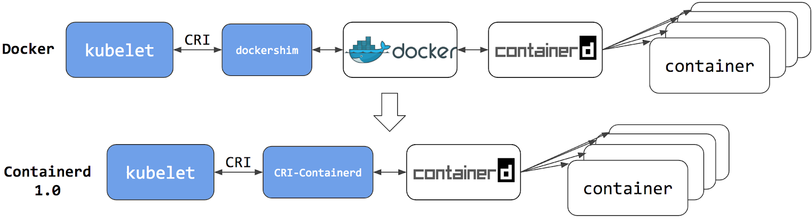
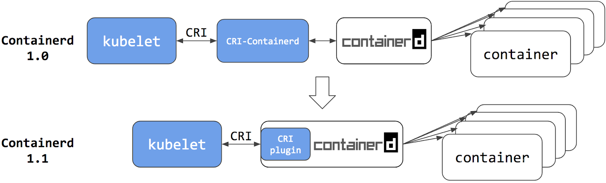

# 前言
虽然kubernetes已发展数年，其火红程度也席卷整个产业，然而我自己的观察结果还是满多人对kubernetes有一些误解，认为kubernetes是docker container的管理工具，事实上从kubernetes官网中就直接明确说明

> Kubernetes（K8s）是一个开源系统，用于自动化容器化应用程序的部署，扩展和管理。

kubernetes是用来管理containerized applications并不是专属于docker独享，作为一个container orchestrator的角色，kubernetes希望能够管理所有容器化的应用程式。

看到这边大概就可以想到就如同**Open Container Initiative (OCI)**一样，为了能够有效地衔接各式各样不同的Container Runtime解决方案，势必也需要推出相关的标准，就如同OCI一样，符合标准的解决方案就能够轻松的整合到kubernetes之中。于是**Container Runtime Interface(CRI)**标准就被设计且开发来

接下来我们将针对这个概念来细细诉说，到底什么是**Container Runtime Interface(CRI)**以及其如何运作。

# 容器运行时接口（CRI）
对于kubernetes来说，希望能够透过一个标准介面与各个Container Runtime解决方案衔接，这个衔接的接口标准就是所谓的Container Runtime。
由于CRI的标准就是一些相关的介面，这意味只要任何CRI Runtime有实力做这些介面，都可以跟kubernetes衔接来处理所有跟Pod有关的操作。

剩下的一个问题就是，之前所探讨过的docker运作流程

> docker client-> docker engine-> docker-containerd-> docker-containerd-shim-> runc->container

这个架构要怎么跟kubernetes & CRI整合?

# Docker和Kubernetes
解释Docker与kubernetes的最好方法就是阅读官方部落格的文章[kubernetes-containerd-integration-goes-ga](https://kubernetes.io/blog/2018/05/24/kubernetes-containerd-integration-goes-ga/)。为了节省读者的时间，接下来就帮大家导读一下这篇文章，以下的图片都来自于上述的官方部落格)

上面提到CRI本身是个沟通介面，这代表沟通的两方都需要根据这个界面去实现与满足。对于kubernetes来说，kubelet自己维护与开发的，要支援CRI本身就不是什么困难的事情。

但是另外一端如果要使用docker的话，那到底要怎么办? docker背后也是有公司在经营，也不是说改就改，这种情况下到底要如何将docker给整合进来？

最直观的想法就是如果没有办法使得docker本身支援CRI的标准，那就额外撰写一个转接器，其运作在kubelet与Docker，该应用程式上承CRI与kubernetes沟通，下承Docker API与Docker Engine沟通

早期的kubernetes采取了这种做法，kubelet内建相关了**dockershim(将 CRI 的调用翻译成 Docker 的 API)**的程式码来处理这段逻辑。这种做法可行，但是其实效能大大则扣，同时也把整体架构带到了更复杂的境界，引进愈来愈多的元件会对开发与除错带来更大的成本。

可以参考下图中的上半部份，而图中的下半部分则是后来的改变之处

反正最后都是透过containerd进行操作，而本身也不太需要docker自己的功能，那是否就直接将dockershim沟通的角色从docker engine转移到containerd即可。因此后来又有所谓的CRI-Containerd的出现。

到这个阶段，已经减少了一个沟通的Daemon,也就是docker engine。但是这样并不能满足想要最佳化的心情。

伴随着Containerd本身的功能开发，提供了Plugin这种外挂功能的特色后，将CRI-Containerd的功能直接整合到该Plugin内就可以直接再次减少一个元件，直接让kubelet与containerd直接沟通来创建相关的container.

kubernetes与各种不同CRI接口对接流程图

