在工作中遇到根目录容量不够，于是结合网上这篇文章，把虚拟机里扩展的十几个GB的容量扩展到根目录下

# CentOS7 LVM根分区扩容步骤

1.查看现有分区大小
```bash
df -TH
```
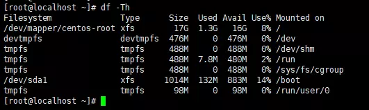

LVM分区，磁盘总大小为20G,根分区总容量为17G  
2.关机增加大小为30G\(测试环境使用的Vmware Workstation\)

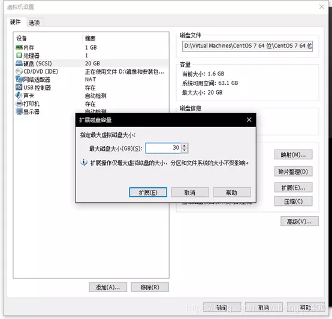  
扩展分区到30G  
3.查看扩容后磁盘大小
```bash
df -TH
lsblk
```
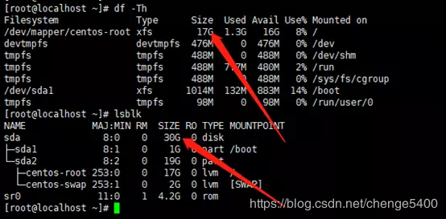

磁盘总大小为30G,根分区为17G  
4.创建分区
```bash
fdisk /dev/sda
```
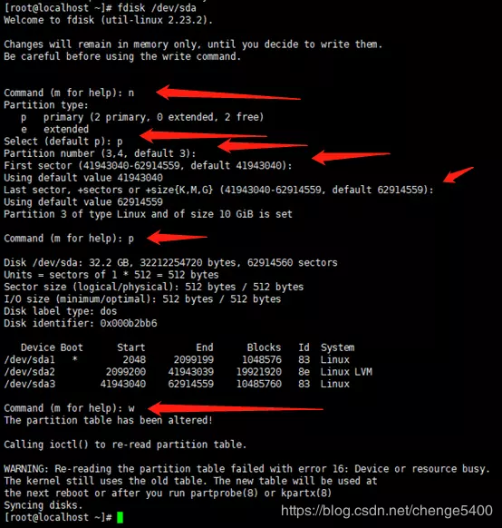

将sda剩余空间全部给sda3  
5.刷新分区并创建物理卷
```bash
partprobe /dev/sda
pvcreate /dev/sda3 
``` 
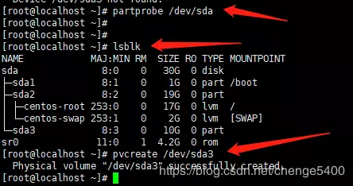

6.查看卷组名称，以及卷组使用情况
```bash
vgdisplay
```  
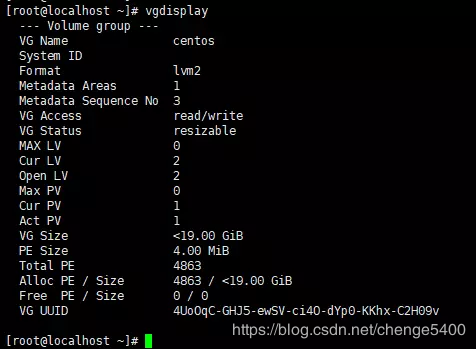

VG Name为centos  
7.将物理卷扩展到卷组
```bash
vgextend centos /dev/sda3
```
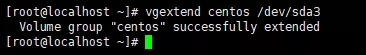

使用sda3扩展VG centos  
8.查看当前逻辑卷的空间状态
```bash
lvdisplay
``` 
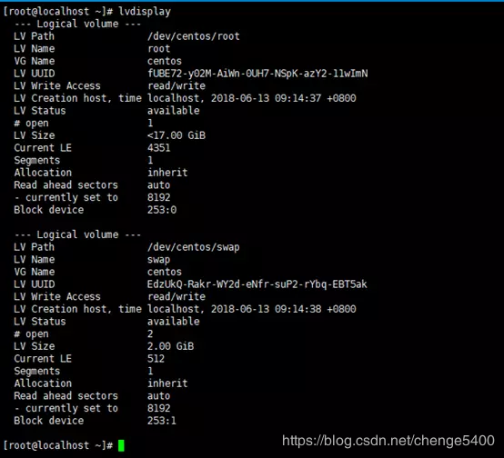

需要扩展LV /dev/centos/root  
9.将卷组中的空闲空间扩展到根分区逻辑卷
```bash
lvextend -l +100%FREE /dev/centos/root
```  
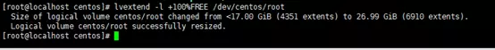

10.刷新根分区
```bash
xfs\_growfs /dev/centos/root
```
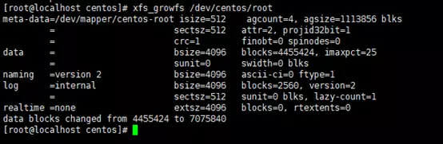

11.查看磁盘使用情况，扩展之前和之后是不一样的  
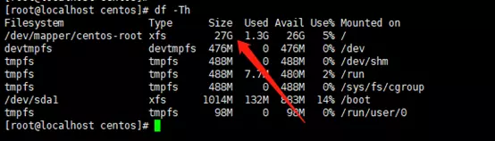

根分区已经变成27G

# CentOS7,非LVM根分区扩容步骤：

1.查看现有的分区大小  
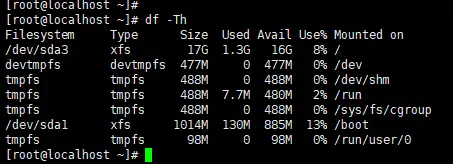

非LVM分区，目前磁盘大小为20G，根分区总容量为17G  
2.关机增加磁盘大小为30G  


3.查看磁盘扩容后状态
```bash
lsblk

dh -TH
```  
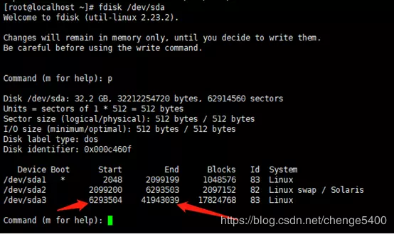

现在磁盘总大小为30G,根分区为17G  
4.进行分区扩展磁盘，记住根分区起始位置和结束位置  


5.删除根分区，切记不要保存  
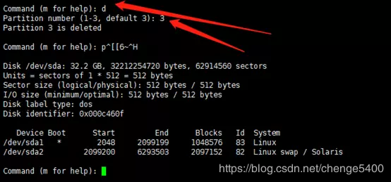

6.创建分区，箭头位置为分区起始位置  
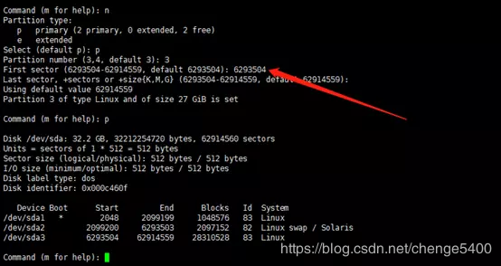

7.保存退出并刷新分区
```bash
partprobe /dev/sda
```  
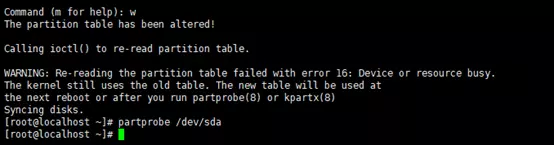

8.查看分区状态  
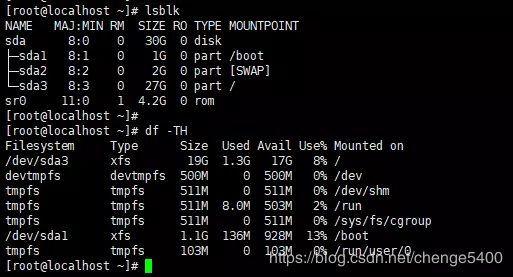

这里不知道为啥变成19G了。。  
9.刷新根分区并查看状态
```bash
xfs_growfs /dev/sda3
```
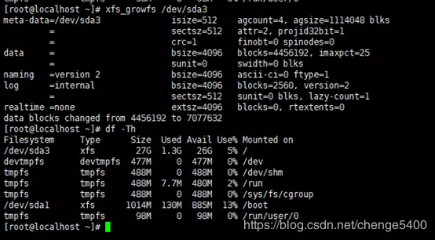

