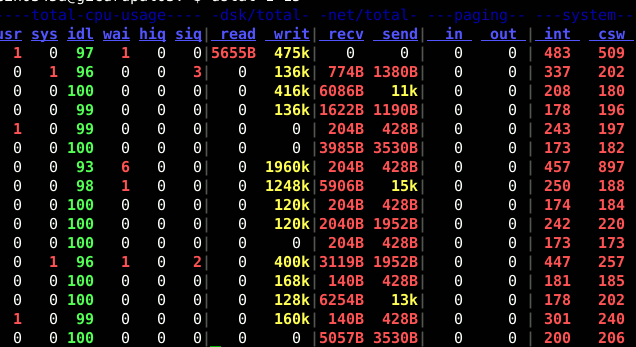
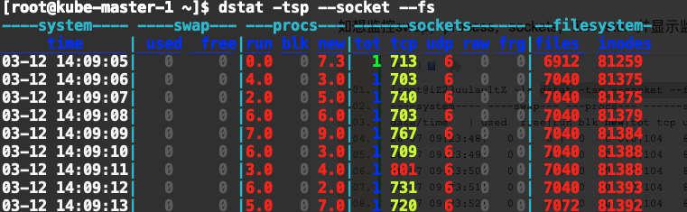

## dstat

dstat 是一个可以取代vmstat，iostat，netstat和ifstat这些命令的多功能产品。dstat克服了这些命令的局限并增加了一些另外的功能，增加了监控项，也变得更灵活了。dstat可以很方便监控系统运行状况并用于基准测试和排除故障。

dstat可以让你实时地看到所有系统资源，例如，你能够通过统计IDE控制器当前状态来比较磁盘利用率，或者直接通过网络带宽数值来比较磁盘的吞吐率（在相同的时间间隔内）。

## 特性
结合了vmstat，iostat，ifstat，netstat以及更多的信息
实时显示统计情况
在分析和排障时可以通过启用监控项并排序
模块化设计
使用python编写的，更方便扩展现有的工作任务
容易扩展和添加你的计数器（请为此做出贡献）
包含的许多扩展插件充分说明了增加新的监控项目是很方便的
可以分组统计块设备/网络设备，并给出总数
可以显示每台设备的当前状态
极准确的时间精度，即便是系统负荷较高也不会延迟显示
显示准确地单位和和限制转换误差范围
用不同的颜色显示不同的单位
显示中间结果延时小于1秒
支持输出CSV格式报表，并能导入到Gnumeric和Excel以生成图形

## 安装
Ubuntu/Mint和Debin系统：
本地软件库中有相关安装包，你可以用下面命令安装：
```bash
# sudo apt-get install dstat
```
RHEL/Centos和Fedora系统:
你可以在romforge软件库中添加有相关安装包，参照指导，使用如下命令很简单就能进行安装：
```bash
# yum install dstat
```
ArchLinux系统：
相关软件包在社区资源库中，你可以用这个命令来安装：
```bash
# pacman -S dstat
```
## 使用方法

dstat的基本用法就是输入dstat命令，输出如下：


这是默认输出显示的信息：
- CPU状态：CPU的使用率。这项报告更有趣的部分是显示了用户，系统和空闲部分，这更好地分析了CPU当前的使用状况。如果你看到"wait"一栏中，CPU的状态是一个高使用率值，那说明系统存在一些其它问题。当CPU的状态处在"waits"时，那是因为它正在等待I/O设备（例如内存，磁盘或者网络）的响应而且还没有收到。

- 磁盘统计：磁盘的读写操作，这一栏显示磁盘的读、写总数。

- 网络统计：网络设备发送和接受的数据，这一栏显示的网络收、发数据总数。

- 分页统计：系统的分页活动。分页指的是一种内存管理技术用于查找系统场景，一个较大的分页表明系统正在使用大量的交换空间，或者说内存非常分散，大多数情况下你都希望看到page in（换入）和page out（换出）的值是0 0。

- 系统统计：这一项显示的是中断（int）和上下文切换（csw）。这项统计仅在有比较基线时才有意义。这一栏中较高的统计值通常表示大量的进程造成拥塞，需要对CPU进行关注。你的服务器一般情况下都会运行运行一些程序，所以这项总是显示一些数值。

默认情况下，dstat每秒都会刷新数据。如果想退出dstat，你可以按"CTRL-C"键。

需要注意的是报告的第一行，通常这里所有的统计都不显示数值的。

这是由于dstat会通过上一次的报告来给出一个总结，所以第一次运行时是没有平均值和总值的相关数据。

但是dstat可以通过传递2个参数运行来控制报告间隔和报告数量。例如，如果你想要dstat输出默认监控、报表输出的时间间隔为3秒钟,并且报表中输出10个结果，你可以运行如下命令：
```bash
dstat 3 10
```

在dstat命令中有很多参数可选，你可以通过man dstat命令查看，大多数常用的参数有这些：
- -a:  等同于 -cdngy
- -c(--cpu): 显示cpu情况
- -d(--disk):  显示硬盘情况
- -l(--load)：显示负载统计量
- -n(--net):  显示网络情况
- -p(--proc): 显示进程状态
- -m(--memory)：显示内存使用率（包括used，buffer，cache，free值）
- -r : 显示I/O统计
- -s : 显示交换分区使用情况
- -t : 将当前时间显示在第一行
- -f : 等同于: -C -D -I -N and -S lists
- -y(--sys): 显示系统状态(中断以及上下文切换)
- –-fs ：显示文件系统统计数据（包括文件总数量和inodes值）
- –-nocolor ：不显示颜色（有时候有用）
- –-socket ：显示网络统计数据
- –-tcp ：显示常用的TCP统计
- –-udp ：显示监听的UDP接口及其当前用量的一些动态数据
当然不止这些用法，dstat附带了一些插件很大程度地扩展了它的功能。你可以通过查看/usr/share/dstat目录来查看它们的一些使用方法，可以通过dstat --list查看。
```bash
[root@master ~]# dstat --list
internal:
	aio, cpu, cpu24, disk, disk24, disk24old, epoch, fs, int, int24, io, ipc, load, lock, mem, net, page, page24, proc, raw, socket,
	swap, swapold, sys, tcp, time, udp, unix, vm
/usr/share/dstat:
	battery, battery-remain, cpufreq, dbus, disk-tps, disk-util, dstat, dstat-cpu, dstat-ctxt, dstat-mem, fan, freespace, gpfs, gpfs-ops,
	helloworld, innodb-buffer, innodb-io, innodb-ops, lustre, memcache-hits, mysql-io, mysql-keys, mysql5-cmds, mysql5-conn, mysql5-io,
	mysql5-keys, net-packets, nfs3, nfs3-ops, nfsd3, nfsd3-ops, ntp, postfix, power, proc-count, qmail, rpc, rpcd, sendmail, snooze,
	squid, test, thermal, top-bio, top-bio-adv, top-childwait, top-cpu, top-cpu-adv, top-cputime, top-cputime-avg, top-int, top-io,
	top-io-adv, top-latency, top-latency-avg, top-mem, top-oom, utmp, vm-memctl, vmk-hba, vmk-int, vmk-nic, vz-cpu, vz-io, vz-ubc, wifi
```

常用的有这些：
- -–disk-util ：显示某一时间磁盘的忙碌状况
- -–freespace ：显示当前磁盘空间使用率
- -–proc-count ：显示正在运行的程序数量
- -–top-bio ：指出块I/O最大的进程
- -–top-cpu ：图形化显示CPU占用最大的进程
- -–top-io ：显示正常I/O最大的进程
- -–top-mem ：显示占用最多内存的进程

## 案例

### -c -y查看CPU使用情况
```bash
# -C 可以指定要查看的CPU ID
[root@kube-master-1 ~]$ dstat -c -C 0,1
-------cpu0-usage--------------cpu1-usage------
usr sys idl wai hiq siq:usr sys idl wai hiq siq
 16  31  35   1   0  17: 19  26  52   3   0   0
 16  41  24   0   0  19: 18  31  51   0   0   0
 20  34  24   1   0  22: 26  29  45   1   0   0
 24  36  22   0   0  19: 23  35  40   0   0   1
 21  42  19   1   0  18: 25  25  48   1   0   0
 18  36  25   0   0  21: 20  25  54   0   0   1
 15  34  30   0   0  21: 19  25  55   1   0   0
 17  43  21   1   0  18: 19  23  58   0   0   0
 16  44  22   0   0  17: 18  29  53   0   0   1

[root@kube-master-1 ~]$ dstat -c -y
----total-cpu-usage---- ---system--
usr sys idl wai hiq siq| int   csw
 17  29  43   2   0   9|  30k  156k
 19  37  31   3   0  11| 100k  172k
 20  37  28   5   0  10|  93k  160k
 18  37  31   3   0  11| 100k  170k
 19  37  30   3   0  10|  99k  170k
 21  36  29   2   0  12|  97k  166k
 22  36  28   4   0  10|  88k  154k
 21  36  29   5   0  10| 100k  171k
 23  36  24   6   0  10|  98k  167k
```
### 如想监控swap，process，sockets，filesystem并显示监控的时间：
```bash
[root@kube-master-1 ~]$ dstat -tsp --socket --fs
----system---- ----swap--- ---procs--- ------sockets------ --filesystem-
     time     | used  free|run blk new|tot tcp udp raw frg|files  inodes
03-12 14:09:05|   0     0 |0.0   0 7.3|  1 713   6   0   0| 6912  81259
03-12 14:09:06|   0     0 |4.0   0 3.0|  1 703   6   0   0| 7040  81375
03-12 14:09:07|   0     0 |2.0   0 5.0|  1 740   6   0   0| 7040  81375
03-12 14:09:08|   0     0 |6.0   0 6.0|  1 703   6   0   0| 7040  81379
```


### 将结果输出到文件
```bash
[root@kube-master-1 ~]$ dstat -tsp --socket --fs --output /tmp/ds.csv
----system---- ----swap--- ---procs--- ------sockets------ --filesystem-
     time     | used  free|run blk new|tot tcp udp raw frg|files  inodes
03-12 14:10:38|   0     0 |0.0   0 7.3|  2 777   6   0   0| 7168  81918
03-12 14:10:39|   0     0 |3.0   0 3.0|  2 806   6   0   0| 7168  81921
03-12 14:10:40|   0     0 | 11   0 4.0|  2 789   6   0   0| 7168  81923
03-12 14:10:41|   0     0 |4.0   0 4.0|  2 803   6   0   0| 7168  81926

[root@kube-master-1 ~]$ cat /tmp/ds.csv
"Dstat 0.7.2 CSV output"
"Author:","Dag Wieers <dag@wieers.com>",,,,"URL:","http://dag.wieers.com/home-made/dstat/"
"Host:","kube-master-1",,,,"User:","root"
"Cmdline:","dstat -tsp --socket --fs --output /tmp/ds.csv",,,,"Date:","03 Dec 2020 14:10:38 CST"

"system","swap",,"procs",,,"sockets",,,,,"filesystem",
"time","used","free","run","blk","new","tot","tcp","udp","raw","frg","files","inodes"
03-12 14:10:38,0.0,0.0,0.000,0.0,7.314,2015.0,777.0,6.0,0.0,0.0,7168.0,81918.0
03-12 14:10:39,0.0,0.0,3.0,0.0,3.0,2019.0,806.0,6.0,0.0,0.0,7168.0,81921.0
03-12 14:10:40,0.0,0.0,11.0,0.0,4.0,2019.0,789.0,6.0,0.0,0.0,7168.0,81923.0
03-12 14:10:41,0.0,0.0,4.0,0.0,4.0,2023.0,803.0,6.0,0.0,0.0,7168.0,81926.0
03-12 14:10:42,0.0,0.0,1.0,0.0,3.0,2024.0,781.0,6.0,0.0,0.0,7168.0,81927.0
03-12 14:10:43,0.0,0.0,6.0,0.0,5.0,2027.0,805.0,6.0,0.0,0.0,7168.0,81930.0
03-12 14:10:44,0.0,0.0,3.0,0.0,8.0,2027.0,796.0,6.0,0.0,0.0,7168.0,81930.0
03-12 14:10:45,0.0,0.0,3.0,0.0,4.0,2032.0,803.0,6.0,0.0,0.0,7168.0,81937.0
03-12 14:10:46,0.0,0.0,6.0,0.0,8.0,2031.0,790.0,6.0,0.0,0.0,7200.0,81935.0
03-12 14:10:47,0.0,0.0,2.0,0.0,2.0,2034.0,815.0,6.0,0.0,0.0,7200.0,81939.0
```


