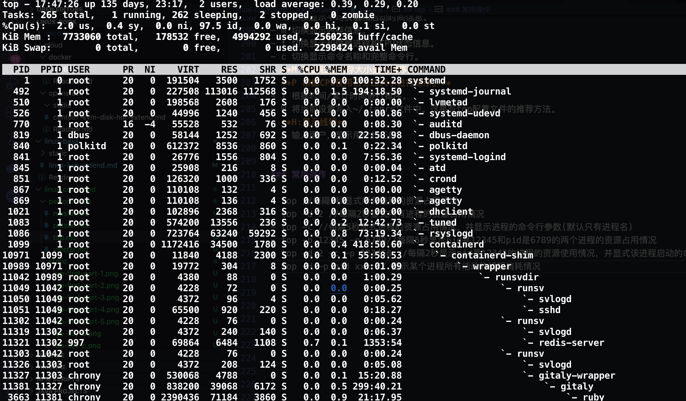

## top

### 统计信息区（系统资源信息区）
前五行，即列表上方的五行


第一行：输出系统任务队列信息
- 18:46:38：系统当前时间 
- up 2days 1:54：系统开机后到现在的总运行时间
- 1 user：当前登录用户数
- load average: 0, 0.01, 0.05：系统负载，系统运行队列的平均利用率，可认为是可运行进程的平均数；三个数值分别为 1分钟、5分钟、15分钟前到现在的平均值；单核CPU中load average的值=1时表示满负荷状态，多核CPU中满负载的load average值为1*CPU核数
 

第二行：任务进程信息


- total：系统全部进程的数量
- running：运行状态的进程数量
- sleeping：睡眠状态的进程数量
- stoped：停止状态的进程数量
- zombie：僵尸进程数量
 

第三行：CPU信息

- us：用户空间占用CPU百分比
- sy：内核空间占用CPU百分比
- ni：已调整优先级的用户进程的CPU百分比
- id：空闲CPU百分比，越低说明CPU使用率越高
- wa：等待IO完成的CPU百分比(进程处于D状态)
- hi：处理硬件中断的占用CPU百分比
- si：处理软中断占用CPU百分比
- st：虚拟机占用CPU百分比

> t: 切换 CPU 部分的展示方式，例如数值还是进度条，也可以切换到关闭这个区域。    
> 1(digit one): 切换单个 CPU 和总体 CPU 的显示。       
> 2: 按照 NUMA Node 展示。     
> 3: 展示指定 NUMA Node 下的所有 CPU。     
> H: 显示线程显示，默认是进程。   

第四行：物理内存信息


以下内存单位均为MB
- total：物理内存总量
- free：空闲内存总量
- used：使用中内存总量
- buff/cacge：用于内核缓存的内存量

> 如下快捷键可以用来控制这个区域：
> - m: 切换 memory 部分的展示方式，例如数值还是进度条，也可以切换到关闭这个区域
> - E: 切换内存单位。 

第五行：交换区内存信息

- total：交换区总量
- free：空闲交换区总量
- used：使用的交换区总量
- avail Mem：可用交换区总量
注：如果used不断在变化， 说明内核在不断进行内存和swap的数据交换，说明内存真的不够用了

问题：内存空间还剩多少空闲呢？

答案：空闲内存=空闲内存总量+缓冲内存量 +可用交换区总量


### 进程信息区（进程列表）

- PID：进程号
- USER：运行进程的用户
- PR：优先级
- NI：nice值。负值表示高优先级，正值表示低优先级
- VIRT：进程虚拟内存的大小，只要是进程申请过的内存，即便还没有真正分配物理内存，也会计算在内；VIRT=SWAP+RES
- RES：进程实际使用的物理内存大小，不包括 Swap 和共享内存
- SHR：共享内存大小，比如与其他进程共同使用的共享内存、加载的动态链接库以及程序的代码段等
- S：进程状态
- %CPU：CPU 使用率
- %MEM：进程使用武力内存占系统总内存的百分比
- TIME+：上次启动后至今的总运行时间
- COMMAND：命令名or命令行
 

#### 内存的重点
- 虚拟内存通常并不会全部分配给物理内存，从上面的输出可以发现每个进程的虚拟内存都比物理内存大得多
- 共享内存 SHR 并不一定是共享的，比如程序的代码段、非共享的动态链接库
- SHR 也包括了进程间真正共享的内容，所以在计算多个进程的内存使用时，不要把所有进程的 SHR 直接相加得出结果
 

#### %CPU
- 表示进程的 CPU 使用率
- 是用户态和内核态 CPU 使用率的总和（us+sy）
- 包括进程用户空间使用的 CPU、通过系统调用执行的内核空间 CPU、在就绪队列等待运行的 CPU
- 在虚拟环境中， 它还包括了运行虚拟机占用的 CPU
- 没有细分进程的用户态 CPU 和内核态 CPU
 

#### 进程状态
- R=运行状态
- S=睡眠状态
- D=不可中断的睡眠状态
- T=跟踪/停止
- Z=僵尸进程

### 常用方式
1、查看所有进程的资源占用情况
top
```bash
top - 17:03:10 up 135 days, 22:32,  2 users,  load average: 0.13, 0.29, 0.39
Tasks: 270 total,   1 running, 267 sleeping,   2 stopped,   0 zombie
%Cpu(s):  1.2 us,  0.5 sy,  0.0 ni, 98.3 id,  0.0 wa,  0.0 hi,  0.0 si,  0.0 st
KiB Mem :  7733060 total,   360392 free,  4845084 used,  2527584 buff/cache
KiB Swap:        0 total,        0 free,        0 used.  2447676 avail Mem

  PID USER      PR  NI    VIRT    RES    SHR S  %CPU %MEM     TIME+ COMMAND
 2171 chrony    20   0 1686728 692492   6432 S   2.7  9.0   3044:31 bundle
11345 992       20   0 2289848 198680  10508 S   1.0  2.6   1232:43 prometheus
11321 997       20   0   69864   6496   1108 S   0.7  0.1   1353:33 redis-server
 9893 chrony    20   0 2390436  70380   3792 S   0.3  0.9  21:14.09 ruby
14120 root      10 -10  148392  25184   6544 S   0.3  0.3 202:53.60 AliYunDun
    1 root      20   0  191504   3500   1752 S   0.0  0.0 100:30.80 systemd
    2 root      20   0       0      0      0 S   0.0  0.0   0:01.20 kthreadd
    4 root       0 -20       0      0      0 S   0.0  0.0   0:00.00 kworker/0:0H
    6 root      20   0       0      0      0 S   0.0  0.0   2:25.19 ksoftirqd/0
    7 root      rt   0       0      0      0 S   0.0  0.0   0:53.31 migration/0
    8 root      20   0       0      0      0 S   0.0  0.0   0:00.00 rcu_bh
    9 root      20   0       0      0      0 S   0.0  0.0  68:47.78 rcu_sched
```

2、监控每个逻辑CPU的状况
top  ，按 1
```bash
top - 17:04:25 up 135 days, 22:34,  2 users,  load average: 0.10, 0.25, 0.38
Tasks: 271 total,   1 running, 268 sleeping,   2 stopped,   0 zombie
%Cpu0  :  2.0 us,  0.3 sy,  0.0 ni, 97.7 id,  0.0 wa,  0.0 hi,  0.0 si,  0.0 st
%Cpu1  :  1.3 us,  0.7 sy,  0.0 ni, 98.0 id,  0.0 wa,  0.0 hi,  0.0 si,  0.0 st
%Cpu2  :  1.7 us,  0.3 sy,  0.0 ni, 98.0 id,  0.0 wa,  0.0 hi,  0.0 si,  0.0 st
%Cpu3  :  2.3 us,  0.7 sy,  0.0 ni, 97.0 id,  0.0 wa,  0.0 hi,  0.0 si,  0.0 st
KiB Mem :  7733060 total,   313884 free,  4889960 used,  2529216 buff/cache
KiB Swap:        0 total,        0 free,        0 used.  2402800 avail Mem

  PID USER      PR  NI    VIRT    RES    SHR S  %CPU %MEM     TIME+ COMMAND
14120 root      10 -10  148392  25184   6544 S   3.3  0.3 202:55.59 AliYunDun
 2171 chrony    20   0 1686728 691716   6432 S   2.7  8.9   3044:33 bundle
11321 997       20   0   69864   6380   1108 S   0.7  0.1   1353:34 redis-server
11345 992       20   0 2289848 199692  10508 S   0.7  2.6   1232:44 prometheus
 1083 root      20   0  574200  13556    236 S   0.3  0.2  12:42.57 tuned
 7372 polkitd   20   0 1664132 243440    904 S   0.3  3.1   5:46.92 mysqld
 9893 chrony    20   0 2390436  70380   3792 S   0.3  0.9  21:14.20 ruby
    1 root      20   0  191504   3500   1752 S   0.0  0.0 100:30.85 systemd
    2 root      20   0       0      0      0 S   0.0  0.0   0:01.20 kthreadd
    4 root       0 -20       0      0      0 S   0.0  0.0   0:00.00 kworker/0:0H
    6 root      20   0       0      0      0 S   0.0  0.0   2:25.19 ksoftirqd/0
    7 root      rt   0       0      0      0 S   0.0  0.0   0:53.31 migration/0
    8 root      20   0       0      0      0 S   0.0  0.0   0:00.00 rcu_bh
    9 root      20   0       0      0      0 S   0.0  0.0  68:47.81 rcu_sched
```

3、高亮显示当前运行进程
top ，按 b


4、显示 完整命令
top ，按 c


5、切换显示CPU、隐藏CPU
top，按t


6、按CPU使用率从大到小排序
top，按P


7、切换显示Memory
top，按m


8、按Memory占用率从大到小排序
top，按M


9、按累计运行时间Time从大到小排序
top，按T


10、高亮CPU列
top，按x


11、通过”shift + >”或”shift + <”可以向右或左改变排序列
top shift + >或shift + <


12、森林视图(展示进程父子关系)


13、设置要展示哪些字段？要根据哪个字段排序
top 其实可以展示很多内容，我们可以定义要展示哪些字段。在全屏模式下，按 f或者F 进入字段管理界面.


首先要注意的是第一行，这个界面可以为 4 个 window 分别设置要展示的字段，最上面一行提示当前正在为哪个 window 设置字段，以及当前使用的排序字段是哪个。同样的，可以通过可以按 a 或者 w 来切换 window。

然后可以上下移动到想要处理的字段，**按空格或者 d 切换是否展示**，按 s 设置用该字段进行排序，按 q 或者 ESC 退出这个界面。前面型号的表示选中。要调整字段的排列顺序，**先选中一个字段，按右键表示开始移动**，然后上下移动，然后**按左键表示移动结束**

### top交互命令

- Ctrl+L 擦除并且重写屏幕。 
- h或者? 显示帮助画面，给出一些简短的命令总结说明。 
- k 终止一个进程。系统将提示用户输入需要终止的进程PID，以及需要发送给该进程什么样的信号。一般的终止进程可以使用15信号；如果不能正常结束那就使用信号9强制结束该进程。默认值是信号15。在安全模式中此命令被屏蔽。 
- i 忽略闲置和僵死进程。这是一个开关式命令。 
- q 退出程序。 
- r 重新安排一个进程的优先级别。系统提示用户输入需要改变的进程PID以及需要设置的进程优先级值。输入一个正值将使优先级降低，反之则可以使该进程拥有更高的优先权。默认值是10。 
S 切换到累计模式。 
- s 改变两次刷新之间的延迟时间。系统将提示用户输入新的时间，单位为s。如果有小数，就换算成m s。输入0值则系统将不断刷新，默认值是5 s。需要注意的是如果设置太小的时间，很可能会引起不断刷新，从而根本来不及看清显示的情况，而且系统负载也会大大增加。 
- **f:进入字段显示配置模式，可增加或者移除显示字段，按相应的字母新增或去除；**
- **o:进入字段顺序设置模式，可配置显示位置顺序，按相应的字母往下移动，按“shift+相应的字母”往上移动**
- f或者F 从当前显示中添加或者删除项目。 
- o或者O 改变显示项目的顺序。 
- l 切换显示平均负载和启动时间信息。 
- m 切换显示内存信息。 
- t 切换显示和隐藏进程和CPU状态信息。 
- c 切换显示命令名称和完整命令行。 
- **M 根据驻留内存大小进行排序。** 
- **P 根据CPU使用百分比大小进行排序。** 
- T 根据时间/累计时间进行排序。 
- W 将当前设置写入~/.toprc文件中。这是写top配置文件的推荐方法。
- **H:显示线程**
- u 输入用户，显示用户的任务


### 常用操作

- top //每隔5秒显式所有进程的资源占用情况
- top -d 2 //每隔2秒显式所有进程的资源占用情况
- top -c //每隔5秒显式进程的资源占用情况，并显示进程的命令行参数(默认只有进程名)
- top -p 12345 -p 6789//每隔5秒显示pid是12345和pid是6789的两个进程的资源占用情况
- top -d 2 -c -p 123456 //每隔2秒显示pid是12345的进程的资源使用情况，并显式该进程启动的命令行参数
- top -H -p pid xxx // 显示某个进程所有活动的线程消耗情况


