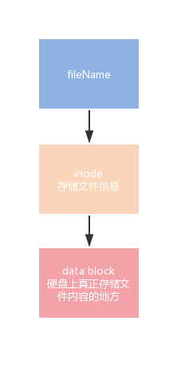
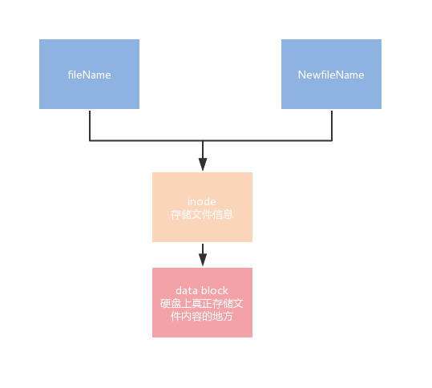
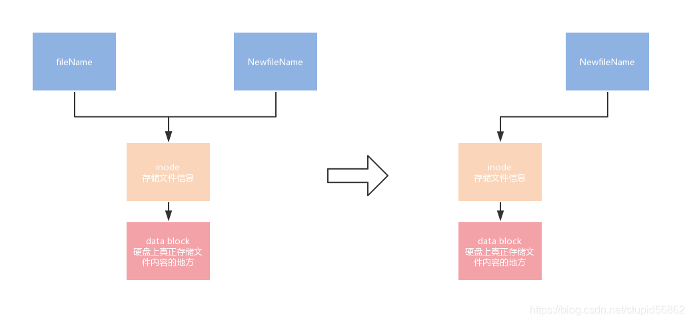
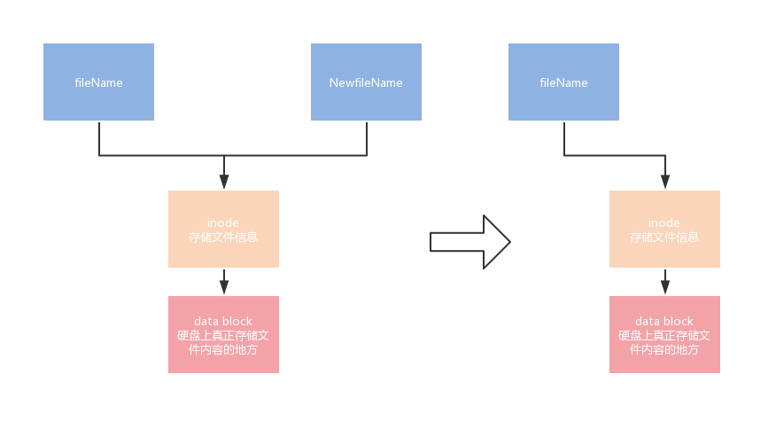

同 CPU、内存一样，磁盘和文件系统的管理，也是操作系统最核心的功能。
- 磁盘为系统提供了最基本的持久化存储。
- 文件系统则在磁盘的基础上，提供了一个用来管理文件的树状结构。

那么，磁盘和文件系统是怎么工作的呢？又有哪些指标可以衡量它们的性能呢？

今天，我就带你先来看看，Linux 文件系统的工作原理。磁盘的工作原理，我们下一节再来学习。

## 索引节点和目录项

文件系统，本身是对存储设备上的文件，进行组织管理的机制。组织方式不同，就会形成不同的文件系统。

你要记住最重要的一点，在 Linux 中一切皆文件。不仅普通的文件和目录，就连块设备、套接字、管道等，也都要通过统一的文件系统来管理。

为了方便管理，Linux 文件系统为每个文件都分配两个数据结构，索引节点（index node）和目录项（directory entry）。它们主要用来记录文件的元信息和目录结构。

- 索引节点，简称为 inode，用来记录文件的元数据，比如 inode 编号、文件大小、访问权限、修改日期、数据的位置等。索引节点和文件一一对应，它跟文件内容一样，都会被持久化存储到磁盘中。所以记住，索引节点同样占用磁盘空间。
 
- 目录项，简称为 dentry，用来记录文件的名字、索引节点指针以及与其他目录项的关联关系(父目录、子目录)。多个关联的目录项，就构成了文件系统的目录结构。不过，不同于索引节点，目录项是由内核维护的一个内存数据结构，所以通常也被叫做目录项缓存。

换句话说，索引节点是每个文件的唯一标志，而目录项维护的正是文件系统的树状结构。目录项和索引节点的关系是多对一，你可以简单理解为，一个文件可以有多个别名。

举个例子，通过硬链接为文件创建的别名，就会对应不同的目录项，不过这些目录项本质上还是链接同一个文件，所以，它们的索引节点相同。

索引节点和目录项纪录了文件的元数据，以及文件间的目录关系，那么具体来说，文件数据到底是怎么存储的呢？是不是直接写到磁盘中就好了呢？

实际上，磁盘读写的最小单位是扇区，然而扇区只有 512B 大小，如果每次都读写这么小的单位，效率一定很低。所以，文件系统又把连续的扇区组成了逻辑块，然后每次都以逻辑块为最小单元，来管理数据。常见的逻辑块大小为 4KB，也就是由连续的 8 个扇区组成。

为了帮助你理解目录项、索引节点以及文件数据的关系，我画了一张示意图。你可以对照着这张图，来回忆刚刚讲过的内容，把知识和细节串联起来。


不过，这里有两点需要你注意。

第一，目录项本身就是一个内存缓存，而索引节点则是存储在磁盘中的数据。在前面的 Buffer 和 Cache 原理中，我曾经提到过，为了协调慢速磁盘与快速 CPU 的性能差异，文件内容会缓存到页缓存 Cache 中。

那么，你应该想到，这些索引节点自然也会缓存到内存中，加速文件的访问。

第二，磁盘在执行文件系统格式化时，会被分成三个存储区域，超级块、索引节点区和数据块区。其中，
- 超级块，存储整个文件系统的状态。
- 索引节点区，用来存储索引节点。
- 数据块区，则用来存储文件数据。

## 硬盘
硬盘设备是由大量的扇区组成的。以 MBR 分区为例。每个扇区的容量为 512 字节。其中第一个扇区最重要。它里面保存着主引导记录与分区表信息。就第一个扇区来讲，主引导记录需要占用 446 字节，分区表为 64 字节，结束符占用 2 字节。其中分区表每记录一个分区信息就需要 16 字节，这样一来，最多就只有4个分区信息可以写到第一扇区中，这4个分区就是4个主分区。

第一个扇区最多只能创建出4个分区 ?
为了解决分区个数不够的问题，可以将第一个扇区的分区表中16个字节(原本要写入主分区信息)的空间(称之为扩展分区)拿出来指向另一个分区。

也就是说，扩展分区并不是一个真正的分区，而像是有一个占用 16 字节的分区表空间的指针，一个指向另外一个分区的指针。这样一来，用户一般会选择使用3个主分区+1个扩展分区的方法，然后在扩展分区中创建无数个逻辑分区，从而来满足多分区(大于4个)的需求。

Linux 系统中有一个名为 superblock 的 “硬盘地图”。 Linux 并不是把文件内容直接写入到 superblock 中，而是在里面记录着整个文件系统的信息。

Linux 把每个文件的权限与属性记录在 inode("索引节点：index node ") 中，而且每个文件占用一个独立的 inode 表格，该表格的默认大小为 128 字节。

里面记录着如下信息 ：
- 文件的访问权限(read、write、execute)
- 该文件的所有者与所属组(owner、group)
- 该文件的大小(size)
- 该文件的创建或内容修改时间(ctime)
- 该文件的最后一次访问时间(atime)
- 该文件的修改时间(mtime)
- 文件的特殊权限(SUID、SGID、SBIT)
- 该文件的真实数据地址(point)。

## 硬链接与软链接(符号链接)

### 硬链接
硬链接(hard link) ： 可以将它理解为一个 “指向原始文件 inode 的指针”，系统不为它分配独立的 inode 和 文件。所以，硬链接文件与原始文件其实是同一个文件，只是名字不同。我们每添加一个硬链接，该文件的 innode 连接数就会增加 1 ； 而且只有当该文件的 inode 连接数为 0 时，才算彻底被将它删除。因此即便删除原始文件，依然可以通过硬链接文件来访问。**需要注意的是，我们不能跨分区对文件进行链接，不能对目录文件进行创建硬链接**
硬链接特点：
1. 文件有相同的inode号及data block，这使得修改其中一个硬链接文件属性或文件数据时，其他硬链接文件都会发生相应修改；
2. 只能对已存在的文件进行创建；
3. 不能跨文件系统（即分区）进行创建；
4. 不能对目录文件进行创建；
5. 删除其中一个硬链接文件时，不会对其他硬链接文件产生影响。 

举例： 磁盘上有个文件

此时新建一个硬链接
```bash
root@luke:~# ln filename NewFileName

```


从上图中可以看出，fileName 和 newFileName 都指向同一个文件，因此，无论你编辑哪一个文件，另一个文件也会做相应的改变。比如:
```bash
root@luke:~# echo 'helloworld' >> filename
root@luke:~# cat NewFileName
helloworld // 此时原文件中也多出了 helloWorld。
# 文件的inode links链接计数变为2。
root@luke:~# stat filename
  File: filename
  Size: 11        	Blocks: 8          IO Block: 4096   regular file
Device: fd00h/64768d	Inode: 326970      Links: 2
Access: (0644/-rw-r--r--)  Uid: (    0/    root)   Gid: (    0/    root)
Access: 2021-01-04 07:41:30.039547580 +0000
Modify: 2021-01-04 07:41:27.299517223 +0000
Change: 2021-01-04 07:41:27.299517223 +0000
 Birth: -
root@luke:~#
```
删除其中任意一个文件，另外一个文件的内容还存在。






### 软链接(符号链接)
软链接有自己的索引节点(即inode号)和用户数据块(datablock)，但是用户数据块存储的内容是另一文件的路径名的指向。软链接其实就是一个普通文件，只是数据块内容有点特殊。
软链接特点：
1. 软链接有自己的文件属性及权限等；
2. 可对不存在的文件或目录创建软链接；
3. 软链接可交叉文件系统；
4. 软链接可对文件或目录创建；
5. 创建软链接时，链接计数 i_nlink 不会增加；
6. 删除软链接并不影响被指向的文件，但若被指向的原文件被删除，则相关软连接被称为死链接（即 dangling link，若被指向路径文件被重新创建，死链接可恢复为正常的软链接）


### 隐藏的问题

一个空目录的链接计数为2，这是由于目录文件本身以及其下的'.'文件。
```bash
root@luke:~# stat test
  File: test
  Size: 4096      	Blocks: 8          IO Block: 4096   directory
Device: fd00h/64768d	Inode: 329609      Links: 2
Access: (0755/drwxr-xr-x)  Uid: (    0/    root)   Gid: (    0/    root)
Access: 2021-01-04 07:58:58.061774330 +0000
Modify: 2020-12-20 03:28:19.469698814 +0000
Change: 2020-12-20 03:28:19.469698814 +0000
 Birth: -
root@luke:~# ls -id test test/.
329609 test  329609 test/.
```

### 查找软链接与硬链接
```bash
# 查找在路径 /home 下的文件 data.txt 的软链接
root@luke:~# find /home -lname data.txt 
/home/harris/debug/test2/a 
 
# 查看路径 /home 有相同 inode 的所有硬链接
root@luke:~# find /home -samefile /home/harris/debug/test3/old.file 
/home/harris/debug/test3/hard.link 
/home/harris/debug/test3/old.file 
 
root@luke:~# find /home -inum 660650 
/home/harris/debug/test3/hard.link 
/home/harris/debug/test3/old.file 
 
// 列出路径 /home/harris/debug/ 下的所有软链接文件
root@luke:~# find /home/harris/debug/ -type l -ls 
656662 0 lrwxrwxrwx 1 harris harris 1 Sep 1 14:37 /home/harris/debug/test2/b -> a
656627 0 lrwxrwxrwx 1 harris harris 8 Sep 1 14:37 /home/harris/debug/test2/a -> 
data.txt
789467 0 lrwxrwxrwx 1 root root 8 Sep 1 18:00 /home/harris/debug/test/soft.link -> 
old.file 
789496    0 lrwxrwxrwx   1 root     root            7 Sep  1 18:01 
/home/harris/debug/test/soft.link.dir -> old.dir
```

## 虚拟文件系统
目录项、索引节点、逻辑块以及超级块，构成了 Linux 文件系统的四大基本要素。不过，为了支持各种不同的文件系统，Linux 内核在用户进程和文件系统的中间，又引入了一个抽象层，也就是虚拟文件系统 VFS（Virtual File System）。

VFS 定义了一组所有文件系统都支持的数据结构和标准接口。这样，用户进程和内核中的其他子系统，只需要跟 VFS 提供的统一接口进行交互就可以了，而不需要再关心底层各种文件系统的实现细节。

这里，我画了一张 Linux 文件系统的架构图，帮你更好地理解系统调用、VFS、缓存、文件系统以及块存储之间的关系。


通过这张图，你可以看到，在 VFS 的下方，Linux 支持各种各样的文件系统，如 Ext4、XFS、NFS 等等。按照存储位置的不同，这些文件系统可以分为三类。
- 第一类是基于磁盘的文件系统，也就是把数据直接存储在计算机本地挂载的磁盘中。常见的 Ext4、XFS、OverlayFS 等，都是这类文件系统。
- 第二类是基于内存的文件系统，也就是我们常说的虚拟文件系统。这类文件系统，不需要任何磁盘分配存储空间，但会占用内存。我们经常用到的 /proc 文件系统，其实就是一种最常见的虚拟文件系统。此外，/sys 文件系统也属于这一类，主要向用户空间导出层次化的内核对象。
- 第三类是网络文件系统，也就是用来访问其他计算机数据的文件系统，比如 NFS、SMB、iSCSI 等。

这些文件系统，要先挂载到 VFS 目录树中的某个子目录（称为挂载点），然后才能访问其中的文件。拿第一类，也就是基于磁盘的文件系统为例，在安装系统时，要先挂载一个根目录（/），在根目录下再把其他文件系统（比如其他的磁盘分区、/proc 文件系统、/sys 文件系统、NFS 等）挂载进来。

## 文件系统 I/O

把文件系统挂载到挂载点后，你就能通过挂载点，再去访问它管理的文件了。VFS 提供了一组标准的文件访问接口。这些接口以系统调用的方式，提供给应用程序使用。

就拿 cat 命令来说，它首先调用 open() ，打开一个文件；然后调用 read() ，读取文件的内容；最后再调用 write()  ，把文件内容输出到控制台的标准输出中：
```bash
int open(const char *pathname, int flags, mode_t mode); 
ssize_t read(int fd, void *buf, size_t count); 
ssize_t write(int fd, const void *buf, size_t count); 
```

文件读写方式的各种差异，导致 I/O 的分类多种多样。最常见的有，缓冲与非缓冲 I/O、直接与非直接 I/O、阻塞与非阻塞 I/O、同步与异步 I/O 等。 接下来，我们就详细看这四种分类。

第一种，根据是否利用标准库缓存，可以把文件 I/O 分为缓冲 I/O 与非缓冲 I/O。
- 缓冲 I/O，是指利用标准库缓存来加速文件的访问，而标准库内部再通过系统调度访问文件。
- 非缓冲 I/O，是指直接通过系统调用来访问文件，不再经过标准库缓存。

注意，这里所说的“缓冲”，是指标准库内部实现的缓存。比方说，你可能见到过，很多程序遇到换行时才真正输出，而换行前的内容，其实就是被标准库暂时缓存了起来。

无论缓冲 I/O 还是非缓冲 I/O，它们最终还是要经过系统调用来访问文件。而根据上一节内容，我们知道，系统调用后，还会通过页缓存，来减少磁盘的 I/O 操作。

第二，根据是否利用操作系统的页缓存，可以把文件 I/O 分为直接 I/O 与非直接 I/O。
- 直接 I/O，是指跳过操作系统的页缓存，直接跟文件系统交互来访问文件。
- 非直接 I/O 正好相反，文件读写时，先要经过系统的页缓存，然后再由内核或额外的系统调用，真正写入磁盘。

想要实现直接 I/O，需要你在系统调用中，指定 O_DIRECT 标志。如果没有设置过，默认的是非直接 I/O。

不过要注意，直接 I/O、非直接 I/O，本质上还是和文件系统交互。如果是在数据库等场景中，你还会看到，跳过文件系统读写磁盘的情况，也就是我们通常所说的裸 I/O。

第三，根据应用程序是否阻塞自身运行，可以把文件 I/O 分为阻塞 I/O 和非阻塞 I/O：
- 所谓阻塞 I/O，是指应用程序执行 I/O 操作后，如果没有获得响应，就会阻塞当前线程，自然就不能执行其他任务。
- 所谓非阻塞 I/O，是指应用程序执行 I/O 操作后，不会阻塞当前的线程，可以继续执行其他的任务，随后再通过轮询或者事件通知的形式，获取调用的结果。

比方说，访问管道或者网络套接字时，设置 O_NONBLOCK 标志，就表示用非阻塞方式访问；而如果不做任何设置，默认的就是阻塞访问。

第四，根据是否等待响应结果，可以把文件 I/O 分为同步和异步 I/O：
- 所谓同步 I/O，是指应用程序执行 I/O 操作后，要一直等到整个 I/O 完成后，才能获得 I/O 响应。
- 所谓异步 I/O，是指应用程序执行 I/O 操作后，不用等待完成和完成后的响应，而是继续执行就可以。等到这次 I/O 完成后，响应会用事件通知的方式，告诉应用程序。
  
举个例子，在操作文件时，如果你设置了 O_SYNC 或者 O_DSYNC 标志，就代表同步 I/O。如果设置了 O_DSYNC，就要等文件数据写入磁盘后，才能返回；而 O_SYNC，则是在 O_DSYNC 基础上，要求文件元数据也要写入磁盘后，才能返回。

再比如，在访问管道或者网络套接字时，设置了 O_ASYNC 选项后，相应的 I/O 就是异步 I/O。这样，内核会再通过 SIGIO 或者 SIGPOLL，来通知进程文件是否可读写。

你可能发现了，这里的好多概念也经常出现在网络编程中。比如非阻塞 I/O，通常会跟 select/poll 配合，用在网络套接字的 I/O 中。

你也应该可以理解，“Linux 一切皆文件”的深刻含义。无论是普通文件和块设备、还是网络套接字和管道等，它们都通过统一的 VFS 接口来访问。


## 性能观测

学了这么多文件系统的原理，你估计也是迫不及待想上手，观察一下文件系统的性能情况了。

接下来，打开一个终端，SSH 登录到服务器上，然后跟我一起来探索，如何观测文件系统的性能。

### 容量

对文件系统来说，最常见的一个问题就是空间不足。当然，你可能本身就知道，用 df 命令，就能查看文件系统的磁盘空间使用情况。比如：
```bash
$ df /dev/sda1 
Filesystem     1K-blocks    Used Available Use% Mounted on 
/dev/sda1       30308240 3167020  27124836  11% / 
```
你可以看到，我的根文件系统只使用了 11% 的空间。这里还要注意，总空间用 1K-blocks 的数量来表示，你可以给 df 加上 -h 选项，以获得更好的可读性：
```bash
$ df -h /dev/sda1 
Filesystem      Size  Used Avail Use% Mounted on 
/dev/sda1        29G  3.1G   26G  11% / 
```
不过有时候，明明你碰到了空间不足的问题，可是用 df 查看磁盘空间后，却发现剩余空间还有很多。这是怎么回事呢？

不知道你还记不记得，刚才我强调的一个细节。除了文件数据，索引节点也占用磁盘空间。你可以给 df 命令加上 -i 参数，查看索引节点的使用情况，如下所示：
```bash
$ df -i /dev/sda1 
Filesystem      Inodes  IUsed   IFree IUse% Mounted on 
/dev/sda1      3870720 157460 3713260    5% / 
```

索引节点的容量，（也就是 Inode 个数）是在格式化磁盘时设定好的，一般由格式化工具自动生成。当你发现索引节点空间不足，但磁盘空间充足时，很可能就是过多小文件导致的。

所以，一般来说，删除这些小文件，或者把它们移动到索引节点充足的其他磁盘中，就可以解决这个问题。

### 缓存

在前面 Cache 案例中，我已经介绍过，可以用 free 或 vmstat，来观察页缓存的大小。复习一下，free 输出的 Cache，是页缓存和可回收 Slab 缓存的和，你可以从 /proc/meminfo ，直接得到它们的大小：
```bash
$ cat /proc/meminfo | grep -E "SReclaimable|Cached" 
Cached:           748316 kB 
SwapCached:            0 kB 
SReclaimable:     179508 kB 
```
话说回来，文件系统中的目录项和索引节点缓存，又该如何观察呢？

实际上，内核使用 Slab 机制，管理目录项和索引节点的缓存。/proc/meminfo 只给出了 Slab 的整体大小，具体到每一种 Slab 缓存，还要查看 /proc/slabinfo 这个文件。

比如，运行下面的命令，你就可以得到，所有目录项和各种文件系统索引节点的缓存情况：
```bash
$ cat /proc/slabinfo | grep -E '^#|dentry|inode' 
# name            <active_objs> <num_objs> <objsize> <objperslab> <pagesperslab> : tunables <limit> <batchcount> <sharedfactor> : slabdata <active_slabs> <num_slabs> <sharedavail> 
xfs_inode              0      0    960   17    4 : tunables    0    0    0 : slabdata      0      0      0 
... 
ext4_inode_cache   32104  34590   1088   15    4 : tunables    0    0    0 : slabdata   2306   2306      0hugetlbfs_inode_cache     13     13    624   13    2 : tunables    0    0    0 : slabdata      1      1      0 
sock_inode_cache    1190   1242    704   23    4 : tunables    0    0    0 : slabdata     54     54      0 
shmem_inode_cache   1622   2139    712   23    4 : tunables    0    0    0 : slabdata     93     93      0 
proc_inode_cache    3560   4080    680   12    2 : tunables    0    0    0 : slabdata    340    340      0 
inode_cache        25172  25818    608   13    2 : tunables    0    0    0 : slabdata   1986   1986      0 
dentry             76050 121296    192   21    1 : tunables    0    0    0 : slabdata   5776   5776      0 
```

这个界面中，dentry 行表示目录项缓存，inode_cache 行，表示 VFS 索引节点缓存，其余的则是各种文件系统的索引节点缓存。

/proc/slabinfo 的列比较多，具体含义你可以查询  man slabinfo。在实际性能分析中，我们更常使用 slabtop  ，来找到占用内存最多的缓存类型。

比如，下面就是我运行 slabtop 得到的结果：
```bash
# 按下c按照缓存大小排序，按下a按照活跃对象数排序 
$ slabtop 
Active / Total Objects (% used)    : 277970 / 358914 (77.4%) 
Active / Total Slabs (% used)      : 12414 / 12414 (100.0%) 
Active / Total Caches (% used)     : 83 / 135 (61.5%) 
Active / Total Size (% used)       : 57816.88K / 73307.70K (78.9%) 
Minimum / Average / Maximum Object : 0.01K / 0.20K / 22.88K 

  OBJS ACTIVE  USE OBJ SIZE  SLABS OBJ/SLAB CACHE SIZE NAME 
69804  23094   0%    0.19K   3324       21     13296K dentry 
16380  15854   0%    0.59K   1260       13     10080K inode_cache 
58260  55397   0%    0.13K   1942       30      7768K kernfs_node_cache 
   485    413   0%    5.69K     97        5      3104K task_struct 
  1472   1397   0%    2.00K     92       16      2944K kmalloc-2048 
```

## 小结

VFS 内部又通过目录项、索引节点、逻辑块以及超级块等数据结构，来管理文件。
- 目录项，记录了文件的名字，以及文件与其他目录项之间的目录关系。
- 索引节点，记录了文件的元数据。
- 逻辑块，是由连续磁盘扇区构成的最小读写单元，用来存储文件数据。
- 超级块，用来记录文件系统整体的状态，如索引节点和逻辑块的使用情况等。

其中，目录项是一个内存缓存；而超级块、索引节点和逻辑块，都是存储在磁盘中的持久化数据。


