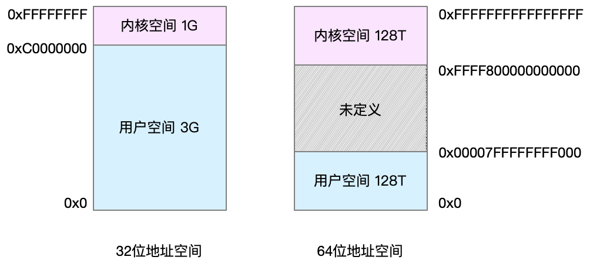

## Linux内存是怎么工作的？

### 内存映射

说到内存，你能说出你现在用的这台计算机内存有多大吗？我估计你记得很清楚，因为这是我们购买时，首先考虑的一个重要参数，比方说，我的笔记本电脑内存就是 8GB 的 。

我们通常所说的内存容量，就像我刚刚提到的 8GB，其实指的是物理内存。物理内存也称为主存，大多数计算机用的主存都是动态随机访问内存（DRAM）。**只有内核才可以直接访问物理内存。那么，进程要访问内存时，该怎么办呢？**

Linux 内核给每个进程都提供了一个独立的**虚拟地址空间**，并且这个地址空间是连续的。这样，进程就可以很方便地访问内存，更确切地说是访问虚拟内存。

虚拟地址空间的内部又被分为内核空间和用户空间两部分，不同字长（也就是单个 CPU 指令可以处理数据的最大长度）的处理器，地址空间的范围也不同。比如最常见的 32 位和 64 位系统，我画了两张图来分别表示它们的虚拟地址空间，如下所示：



通过这里可以看出，32 位系统的内核空间占用 1G，位于最高处，剩下的 3G 是用户空间。而 64 位系统的内核空间和用户空间都是 128T，分别占据整个内存空间的最高和最低处，剩下的中间部分是未定义的。

还记得进程的用户态和内核态吗？进程在用户态时，只能访问用户空间内存；只有进入内核态后，才可以访问内核空间内存。虽然每个进程的地址空间都包含了内核空间，但这些内核空间，其实关联的都是相同的物理内存。这样，进程切换到内核态后，就可以很方便地访问内核空间内存。

既然每个进程都有一个这么大的地址空间，那么所有进程的虚拟内存加起来，自然要比实际的物理内存大得多。所以，并不是所有的虚拟内存都会分配物理内存，只有那些实际使用的虚拟内存才分配物理内存，并且分配后的物理内存，是通过**内存映射**来管理的。

内存映射，其实就是将**虚拟内存地址**映射到**物理内存地址**。为了完成内存映射，内核为每个进程都维护了一张页表，记录虚拟地址与物理地址的映射关系，如下图所示：


页表实际上存储在 CPU 的内存管理单元 MMU 中，这样，正常情况下，处理器就可以直接通过硬件，找出要访问的内存。

而当进程访问的虚拟地址在页表中查不到时，系统会产生一个缺页异常，进入内核空间分配物理内存、更新进程页表，最后再返回用户空间，恢复进程的运行。

另外，我在 CPU 上下文切换的文章中曾经提到， TLB（Translation Lookaside Buffer，转译后备缓冲器）会影响 CPU 的内存访问性能，在这里其实就可以得到解释。

TLB 其实就是 MMU 中页表的高速缓存。由于进程的虚拟地址空间是独立的，而 TLB 的访问速度又比 MMU 快得多，所以，通过减少进程的上下文切换，减少 TLB 的刷新次数，就可以提高 TLB 缓存的使用率，进而提高 CPU 的内存访问性能。

不过要注意，MMU 并不以字节为单位来管理内存，而是规定了一个内存映射的最小单位，也就是页，通常是 4 KB 大小。这样，每一次内存映射，都需要关联 4 KB 或者 4KB 整数倍的内存空间。

页的大小只有 4 KB ，导致的另一个问题就是，整个页表会变得非常大。比方说，仅 32 位系统就需要 100 多万个页表项（4GB/4KB），才可以实现整个地址空间的映射。为了解决页表项过多的问题，Linux 提供了两种机制，也就是多级页表和大页（HugePage）。

多级页表就是把内存分成区块来管理，将原来的映射关系改成区块索引和区块内的偏移。由于虚拟内存空间通常只用了很少一部分，那么，多级页表就只保存这些使用中的区块，这样就可以大大地减少页表的项数。Linux 用的正是四级页表来管理内存页，如下图所示，虚拟地址被分为 5 个部分，前 4 个表项用于选择页，而最后一个索引表示页内偏移。


再看大页，顾名思义，就是比普通页更大的内存块，常见的大小有 2MB 和 1GB。大页通常用在使用大量内存的进程上，比如 Oracle、DPDK 等。

通过这些机制，在页表的映射下，**进程就可以通过虚拟地址来访问物理内存**了。那么具体到一个 Linux 进程中，这些内存又是怎么使用的呢？


###虚拟内存空间分布

首先，我们需要进一步了解虚拟内存空间的分布情况。最上方的内核空间不用多讲，下方的用户空间内存，其实又被分成了多个不同的段。以 32 位系统为例，我画了一张图来表示它们的关系。


通过这张图你可以看到，用户空间内存，从低到高分别是五种不同的内存段。
1. 只读段，包括代码和常量等。
2. 数据段，包括全局变量等。
3. 堆，包括动态分配的内存，从低地址开始向上增长。
4. 文件映射段，包括动态库、共享内存等，从高地址开始向下增长。
5. 栈，包括局部变量和函数调用的上下文等。栈的大小是固定的，一般是 8 MB。

在这五个内存段中，堆和文件映射段的内存是动态分配的。比如说，使用 C 标准库的 malloc() 或者 mmap() ，就可以分别在堆和文件映射段动态分配内存。

其实 64 位系统的内存分布也类似，只不过内存空间要大得多。那么，更重要的问题来了，内存究竟是怎么分配的呢？


### 内存分配与回收
malloc() 是 C 标准库提供的内存分配函数，对应到系统调用上，有两种实现方式，即 brk() 和 mmap()。

对小块内存（小于 128K），C 标准库使用 brk() 来分配，也就是通过移动堆顶的位置来分配内存。这些内存释放后并不会立刻归还系统，而是被缓存起来，这样就可以重复使用。

而大块内存（大于 128K），则直接使用内存映射 mmap() 来分配，也就是在文件映射段找一块空闲内存分配出去。

这两种方式，自然各有优缺点。

brk() 方式的缓存，可以减少缺页异常的发生，提高内存访问效率。不过，由于这些内存没有归还系统，在内存工作繁忙时，频繁的内存分配和释放会造成内存碎片。

而 mmap() 方式分配的内存，会在释放时直接归还系统，所以每次 mmap 都会发生缺页异常。在内存工作繁忙时，频繁的内存分配会导致大量的缺页异常，使内核的管理负担增大。这也是 malloc 只对大块内存使用 mmap  的原因。

了解这两种调用方式后，我们还需要清楚一点，那就是，当这两种调用发生后，其实并没有真正分配内存。这些内存，都只在首次访问时才分配，也就是通过缺页异常进入内核中，再由内核来分配内存。

整体来说，Linux 使用伙伴系统来管理内存分配。前面我们提到过，这些内存在 MMU 中以页为单位进行管理，伙伴系统也一样，以页为单位来管理内存，并且会通过相邻页的合并，减少内存碎片化（比如 brk 方式造成的内存碎片）。

你可能会想到一个问题，如果遇到比页更小的对象，比如不到 1K 的时候，该怎么分配内存呢？

实际系统运行中，确实有大量比页还小的对象，如果为它们也分配单独的页，那就太浪费内存了。

所以，在用户空间，malloc 通过 brk() 分配的内存，在释放时并不立即归还系统，而是缓存起来重复利用。在内核空间，Linux 则通过 slab 分配器来管理小内存。你可以把 slab 看成构建在伙伴系统上的一个缓存，主要作用就是分配并释放内核中的小对象。

对内存来说，如果只分配而不释放，就会造成内存泄漏，甚至会耗尽系统内存。所以，在应用程序用完内存后，还需要调用 free() 或 unmap() ，来释放这些不用的内存。当然，系统也不会任由某个进程用完所有内存。在发现内存紧张时，系统就会通过一系列机制来回收内存，比如下面这三种方式：
- 回收缓存，比如使用 LRU（Least Recently Used）算法，回收最近使用最少的内存页面；
- 回收不常访问的内存，把不常用的内存通过交换分区直接写到磁盘中；
- 杀死进程，内存紧张时系统还会通过 OOM（Out of Memory），直接杀掉占用大量内存的进程。

其中，第二种方式回收不常访问的内存时，会用到交换分区（以下简称 Swap）。Swap 其实就是把一块磁盘空间当成内存来用。它可以把进程暂时不用的数据存储到磁盘中（这个过程称为换出），当进程访问这些内存时，再从磁盘读取这些数据到内存中（这个过程称为换入）。

所以，你可以发现，Swap 把系统的可用内存变大了。不过要注意，通常只在内存不足时，才会发生 Swap 交换。并且由于磁盘读写的速度远比内存慢，Swap 会导致严重的内存性能问题。

第三种方式提到的  OOM（Out of Memory），其实是内核的一种保护机制。它监控进程的内存使用情况，并且使用 oom_score 为每个进程的内存使用情况进行评分：
- 一个进程消耗的内存越大，oom_score 就越大；
- 一个进程运行占用的 CPU 越多，oom_score 就越小。

这样，进程的 oom_score 越大，代表消耗的内存越多，也就越容易被 OOM 杀死，从而可以更好保护系统。

当然，为了实际工作的需要，管理员可以通过 /proc 文件系统，手动设置进程的 oom_adj ，从而调整进程的 oom_score。

oom_adj 的范围是 [-17, 15]，数值越大，表示进程越容易被 OOM 杀死；数值越小，表示进程越不容易被 OOM 杀死，其中 -17 表示禁止 OOM。

比如用下面的命令，你就可以把 sshd 进程的 oom_adj 调小为 -16，这样， sshd 进程就不容易被 OOM 杀死。
```bash
echo -16 > /proc/$(pidof sshd)/oom_adj
```

### 如何查看内存使用情况

通过了解内存空间的分布，以及内存的分配和回收，我想你对内存的工作原理应该有了大概的认识。当然，系统的实际工作原理更加复杂，也会涉及其他一些机制，这里我只讲了最主要的原理。掌握了这些，你可以对内存的运作有一条主线认识，不至于脑海里只有术语名词的堆砌。

那么在了解内存的工作原理之后，我们又该怎么查看系统内存使用情况呢？

其实前面 CPU 内容的学习中，我们也提到过一些相关工具。在这里，你第一个想到的应该是 free  工具吧。下面是一个 free 的输出示例：
```bash
# 注意不同版本的free输出可能会有所不同
$ free
              total        used        free      shared  buff/cache   available
Mem:        8169348      263524     6875352         668     1030472     7611064
Swap:             0           0           0
```

你可以看到，free 输出的是一个表格，其中的数值都默认以字节为单位。表格总共有两行六列，这两行分别是物理内存 Mem 和交换分区 Swap 的使用情况，而六列中，每列数据的含义分别为：
- 第一列，total 是总内存大小；
- 第二列，used 是已使用内存的大小，包含了共享内存；
- 第三列，free 是未使用内存的大小；
- 第四列，shared 是共享内存的大小；
- 第五列，buff/cache 是缓存和缓冲区的大小；
- 最后一列，available 是新进程可用内存的大小。

这里尤其注意一下，最后一列的可用内存 available 。available 不仅包含未使用内存，还包括了可回收的缓存，所以一般会比未使用内存更大。不过，并不是所有缓存都可以回收，因为有些缓存可能正在使用中。

不过，我们知道，free 显示的是整个系统的内存使用情况。如果你想查看进程的内存使用情况，可以用 top 或者 ps 等工具。比如，下面是 top 的输出示例：
```bash
# 按下M切换到内存排序
$ top
...
KiB Mem :  8169348 total,  6871440 free,   267096 used,  1030812 buff/cache
KiB Swap:        0 total,        0 free,        0 used.  7607492 avail Mem


  PID USER      PR  NI    VIRT    RES    SHR S  %CPU %MEM     TIME+ COMMAND
  430 root      19  -1  122360  35588  23748 S   0.0  0.4   0:32.17 systemd-journal
 1075 root      20   0  771860  22744  11368 S   0.0  0.3   0:38.89 snapd
 1048 root      20   0  170904  17292   9488 S   0.0  0.2   0:00.24 networkd-dispat
    1 root      20   0   78020   9156   6644 S   0.0  0.1   0:22.92 systemd
12376 azure     20   0   76632   7456   6420 S   0.0  0.1   0:00.01 systemd
12374 root      20   0  107984   7312   6304 S   0.0  0.1   0:00.00 sshd
...
```

top 输出界面的顶端，也显示了系统整体的内存使用情况，这些数据跟 free 类似，我就不再重复解释。我们接着看下面的内容，跟内存相关的几列数据，比如 VIRT、RES、SHR 以及 %MEM 等。

这些数据，包含了进程最重要的几个内存使用情况，我们挨个来看。
- VIRT 是进程虚拟内存的大小，只要是进程申请过的内存，即便还没有真正分配物理内存，也会计算在内。
- RES 是常驻内存的大小，也就是进程实际使用的物理内存大小，但不包括 Swap 和共享内存。
- SHR 是共享内存的大小，比如与其他进程共同使用的共享内存、加载的动态链接库以及程序的代码段等。
- %MEM 是进程使用物理内存占系统总内存的百分比。

除了要认识这些基本信息，在查看 top 输出时，你还要注意两点。

第一，虚拟内存通常并不会全部分配物理内存。从上面的输出，你可以发现每个进程的虚拟内存都比常驻内存大得多。

第二，共享内存 SHR 并不一定是共享的，比方说，程序的代码段、非共享的动态链接库，也都算在 SHR 里。当然，SHR 也包括了进程间真正共享的内存。所以在计算多个进程的内存使用时，不要把所有进程的 SHR 直接相加得出结果。

### Buff与Cache

**buffer**在操作系统中指**buffer cache**， 中文一般翻译为 "缓冲区",**针对磁盘块的读写**。要理解缓冲区，必须明确另外两个概念："扇区" 和 "块"。扇区是设备的最小寻址单元，也叫 "硬扇区" 或 "设备块"。块是操作系统中文件系统的最小寻址单元，也叫 "文件块" 或 "I/O 块"。每个块包含一个或多个扇区，但大小不能超过一个页面，所以一个页可以容纳一个或多个内存中的块。当一个块被调入内存时，它要存储在一个缓冲区中。每个缓冲区与一个块对应，它相当于是磁盘块在内存中的表示(下图来自互联网)：


**cache**在操作系统中指**page cache**，中文一般翻译为 "页高速缓存"，**针对文件inode的读写**。页高速缓存是内核实现的磁盘缓存。它主要用来减少对磁盘的 I/O 操作。具体地讲，是通过把磁盘中的数据缓存到物理内存中，把对磁盘的访问变为对物理内存的访问。页高速缓存缓存的是内存页面。**缓存中的页来自对普通文件、块设备文件(这个指的就是 buffer cache 呀)和内存映射文件的读写**。

页高速缓存对普通文件的缓存我们可以这样理解：当内核要读一个文件(比如 /etc/hosts)时，它会先检查这个文件的数据是不是已经在页高速缓存中了。如果在，就放弃访问磁盘，直接从内存中读取。这个行为称为缓存命中。如果数据不在缓存中，就是未命中缓存，此时内核就要调度块 I/O 操作从磁盘去读取数据。然后内核将读来的数据放入页高速缓存中。这种缓存的目标是文件系统可以识别的文件(比如 /etc/hosts)。

页高速缓存对块设备文件的缓存就是我们在前面介绍的 buffer cahce。因为独立的磁盘块通过缓冲区也被存入了页高速缓存(缓冲区最终是由页高速缓存来承载的)。

### 回收缓存
Linux 内核会在内存将要耗尽的时候，触发内存回收的工作，以便释放出内存给急需内存的进程使用。一般情况下，这个操作中主要的内存释放都来自于对 buffer ／ cache 的释放。尤其是被使用更多的 cache 空间。既然它主要用来做缓存，只是在内存够用的时候加快进程对文件的读写速度，那么在内存压力较大的情况下，当然有必要清空释放 cache ，作为 free 空间分给相关进程使用。所以一般情况下，我们认为 buffer/cache 空间可以被释放，这个理解是正确的。

但是这种清缓存的工作也并不是没有成本。理解 cache 是干什么的就可以明白清缓存必须保证 cache 中的数据跟对应文件中的数据一致，才能对 cache 进行释放。所以伴随着 cache 清除的行为的，一般都是系统 IO 飙高。因为内核要对比 cache 中的数据和对应硬盘文件上的数据是否一致，如果不一致需要写回，之后才能回收。

在系统中除了内存将被耗尽的时候可以清缓存以外，我们还可以使用下面这个文件来人工触发缓存清除的操作：
```bash
echo 1 > /proc/sys/vm/drop_caches
```
当然，这个文件可以设置的值分别为 1 、 2 、 3 。它们所表示的含义为：

- echo 1 > /proc/sys/vm/drop_caches:表示清除 pagecache 。

- echo 2 > /proc/sys/vm/drop_caches:表示清除回收 slab 分配器中的对象（包括目录项缓存和 inode 缓存）。 slab 分配器是内核中管理内存的一种机制，其中很多缓存数据实现都是用的 pagecache 。

- echo 3 > /proc/sys/vm/drop_caches:表示清除 pagecache 和 slab 分配器中的缓存对象。


### free数据的来源

```bash

buffers  Memory used by kernel buffers (Buffers in /proc/meminfo)

cache  Memory used by the page cache and slabs (Cached and SReclaimable in /proc/meminfo)

buff/cache
        Sum of buffers and cache
```
从 free 的手册中，你可以看到 buffer 和 cache 的说明。
- Buffers 是内核缓冲区用到的内存，对应的是  /proc/meminfo 中的 Buffers 值。
- Cache 是内核页缓存和 Slab 用到的内存，对应的是  /proc/meminfo 中的 Cached 与 SReclaimable 之和。

这里的说明告诉我们，这些数值都来自 /proc/meminfo，但更具体的 Buffers、Cached 和 SReclaimable 的含义，还是没有说清楚。

### proc 文件系统

我在前面 CPU 性能模块就曾经提到过，/proc 是 Linux 内核提供的一种特殊文件系统，是用户跟内核交互的接口。比方说，用户可以从 /proc 中查询内核的运行状态和配置选项，查询进程的运行状态、统计数据等，当然，你也可以通过 /proc  来修改内核的配置。

proc 文件系统同时也是很多性能工具的最终数据来源。比如我们刚才看到的 free ，就是通过读取/proc/meminfo，得到内存的使用情况。

继续说回/proc/meminfo，既然 Buffers、Cached、SReclaimable 这几个指标不容易理解，那我们还得继续查 proc 文件系统，获取它们的详细定义。

执行 man proc，你就可以得到 proc 文件系统的详细文档。

注意这个文档比较长，你最好搜索一下（比如搜索 meminfo），以便更快定位到内存部分。

```bash
Buffers %lu
    Relatively temporary storage for raw disk blocks that shouldn't get tremendously large (20MB or so).

Cached %lu
   In-memory cache for files read from the disk (the page cache).  Doesn't include SwapCached.
...
SReclaimable %lu (since Linux 2.6.19)
    Part of Slab, that might be reclaimed, such as caches.
    
SUnreclaim %lu (since Linux 2.6.19)
    Part of Slab, that cannot be reclaimed on memory pressure.
```

通过这个文档，我们可以看到：
- Buffers 是对原始磁盘块的临时存储，也就是用来缓存磁盘的数据，通常不会特别大（20MB 左右）。这样，内核就可以把分散的写集中起来，统一优化磁盘的写入，比如可以把多次小的写合并成单次大的写等等。
- Cached 是从磁盘读取文件的页缓存，也就是用来缓存从文件读取的数据。这样，下次访问这些文件数据时，就可以直接从内存中快速获取，而不需要再次访问缓慢的磁盘。
- SReclaimable 是 Slab 的一部分。Slab 包括两部分，其中的可回收部分，用 SReclaimable 记录；而不可回收部分，用 SUnreclaim 记录。

**Buffer 是对磁盘数据的缓存，而 Cache 是文件数据的缓存，它们既会用在读请求中，也会用在写请求中。**


