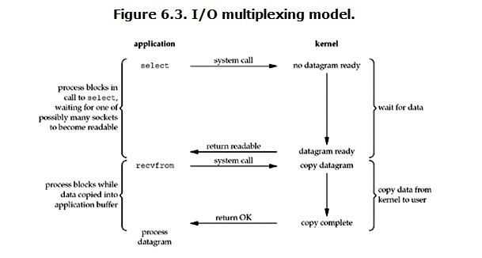
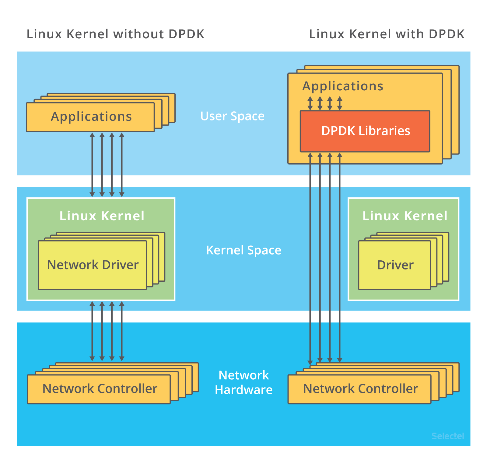

## 文件描述符
### 文件描述符概念
Linux 系统中，把一切都看做是文件，当进程打开现有文件或创建新文件时，内核向进程返回一个文件描述符，文件描述符就是内核为了高效管理已被打开的文件所创建的索引，用来指向被打开的文件，所有执行I/O操作的系统调用都会通过文件描述符。

### 文件描述符、文件、进程间的关系
1.描述：
- 每个文件描述符会与一个打开的文件相对应；
- 不同的文件描述符也可能指向同一个文件
- 相同的文件可以被不同的进程打开，也可以在同一个进程被多次打开

2.系统为维护文件描述符，建立了三个表
- 进程级的文件描述符表
- 系统级的文件描述符表
- 文件系统的i-node表 


3. 通过这三个表，认识文件描述符


在进程A中，文件描述符1和30都指向了同一个打开的文件句柄（#23），这可能是该进程多次对执行打开操作

进程A中的文件描述符2和进程B的文件描述符2都指向了同一个打开的文件句柄（#73），这种情况有几种可能，1.进程A和进程B可能是父子进程关系;2.进程A和进程B打开了同一个文件，且文件描述符相同（低概率事件=_=）；3.A、B中某个进程通过UNIX域套接字将一个打开的文件描述符传递给另一个进程。

进程A的描述符0和进程B的描述符3分别指向不同的打开文件句柄，但这些句柄均指向i-node表的相同条目（1936），换言之，指向同一个文件。发生这种情况是因为每个进程各自对同一个文件发起了打开请求。同一个进程两次打开同一个文件，也会发生类似情况。

### 文件描述符限制
每打开一个文件都会创建文件描述符，并将文件指针指向这个文件描述符，文件描述符由非负整数表示，系统默认的3个文件描述符是0，1，2，即标准输入、标准输出、标准错误输出。

此时打开一个文件即从3开始，写入到文件描述符表中。每个进程在PCB（Process Control Block）即进程控制块中都保存着一份文件描述符表。

能打开多少文件描述符？理论来说内存有多大就可以打开多少文件描述符，但内核进行管理一般是内存的10%(系统限制)。


**查看系统限制可以创建多少文件描述符**：

```bash
# 方法一
root@luke:~# sysctl -a|grep file-max
fs.file-max = 9223372036854775807

# 方法二
root@luke:~# cat /proc/sys/fs/file-max
9223372036854775807

# 临时修改系统级别
root@luke:~# sysctl -w fs.file-max=65535
fs.file-max = 65535
root@luke:~# echo 65535 > /proc/sys/fs/file-max
# 永久修改
root@luke:~# echo 'fs.file-max=65535' >> /etc/sysctl.conf
# 执行sysctl -p使配置生效(不执行不生效)
root@luke:~# sysctl -p
```

内核为了不让某个进程消耗掉所有文件资源，会对单个进程最大打开文件个数做限制：

**查看用户级别的使用ulimit**
```bash
# 单个进程打开的最大文件数
[root@WebA-136 ~]# ulimit -n#列出每个进程可以打开的文件数，此值不能超过1024*1024，内核限制，若要超过此值需要重新编译内核。从内核2.6.25可以动态修改此值vim /proc/sys/fs/nr_open
1024
[root@luke ~]# cat /proc/sys/fs/nr_open
1048576
[root@luke ~]# ulimit -n 1048577
-bash: ulimit: open files: cannot modify limit: Operation not permitted

[root@luke ~]# echo '1048577' > /proc/sys/fs/nr_open
[root@luke ~]# cat /proc/sys/fs/nr_open
1048577
[root@luke ~]# ulimit -n 1048577

# 不能超过上面单个进程能打开的文件数  nr_open
# 临时修改
[root@luke ~]# ulimit -SHn 65535
# 永久修改,修改所有用户，修改配置文件/etc/security/limit.conf
[root@luke ~]# echo '* - nofile 65535' >> /etc/security/limit.conf

# 永久修改，修改单一用户，写入用户环境变量中  .bash_profile 写入ulimit -SHn 10240.
[root@Management-Machine-140 ~]# echo "ulimit -SHn 10240" >>/root/.bash_profile
[root@Management-Machine-140 ~]# ulimit -n  #已修改
10240
[root@Management-Machine-140 ~]#

```
### file-max、nr_open、nofile
file-max是内核针对所有进程可分配的最大文件数，nr_open是单个进程可分配的最大文件数，所以在我们使用ulimit或limits.conf来设置时，如果要超过默认的1048576值时需要先增大nr_open值（sysctl -w fs.nr_open=100000000或者直接写入sysctl.conf文件）。当然百万级别的单进程最大file-handle打开数应该也够用了吧。
- 所有进程打开的文件描述符数不能超过/proc/sys/fs/file-max
- 单个进程打开的文件描述符数不能超过user limit中nofile的soft limit
- nofile的soft limit不能超过其hard limit
- nofile的hard limit不能超过/proc/sys/fs/nr_open

### 查看进程的文件描述符
```bash
[root@luke ~]# ps -ef|grep nginx
root     19454 19410  0  2020 ?        00:00:00 nginx: master process nginx -g daemon off;
65534    19691 19454  0  2020 ?        00:02:25 nginx: worker process
root     19762 19729  0  2020 ?        00:00:00 nginx: master process nginx -g daemon off;
33       19926 19762  0  2020 ?        00:10:58 nginx: worker process
33       19927 19762  0  2020 ?        00:10:45 nginx: worker process
33       19928 19762  0  2020 ?        00:11:00 nginx: worker process
33       19930 19762  0  2020 ?        00:11:00 nginx: worker process
root     28596 28579  0  2020 ?        00:00:00 nginx: master process nginx -g daemon off;
104      28639 28596  0  2020 ?        00:00:02 nginx: worker process

[root@luke ~]# cat /proc/19410/limits
Limit                     Soft Limit           Hard Limit           Units
Max cpu time              unlimited            unlimited            seconds
Max file size             unlimited            unlimited            bytes
Max data size             unlimited            unlimited            bytes
Max stack size            8388608              unlimited            bytes
Max core file size        unlimited            unlimited            bytes
Max resident set          unlimited            unlimited            bytes
Max processes             unlimited            unlimited            processes
Max open files            1048576              1048576              files
Max locked memory         65536                65536                bytes
Max address space         unlimited            unlimited            bytes
Max file locks            unlimited            unlimited            locks
Max pending signals       30125                30125                signals
Max msgqueue size         819200               819200               bytes
Max nice priority         0                    0
Max realtime priority     0                    0
Max realtime timeout      unlimited            unlimited            us
[root@luke ~]#
[root@luke ~]# ls /proc/19410/fdinfo/
0  1  10  11  12  13  14  15  16  17  2  4  5  6  7  8  9
```

## IO模型
### 直接I/O和缓存I/O
　　缓存 I/O 又被称作标准 I/O，大多数文件系统的默认 I/O 操作都是缓存 I/O。在 Linux 的缓存 I/O 机制中，以write为例，数据会先被拷贝到应用程序的地址空间，再拷贝到操作系统内核的缓冲区中，然后才会写到存储设备中。


缓存I/O的write：


直接I/O的write：（少了拷贝到进程缓冲区这一步）


### IO/模式详解
对于一次IO访问（这回以read举例），数据会先被拷贝到操作系统内核的缓冲区中，然后才会从操作系统内核的缓冲区拷贝到应用程序的缓冲区，最后交给进程。所以说，当一个read操作发生时，它会经历两个阶段：
1. 等待数据准备 (Waiting for the data to be ready)
2. 将数据从内核拷贝到进程中 (Copying the data from the kernel to the process)

正式因为这两个阶段，linux系统产生了下面五种网络模式的方案：
- 阻塞 I/O（blocking IO）
- 非阻塞 I/O（nonblocking IO）
- I/O 多路复用（ IO multiplexing）
- 信号驱动 I/O（ signal driven IO）
- 异步 I/O（asynchronous IO）

#### block I/O模型（阻塞I/O）
阻塞I/O模型示意图：


read为例：
1. 进程发起read，进行recvfrom系统调用；
2. 内核开始第一阶段，准备数据（从磁盘拷贝到缓冲区），进程请求的数据并不是一下就能准备好；准备数据是要消耗时间的；
3. 与此同时，进程阻塞（进程是自己选择阻塞与否），等待数据ing；
4. 直到数据从内核拷贝到了用户空间，内核返回结果，进程解除阻塞。
也就是说，内核准备数据和数据从内核拷贝到进程内存地址这两个过程都是阻塞的。

#### non-block（非阻塞I/O模型）
可以通过设置socket使其变为non-blocking。当对一个non-blocking socket执行读操作时，流程是这个样子:


1. 当用户进程发出read操作时，如果kernel中的数据还没有准备好；
2. 那么它并不会block用户进程，而是立刻返回一个error，从用户进程角度讲 ，它发起一个read操作后，并不需要等待，而是马上就得到了一个结果；
3. 用户进程判断结果是一个error时，它就知道数据还没有准备好，于是它可以再次发送read操作。一旦kernel中的数据准备好了，并且又再次收到了用户进程的system call；
4. 那么它马上就将数据拷贝到了用户内存，然后返回。

所以，nonblocking IO的特点是用户进程在内核准备数据的阶段需要不断的主动询问数据好了没有。

#### I/O多路复用
I/O多路复用实际上就是用select, poll, epoll监听多个io对象，当io对象有变化（有数据）的时候就通知用户进程。好处就是单个进程可以处理多个socket。当然具体区别我们后面再讨论，现在先来看下I/O多路复用的流程：



1. 当用户进程调用了select，那么整个进程会被block；
2. 而同时，kernel会“监视”所有select负责的socket；
3. 当任何一个socket中的数据准备好了，select就会返回；
4. 这个时候用户进程再调用read操作，将数据从kernel拷贝到用户进程。


所以，I/O 多路复用的特点是通过一种机制一个进程能同时等待多个文件描述符，而这些文件描述符（套接字描述符）其中的任意一个进入读就绪状态，select()函数就可以返回。

这个图和blocking IO的图其实并没有太大的不同，事实上，还更差一些。因为这里需要使用两个system call (select 和 recvfrom)，而blocking IO只调用了一个system call (recvfrom)。但是，用select的优势在于它可以同时处理多个connection。

**强调**:
1. 如果处理的连接数不是很高的话，使用select/epoll的web server不一定比使用multi-threading + blocking IO的web server性能更好，可能延迟还更大。select/epoll的优势并不是对于单个连接能处理得更快，而是在于能处理更多的连接。

2. 在多路复用模型中，对于每一个socket，一般都设置成为non-blocking，但是，如上图所示，整个用户的process其实是一直被block的。只不过process是被select这个函数block，而不是被socket IO给block。

结论: select的优势在于可以处理多个连接，不适用于单个连接

#### asynchronous I/O（异步 I/O）
真正的异步I/O很牛逼，流程大概如下:


1. 用户进程发起read操作之后，立刻就可以开始去做其它的事。
2. 而另一方面，从kernel的角度，当它受到一个asynchronous read之后，首先它会立刻返回，所以不会对用户进程产生任何block。
3. 然后，kernel会等待数据准备完成，然后将数据拷贝到用户内存，当这一切都完成之后，kernel会给用户进程发送一个signal，告诉它read操作完成了。

## IO模型比较分析

到目前为止，已经将四个IO Model都介绍完了。现在回过头来回答最初的那几个问题：
- blocking和non-blocking的区别在哪，
- synchronous IO和asynchronous IO的区别在哪。
先回答最简单的这个：blocking vs non-blocking。
前面的介绍中其实已经很明确的说明了这两者的区别。调用blocking IO会一直block住对应的进程直到操作完成，而non-blocking IO在kernel还准备数据的情况下会立刻返回。

再说明synchronous IO和asynchronous IO的区别之前，需要先给出两者的定义。Stevens给出的定义（其实是POSIX的定义）是这样子的：  
> A synchronous I/O operation causes the requesting process to be blocked until that I/O operationcompletes;  
> An asynchronous I/O operation does not cause the requesting process to be blocked; 
  
两者的区别就在于**synchronous IO做”IO operation”的时候会将process阻塞**。按照这个定义，四个IO模型可以分为两大类，
- 之前所述的blocking IO，non-blocking IO，IO multiplexing都属于synchronous IO这一类，
- asynchronous I/O后一类 。

有人可能会说，non-blocking IO并没有被block啊。这里有个非常“狡猾”的地方，定义中所指的”IO operation”是指真实的IO操作，就是例子中的recvfrom这个system call。**non-blocking IO在执行recvfrom这个system call的时候，如果kernel的数据没有准备好，这时候不会block进程。但是，当kernel中数据准备好的时候，recvfrom会将数据从kernel拷贝到用户内存中，这个时候进程是被block了,在这段时间内，进程是被block的。**

而asynchronous IO则不一样，当进程发起IO 操作之后，就直接返回再也不理睬了，直到kernel发送一个信号，告诉进程说IO完成。在这整个过程中，进程完全没有被block。


经过上面的介绍，会发现non-blocking IO和asynchronous IO的区别还是很明显的。在non-blocking IO中，虽然进程大部分时间都不会被block，但是它仍然要求进程去主动的check，并且当数据准备完成以后，也需要**进程主动的再次调用recvfrom来将数据拷贝到用户内存空间**。而asynchronous IO则完全不同。它就像是**用户进程将整个IO操作交给了他人（kernel）完成，然后他人做完后发信号通知**。在此期间，**用户进程不需要去检查IO操作的状态，也不需要主动的去拷贝数据**。


## IO模型优化

异步、非阻塞 I/O 的解决思路，你应该听说过，其实就是我们在网络编程中经常用到的 I/O 多路复用（I/O Multiplexing）。I/O 多路复用是什么意思呢？

别急，详细了解前，我先来讲两种 I/O 事件通知的方式：水平触发和边缘触发，它们常用在套接字接口的文件描述符中。
- 水平触发：只要文件描述符可以非阻塞地执行 I/O ，就会触发通知。也就是说，应用程序可以随时检查文件描述符的状态，然后再根据状态，进行 I/O 操作。
- 边缘触发：只有在文件描述符的状态发生改变（也就是 I/O 请求达到）时，才发送一次通知。这时候，应用程序需要尽可能多地执行 I/O，直到无法继续读写，才可以停止。如果 I/O 没执行完，或者因为某种原因没来得及处理，那么这次通知也就丢失了。

接下来，我们再回过头来看 I/O 多路复用的方法。这里其实有很多实现方法，我带你来逐个分析一下。

**第一种，使用非阻塞 I/O 和水平触发通知，比如使用 select 或者 poll**。

根据刚才水平触发的原理，select 和 poll 需要从文件描述符列表中，找出哪些可以执行 I/O ，然后进行真正的网络 I/O 读写。由于 I/O 是非阻塞的，一个线程中就可以同时监控一批套接字的文件描述符，这样就达到了单线程处理多请求的目的。

所以，这种方式的最大优点，是对应用程序比较友好，它的 API 非常简单。

但是，应用软件使用 select 和 poll 时，需要对这些文件描述符列表进行轮询，这样，请求数多的时候就会比较耗时。并且，select 和 poll 还有一些其他的限制。

select 使用固定长度的位相量，表示文件描述符的集合，因此会有最大描述符数量的限制。比如，在 32 位系统中，**默认限制是 1024**。并且，在 select 内部，检查套接字状态是用轮询的方法，再加上应用软件使用时的轮询，就变成了一个 O(n^2) 的关系。

而 poll 改进了 select 的表示方法，换成了一个没有固定长度的数组，这样就没有了最大描述符数量的限制（当然还会受到系统文件描述符限制）。但应用程序在使用 poll 时，同样需要对文件描述符列表进行轮询，这样，处理耗时跟描述符数量就是 O(N) 的关系。

除此之外，应用程序每次调用 select 和 poll 时，还需要把文件描述符的集合，从用户空间传入内核空间，由内核修改后，再传出到用户空间中。这一来一回的内核空间与用户空间切换，也增加了处理成本。

有没有什么更好的方式来处理呢？答案自然是肯定的。

**第二种，使用非阻塞 I/O 和边缘触发通知，比如 epoll。**

既然 select 和 poll 有那么多的问题，就需要继续对其进行优化，而 epoll 就很好地解决了这些问题。
- epoll 使用红黑树，在内核中管理文件描述符的集合，这样，就不需要应用程序在每次操作时都传入、传出这个集合。
- epoll 使用事件驱动的机制，只关注有 I/O 事件发生的文件描述符，不需要轮询扫描整个集合。

不过要注意，epoll 是在 Linux 2.6 中才新增的功能（2.4 虽然也有，但功能不完善）。由于边缘触发只在文件描述符可读或可写事件发生时才通知，那么应用程序就需要尽可能多地执行 I/O，并要处理更多的异常事件。

**第三种，使用异步 I/O（Asynchronous I/O，简称为 AIO）。**

在前面文件系统原理的内容中，我曾介绍过异步 I/O 与同步 I/O 的区别。异步 I/O 允许应用程序同时发起很多 I/O 操作，而不用等待这些操作完成。而在 I/O 完成后，系统会用事件通知（比如信号或者回调函数）的方式，告诉应用程序。这时，应用程序才会去查询 I/O 操作的结果。

异步 I/O 也是到了 Linux 2.6 才支持的功能，并且在很长时间里都处于不完善的状态，比如 glibc 提供的异步 I/O 库，就一直被社区诟病。同时，由于异步 I/O 跟我们的直观逻辑不太一样，想要使用的话，一定要小心设计，其使用难度比较高。

## DPDK和XDP

### DPDK
有没有可能在单机中，同时处理 1000 万的请求呢？这也就是 C10M 问题。无论你怎么优化应用程序和内核中的各种网络参数，想实现 1000 万请求的并发，都是极其困难的。

究其根本，还是 Linux 内核协议栈做了太多太繁重的工作。从网卡中断带来的硬中断处理程序开始，到软中断中的各层网络协议处理，最后再到应用程序，这个路径实在是太长了，就会导致网络包的处理优化，到了一定程度后，就无法更进一步了。

要解决这个问题，最重要就是跳过内核协议栈的冗长路径，把网络包直接送到要处理的应用程序那里去。这里有两种常见的机制，DPDK 和 XDP。

第一种机制，DPDK，是用户态网络的标准。它跳过内核协议栈，直接由**用户态进程通过轮询的方式，来处理网络接收**。



此外，DPDK 还通过大页、CPU 绑定、内存对齐、流水线并发等多种机制，优化网络包的处理效率。

### XDP
第二种机制，XDP（eXpress Data Path），则是 Linux 内核提供的一种高性能网络数据路径。它允许网络包，在进入内核协议栈之前，就进行处理，也可以带来更高的性能。XDP 底层跟我们之前用到的 bcc-tools 一样，都是基于 Linux 内核的 eBPF 机制实现的。XDP 的原理如下图所示：


你可以看到，XDP 对内核的要求比较高，需要的是 Linux 4.8 以上版本，并且它也不提供缓存队列。基于 XDP 的应用程序通常是专用的网络应用，常见的有 IDS（入侵检测系统）、DDoS 防御、 cilium 容器网络插件等。


