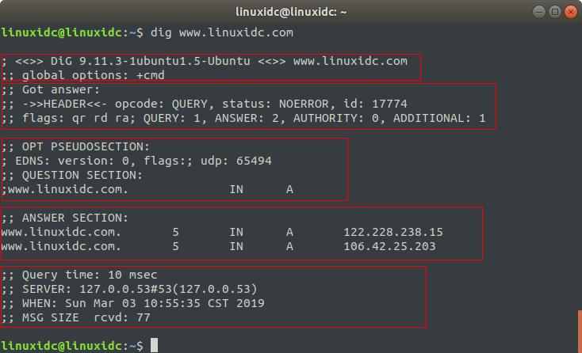

## 常见工具
### DNS排查工具
#### nslookup
1. 指定DNS服务器解析
nslookup 域名  dnsserver
```bash
[root@luke ~]# nslookup example.com
Server:		100.100.2.136
Address:	100.100.2.136#53

Non-authoritative answer:
Name:	example.com
Address: 93.184.216.34
Name:	example.com
Address: 2606:2800:220:1:248:1893:25c8:1946

[root@luke ~]# nslookup example.com 114.114.114.114
Server:		114.114.114.114
Address:	114.114.114.114#53

Non-authoritative answer:
Name:	example.com
Address: 93.184.216.34
Name:	example.com
Address: 2606:2800:220:1:248:1893:25c8:1946

```
2. 输出调试信息
nslookup -debug 域名  dnsserver
```bash
[root@clever-cargo ~]# nslookup -debug example.com
Server:		100.100.2.136
Address:	100.100.2.136#53

------------
    QUESTIONS:
	example.com, type = A, class = IN
    ANSWERS:
    ->  example.com
	internet address = 93.184.216.34
	ttl = 86254
    AUTHORITY RECORDS:
    ADDITIONAL RECORDS:
------------
Non-authoritative answer:
Name:	example.com
Address: 93.184.216.34
------------
    QUESTIONS:
	example.com, type = AAAA, class = IN
    ANSWERS:
    ->  example.com
	has AAAA address 2606:2800:220:1:248:1893:25c8:1946
	ttl = 75860
    AUTHORITY RECORDS:
    ADDITIONAL RECORDS:
------------
Name:	example.com
Address: 2606:2800:220:1:248:1893:25c8:1946
```
3. 指定查询类型
nslookup -querytype=CNAME 域名  dnsserver
```bash
[root@luke ~]# nslookup -querytype=CNAME jd.com 114.114.114.114
Server:		114.114.114.114
Address:	114.114.114.114#53

Non-authoritative answer:
*** Can't find jd.com: No answer

Authoritative answers can be found from:
jd.com
	origin = ns1.jdcache.com
	mail addr = apollo.jd.com
	serial = 2015168809
	refresh = 10800
	retry = 3600
	expire = 604800
	minimum = 38400

[root@luke ~]# nslookup -querytype=mx jd.com 114.114.114.114
Server:		114.114.114.114
Address:	114.114.114.114#53

Non-authoritative answer:
jd.com	mail exchanger = 30 mx1.jd.com.
jd.com	mail exchanger = 10 mx.jd.com.

Authoritative answers can be found from:

```
#### dig
Linux下解析域名除了使用nslookup之外，开可以使用dig命令来解析域名，dig命令可以得到更多的域名信息。dig 命令主要用来从 DNS 域名服务器查询主机地址信息。dig的全称是 (domain information groper)。它是一个用来灵活探测DNS的工具。它会打印出>DNS name server的回应。

##### 1. 查询单个域名的DNS信息
```bash
[root@luke ~]# dig www.linuxidc.com

; <<>> DiG 9.11.4-P2-RedHat-9.11.4-9.P2.el7 <<>> www.linuxidc.com
;; global options: +cmd
;; Got answer:
;; ->>HEADER<<- opcode: QUERY, status: NOERROR, id: 39609
;; flags: qr rd ra; QUERY: 1, ANSWER: 3, AUTHORITY: 0, ADDITIONAL: 1

;; OPT PSEUDOSECTION:
; EDNS: version: 0, flags:; udp: 4096
;; QUESTION SECTION:
;www.linuxidc.com.		IN	A

;; ANSWER SECTION:
www.linuxidc.com.	600	IN	CNAME	www.linuxidc.com.cdn.dnsv1.com.
www.linuxidc.com.cdn.dnsv1.com.	600 IN	CNAME	motfr076.sched.sma.tdnsv5.com.
motfr076.sched.sma.tdnsv5.com. 180 IN	A	101.71.72.225

;; Query time: 108 msec
;; SERVER: 100.100.2.136#53(100.100.2.136)
;; WHEN: Fri Jan 15 17:11:13 CST 2021
;; MSG SIZE  rcvd: 142
```

dig 命令默认的输出信息比较丰富，大概可以分为5个部分
- 第一部分显示 dig 命令的版本和输入的参数。
- 第二部分显示服务返回的一些技术详情，比较重要的是 status。如果 status 的值为 NOERROR 则说明本次查询成功结束。
- 第三部分中的 "QUESTION SECTION" 显示我们要查询的域名。
- 第四部分的 "ANSWER SECTION" 是查询到的结果。
- 第五部分则是本次查询的一些统计信息，比如用了多长时间，查询了哪个 DNS 服务器，在什么时间进行的查询等等。

默认情况下 dig 命令查询 A 记录，上图中显示的 A 即说明查询的记录类型为 A 记录。在尝试查询其它类型的记录前让我们先来了解一下常见的 DNS 记录类型。

### 网络延迟
在发现网络延迟增大后，你可以用 traceroute、hping3、tcpdump、Wireshark、strace 等多种工具，来定位网络中的潜在问题。比如，
- 使用 hping3 以及 wrk 等工具，确认单次请求和并发请求情况的网络延迟是否正常。
- 使用 traceroute，确认路由是否正确，并查看路由中每一跳网关的延迟。
- 使用 tcpdump 和 Wireshark，确认网络包的收发是否正常。
- 使用 strace 等，观察应用程序对网络套接字的调用情况是否正常。

#### hping3

#### traceroute

#### tcpdump


#### strace


#### wirshark


