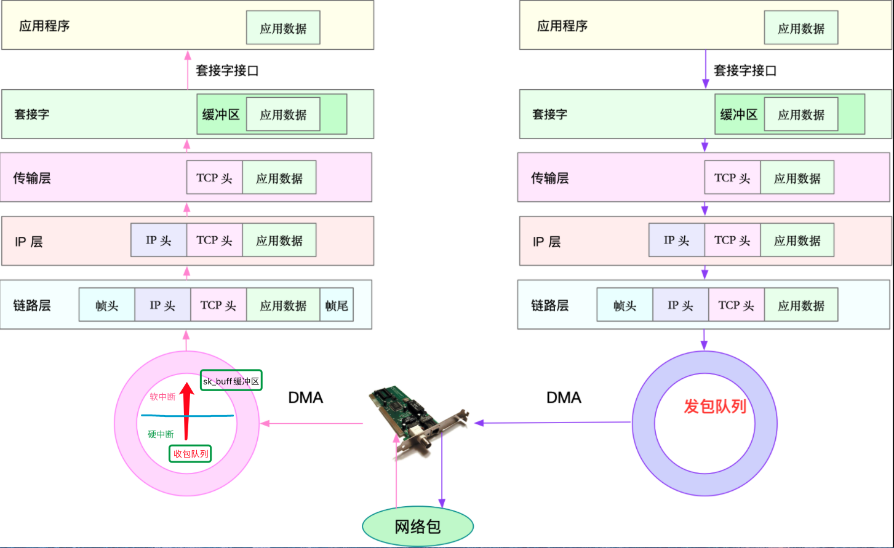

## 网络模型
说到网络，我想你肯定经常提起七层负载均衡、四层负载均衡，或者三层设备、二层设备等等。那么，这里说的二层、三层、四层、七层又都是什么意思呢？

实际上，这些层都来自国际标准化组织制定的开放式系统互联通信参考模型（Open System Interconnection Reference Model），简称为 OSI 网络模型。

为了解决网络互联中异构设备的兼容性问题，并解耦复杂的网络包处理流程，OSI 模型把网络互联的框架分为应用层、表示层、会话层、传输层、网络层、数据链路层以及物理层等七层，每个层负责不同的功能。其中，
- 应用层，负责为应用程序提供统一的接口。
- 表示层，负责把数据转换成兼容接收系统的格式。
- 会话层，负责维护计算机之间的通信连接。
- 传输层，负责为数据加上传输表头，形成数据包。
- 网络层，负责数据的路由和转发。
- 数据链路层，负责 MAC 寻址、错误侦测和改错。
- 物理层，负责在物理网络中传输数据帧。

但是 OSI 模型还是太复杂了，也没能提供一个可实现的方法。所以，在 Linux 中，我们实际上使用的是另一个更实用的四层模型，即 TCP/IP 网络模型。TCP/IP 模型，把网络互联的框架分为应用层、传输层、网络层、网络接口层等四层，其中，

TCP/IP 模型，把网络互联的框架分为应用层、传输层、网络层、网络接口层等四层，其中，
- 应用层，负责向用户提供一组应用程序，比如 HTTP、FTP、DNS 等。
- 传输层，负责端到端的通信，比如 TCP、UDP 等。
- 网络层，负责网络包的封装、寻址和路由，比如 IP、ICMP 等。
- 网络接口层，负责网络包在物理网络中的传输，比如 MAC 寻址、错误侦测以及通过网卡传输网络帧等。

为了帮你更形象理解 TCP/IP 与 OSI 模型的关系，我画了一张图，如下所示：


当然了，虽说 Linux 实际按照 TCP/IP 模型，实现了网络协议栈，但在平时的学习交流中，我们习惯上还是用 OSI 七层模型来描述。比如，说到七层和四层负载均衡，对应的分别是 OSI 模型中的应用层和传输层（而它们对应到 TCP/IP 模型中，实际上是四层和三层）。

## Linux 网络栈

有了 TCP/IP 模型后，在进行网络传输时，数据包就会按照协议栈，对上一层发来的数据进行逐层处理；然后封装上该层的协议头，再发送给下一层。

当然，网络包在每一层的处理逻辑，都取决于各层采用的网络协议。比如在应用层，一个提供 REST API 的应用，可以使用 HTTP 协议，把它需要传输的 JSON 数据封装到 HTTP 协议中，然后向下传递给 TCP 层。

而封装做的事情就很简单了，只是在原来的负载前后，增加固定格式的元数据，原始的负载数据并不会被修改。

比如，以通过 TCP 协议通信的网络包为例，通过下面这张图，我们可以看到，应用程序数据在每个层的封装格式。


其中：
- 传输层在应用程序数据前面增加了 TCP 头；
- 网络层在 TCP 数据包前增加了 IP 头；
- 而网络接口层，又在 IP 数据包前后分别增加了帧头和帧尾。

这些新增的头部和尾部，都按照特定的协议格式填充，想了解具体格式，你可以查看协议的文档。 比如，你可以查看[这里](https://zh.wikipedia.org/wiki/%E4%BC%A0%E8%BE%93%E6%8E%A7%E5%88%B6%E5%8D%8F%E8%AE%AE#%E5%B0%81%E5%8C%85%E7%B5%90%E6%A7%8B)，了解 TCP 头的格式。

这些新增的头部和尾部，增加了网络包的大小，但我们都知道，物理链路中并不能传输任意大小的数据包。网络接口配置的最大传输单元（MTU），就规定了最大的 IP 包大小。在我们最常用的以太网中，MTU 默认值是 1500（这也是 Linux 的默认值）。

一旦网络包超过 MTU 的大小，就会在网络层分片，以保证分片后的 IP 包不大于 MTU 值。显然，MTU 越大，需要的分包也就越少，自然，网络吞吐能力就越好。
理解了 TCP/IP 网络模型和网络包的封装原理后，你很容易能想到，Linux 内核中的网络栈，其实也类似于 TCP/IP 的四层结构。如下图所示，就是 Linux 通用 IP 网络栈的示意图：


我们从上到下来看这个网络栈，你可以发现，
- 最上层的应用程序，需要通过系统调用，来跟套接字接口进行交互；
- 套接字的下面，就是我们前面提到的传输层、网络层和网络接口层；
- 最底层，则是网卡驱动程序以及物理网卡设备。

这里我简单说一下网卡。网卡是发送和接收网络包的基本设备。在系统启动过程中，网卡通过内核中的网卡驱动程序注册到系统中。而**在网络收发过程中，内核通过中断跟网卡进行交互**。

再结合前面提到的 Linux 网络栈，可以看出，网络包的处理非常复杂。所以，**网卡硬中断只处理最核心的网卡数据接收或发送，而协议栈中的大部分逻辑，都会放到软中断中处理**。

## Linux网络收发流程
了解了 Linux 网络栈后，我们再来看看， Linux 到底是怎么收发网络包的

### 网络包的接收流程

我们先来看网络包的接收流程。

当一个网络帧到达网卡后，网卡会通过 DMA 方式，把这个网络包放到收包队列中；然后通过硬中断，告诉中断处理程序已经收到了网络包。

接着，网卡中断处理程序会为网络帧分配内核数据结构（sk_buff），并将其拷贝到 sk_buff 缓冲区中；然后再通过软中断，通知内核收到了新的网络帧。

接下来，内核协议栈从缓冲区中取出网络帧，并通过网络协议栈，从下到上逐层处理这个网络帧。比如，
- 在链路层检查报文的合法性，找出上层协议的类型（比如 IPv4 还是 IPv6），再去掉帧头、帧尾，然后交给网络层。
- 网络层取出 IP 头，判断网络包下一步的走向，比如是交给上层处理还是转发。当网络层确认这个包是要发送到本机后，就会取出上层协议的类型（比如 TCP 还是 UDP），去掉 IP 头，再交给传输层处理。
- 传输层取出 TCP 头或者 UDP 头后，根据 < 源 IP、源端口、目的 IP、目的端口 > 四元组作为标识，找出对应的 Socket，并把数据拷贝到 Socket 的接收缓存中。

最后，应用程序就可以使用 Socket 接口，读取到新接收到的数据了。为了更清晰表示这个流程，我画了一张图，这张图的左半部分表示接收流程，而图中的粉色箭头则表示网络包的处理路径。



### 网络包的发送流程

了解网络包的接收流程后，就很容易理解网络包的发送流程。网络包的发送流程就是上图的右半部分，很容易发现，网络包的发送方向，正好跟接收方向相反。

首先，应用程序调用 Socket API（比如 sendmsg）发送网络包。

由于这是一个系统调用，所以会陷入到内核态的套接字层中。套接字层会把数据包放到**Socket发送缓冲区**中。

接下来，网络协议栈从**Socket发送缓冲区**中，取出数据包；再按照 TCP/IP 栈，从上到下逐层处理。比如，传输层和网络层，分别为其增加 TCP 头和 IP 头，执行路由查找确认下一跳的 IP，并按照 MTU 大小进行分片。

分片后的网络包，再送到网络接口层，进行物理地址寻址，以找到下一跳的 MAC 地址。然后添加帧头和帧尾，放到发包队列中。这一切完成后，会有软中断通知驱动程序：发包队列中有新的网络帧需要发送。

最后，驱动程序通过 DMA ，从发包队列中读出网络帧，并通过物理网卡把它发送出去。

## 性能指标

实际上，我们通常用带宽、吞吐量、延时、PPS（Packet Per Second）等指标衡量网络的性能。
- **带宽**，表示链路的最大传输速率，单位通常为 b/s （比特 / 秒）。
- **吞吐量**，表示单位时间内成功传输的数据量，单位通常为 b/s（比特 / 秒）或者 B/s（字节 / 秒）。吞吐量受带宽限制，而吞吐量 / 带宽，也就是该网络的使用率。
- **延时**，表示从网络请求发出后，一直到收到远端响应，所需要的时间延迟。在不同场景中，这一指标可能会有不同含义。比如，它可以表示，建立连接需要的时间（比如 TCP 握手延时），或一个数据包往返所需的时间（比如 RTT）。
- **PPS**，是 Packet Per Second（包 / 秒）的缩写，表示以网络包为单位的传输速率。PPS 通常用来评估网络的转发能力，比如硬件交换机，通常可以达到线性转发（即 PPS 可以达到或者接近理论最大值）。而基于 Linux 服务器的转发，则容易受网络包大小的影响。

除了这些指标，**网络的可用性（网络能否正常通信）**、**并发连接数（TCP 连接数量）**、**丢包率（丢包百分比）**、**重传率**（重新传输的网络包比例）等也是常用的性能指标。

接下来，请你打开一个终端，SSH 登录到服务器上，然后跟我一起来探索、观测这些性能指标。


## 网络配置

分析网络问题的第一步，通常是查看网络接口的配置和状态。你可以使用 ifconfig 或者 ip 命令，来查看网络的配置。我个人更推荐使用 ip 工具，因为它提供了更丰富的功能和更易用的接口。

> ifconfig 和 ip 分别属于软件包 net-tools 和 iproute2，iproute2 是 net-tools 的下一代。通常情况下它们会在发行版中默认安装。但如果你找不到 ifconfig 或者 ip 命令，可以安装这两个软件包。

以网络接口 eth0 为例，你可以运行下面的两个命令，查看它的配置和状态：
```bash

$ ifconfig eth0
eth0: flags=4163<UP,BROADCAST,RUNNING,MULTICAST> mtu 1500
      inet 10.240.0.30 netmask 255.240.0.0 broadcast 10.255.255.255
      inet6 fe80::20d:3aff:fe07:cf2a prefixlen 64 scopeid 0x20<link>
      ether 78:0d:3a:07:cf:3a txqueuelen 1000 (Ethernet)
      RX packets 40809142 bytes 9542369803 (9.5 GB)
      RX errors 0 dropped 0 overruns 0 frame 0
      TX packets 32637401 bytes 4815573306 (4.8 GB)
      TX errors 0 dropped 0 overruns 0 carrier 0 collisions 0
​
$ ip -s addr show dev eth0
2: eth0: <BROADCAST,MULTICAST,UP,LOWER_UP> mtu 1500 qdisc mq state UP group default qlen 1000
  link/ether 78:0d:3a:07:cf:3a brd ff:ff:ff:ff:ff:ff
  inet 10.240.0.30/12 brd 10.255.255.255 scope global eth0
      valid_lft forever preferred_lft forever
  inet6 fe80::20d:3aff:fe07:cf2a/64 scope link
      valid_lft forever preferred_lft forever
  RX: bytes packets errors dropped overrun mcast
   9542432350 40809397 0       0       0       193
  TX: bytes packets errors dropped carrier collsns
   4815625265 32637658 0       0       0       0
```

你可以看到，ifconfig 和 ip 命令输出的指标基本相同，只是显示格式略微不同。比如，它们都包括了网络接口的状态标志、MTU 大小、IP、子网、MAC 地址以及网络包收发的统计信息。

这些具体指标的含义，在文档中都有详细的说明，不过，这里有几个跟网络性能密切相关的指标，需要你特别关注一下。

第一，网络接口的状态标志。ifconfig 输出中的 RUNNING ，或 ip 输出中的 LOWER_UP ，都表示物理网络是连通的，即网卡已经连接到了交换机或者路由器中。如果你看不到它们，通常表示网线被拔掉了。

第二，MTU 的大小。MTU 默认大小是 1500，根据网络架构的不同（比如是否使用了 VXLAN 等叠加网络），你可能需要调大或者调小 MTU 的数值。

第三，网络接口的 IP 地址、子网以及 MAC 地址。这些都是保障网络功能正常工作所必需的，你需要确保配置正确。

第四，网络收发的字节数、包数、错误数以及丢包情况，特别是 TX 和 RX 部分的 errors、dropped、overruns、carrier 以及 collisions 等指标不为 0 时，通常表示出现了网络 I/O 问题。其中：
- errors 表示发生错误的数据包数，比如校验错误、帧同步错误等；
- dropped 表示丢弃的数据包数，即数据包已经收到了 Ring Buffer，但因为内存不足等原因丢包；
- overruns 表示超限数据包数，即网络 I/O 速度过快，导致 Ring Buffer 中的**数据包来不及处理（队列满）**而导致的丢包；
- carrier 表示发生 carrirer 错误的数据包数，比如双工模式不匹配、物理电缆出现问题等；
- collisions 表示碰撞数据包数。

## 套接字信息

ifconfig 和 ip 只显示了网络接口收发数据包的统计信息，但在实际的性能问题中，网络协议栈中的统计信息，我们也必须关注。你可以用 netstat 或者 ss ，来查看套接字、网络栈、网络接口以及路由表的信息。

我个人更推荐，使用 ss 来查询网络的连接信息，因为它比 netstat 提供了更好的性能（速度更快）。

比如，你可以执行下面的命令，查询套接字信息：
```bash
# head -n 3 表示只显示前面3行
# -l 表示只显示监听套接字
# -n 表示显示数字地址和端口(而不是名字)
# -p 表示显示进程信息
$ netstat -nlp | head -n 3
Active Internet connections (only servers)
Proto Recv-Q Send-Q Local Address           Foreign Address         State       PID/Program name
tcp        0      0 127.0.0.53:53           0.0.0.0:*               LISTEN      840/systemd-resolve

# -l 表示只显示监听套接字
# -t 表示只显示 TCP 套接字
# -n 表示显示数字地址和端口(而不是名字)
# -p 表示显示进程信息
$ ss -ltnp | head -n 3
State    Recv-Q    Send-Q        Local Address:Port        Peer Address:Port
LISTEN   0         128           127.0.0.53%lo:53               0.0.0.0:*        users:(("systemd-resolve",pid=840,fd=13))
LISTEN   0         128                 0.0.0.0:22               0.0.0.0:*        users:(("sshd",pid=1459,fd=3))
```
netstat 和 ss 的输出也是类似的，都展示了套接字的状态、接收队列、发送队列、本地地址、远端地址、进程 PID 和进程名称等。

其中，**接收队列（Recv-Q）和发送队列（Send-Q）需要你特别关注，它们通常应该是 0**。当你发现它们不是 0 时，说明有网络包的堆积发生。当然还要注意，在不同套接字状态下，它们的含义不同。

当套接字处于连接状态（Established）时，
- Recv-Q 表示套接字缓冲还没有被应用程序取走的字节数（即接收队列长度）。
- 而 Send-Q 表示还没有被远端主机确认的字节数（即发送队列长度）。

当套接字处于监听状态（Listening）时，
- Recv-Q 表示全连接队列的长度。
- 而 Send-Q 表示全连接队列的最大长度。

所谓全连接，是指服务器收到了客户端的 ACK，完成了 TCP 三次握手，然后就会把这个连接挪到全连接队列中。这些全连接中的套接字，还需要被 accept() 系统调用取走，服务器才可以开始真正处理客户端的请求。

与全连接队列相对应的，还有一个半连接队列。所谓半连接是指还没有完成 TCP 三次握手的连接，连接只进行了一半。服务器收到了客户端的 SYN 包后，就会把这个连接放到半连接队列中，然后再向客户端发送 SYN+ACK 包。

## 协议栈统计信息

类似的，使用 netstat 或 ss ，也可以查看协议栈的信息：
```bash

$ netstat -s
...
Tcp:
    3244906 active connection openings
    23143 passive connection openings
    115732 failed connection attempts
    2964 connection resets received
    1 connections established
    13025010 segments received
    17606946 segments sent out
    44438 segments retransmitted
    42 bad segments received
    5315 resets sent
    InCsumErrors: 42
...

$ ss -s
Total: 186 (kernel 1446)
TCP:   4 (estab 1, closed 0, orphaned 0, synrecv 0, timewait 0/0), ports 0

Transport Total     IP        IPv6
*    1446      -         -
RAW    2         1         1
UDP    2         2         0
TCP    4         3         1
...
```

这些协议栈的统计信息都很直观。ss 只显示已经连接、关闭、孤儿套接字等简要统计，而 netstat 则提供的是更详细的网络协议栈信息。

比如，上面 netstat 的输出示例，就展示了 TCP 协议的主动连接、被动连接、失败重试、发送和接收的分段数量等各种信息。

## 网络吞吐和 PPS

接下来，我们再来看看，如何查看系统当前的网络吞吐量和 PPS。在这里，我推荐使用我们的老朋友 sar，在前面的 CPU、内存和 I/O 模块中，我们已经多次用到它。

给 sar 增加 -n 参数就可以查看网络的统计信息，比如网络接口（DEV）、网络接口错误（EDEV）、TCP、UDP、ICMP 等等。执行下面的命令，你就可以得到网络接口统计信息：

```bash
# 数字1表示每隔1秒输出一组数据
$ sar -n DEV 1
Linux 4.15.0-1035-azure (ubuntu)   01/06/19   _x86_64_  (2 CPU)

13:21:40        IFACE   rxpck/s   txpck/s    rxkB/s    txkB/s   rxcmp/s   txcmp/s  rxmcst/s   %ifutil
13:21:41         eth0     18.00     20.00      5.79      4.25      0.00      0.00      0.00      0.00
13:21:41      docker0      0.00      0.00      0.00      0.00      0.00      0.00      0.00      0.00
13:21:41           lo      0.00      0.00      0.00      0.00      0.00      0.00      0.00      0.00
```
这儿输出的指标比较多，我来简单解释下它们的含义。
- rxpck/s 和 txpck/s 分别是接收和发送的 PPS，单位为包 / 秒。
- rxkB/s 和 txkB/s 分别是接收和发送的吞吐量，单位是 KB/ 秒。
- rxcmp/s 和 txcmp/s 分别是接收和发送的压缩数据包数，单位是包 / 秒。
- %ifutil 是网络接口的使用率，即半双工模式下为 (rxkB/s+txkB/s)/Bandwidth，而全双工模式下为 max(rxkB/s, txkB/s)/Bandwidth。

其中，Bandwidth 可以用 ethtool 来查询，它的单位通常是 Gb/s 或者 Mb/s，不过注意这里小写字母 b ，表示比特而不是字节。我们通常提到的千兆网卡、万兆网卡等，单位也都是比特。如下你可以看到，我的 eth0 网卡就是一个千兆网卡：
```bash
$ ethtool eth0 | grep Speed
  Speed: 1000Mb/s
```
## 连通性和延时

最后，我们通常使用 ping ，来测试远程主机的连通性和延时，而这基于 ICMP 协议。比如，执行下面的命令，你就可以测试本机到 114.114.114.114 这个 IP 地址的连通性和延时：
```bash
# -c3表示发送三次ICMP包后停止
$ ping -c3 114.114.114.114
PING 114.114.114.114 (114.114.114.114) 56(84) bytes of data.
64 bytes from 114.114.114.114: icmp_seq=1 ttl=54 time=244 ms
64 bytes from 114.114.114.114: icmp_seq=2 ttl=47 time=244 ms
64 bytes from 114.114.114.114: icmp_seq=3 ttl=67 time=244 ms

--- 114.114.114.114 ping statistics ---
3 packets transmitted, 3 received, 0% packet loss, time 2001ms
rtt min/avg/max/mdev = 244.023/244.070/244.105/0.034 ms
```
ping 的输出，可以分为两部分。
- 第一部分，是每个 ICMP 请求的信息，包括 ICMP 序列号（icmp_seq）、TTL（生存时间，或者跳数）以及往返延时。
- 第二部分，则是三次 ICMP 请求的汇总。

比如上面的示例显示，发送了 3 个网络包，并且接收到 3 个响应，没有丢包发生，这说明测试主机到 114.114.114.114 是连通的；平均往返延时（RTT）是 244ms，也就是从发送 ICMP 开始，到接收到 114.114.114.114 回复的确认，总共经历 244ms。


## 小结

我们通常使用带宽、吞吐量、延时等指标，来衡量网络的性能；相应的，你可以用 ifconfig、netstat、ss、sar、ping 等工具，来查看这些网络的性能指标。